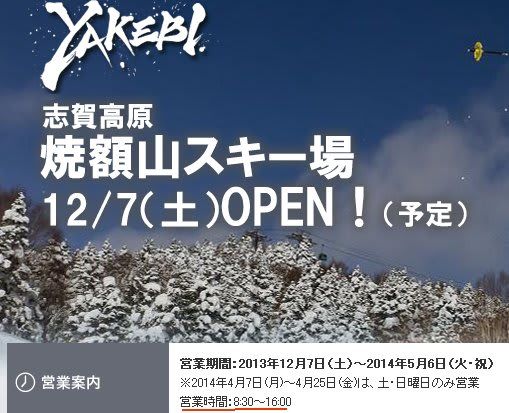

# 志賀高原の2014シーズンは，なにか変わったかな？

📅 投稿日時: 2013-11-13 01:11:03

えー．

かなりのスキー場で雪が積もり，

[人工降雪機がフル稼働](https://www.facebook.com/photo.php?fbid=228843777283582&set=pcb.228844193950207&type=1&theater)して．

鹿沢なんかは，[今週末にも仮オープンできるかも](https://www.facebook.com/kazawasnow/posts/228844193950207)？

と言っている，今日この頃．

皆様，いかがお過ごしでしょうか．

[昨日の記事で，](e6f85eb04470c35ce26e222d31ac049bc.md)

志賀高原あたりでは，-9度くらいまで冷え込みそう！？

…って書きましたが．

なんだか．

志賀高原のホテル銀嶺さんのBlogで．

[12日の朝，マイナス9度になったとの報告が…](http://blog.goo.ne.jp/ginrei1/e/48c4445cbd719ac9ab0d2cd91ae141fe)

うはははは．ぴったり予想と一致しているじゃないかっ！

見たかっ！私の志賀高原補正による天気予想の正確さをっ！←ただのまぐれ当たりでしょ

ってことで．

そろそろスキーシーズンも近づき．

志賀高原のいろいろなHPが，今シーズン向けに更新されてきて．

今シーズンの状況がだんだん分かってきたのですが．

まず．

焼額フリーク(マニア，といったほうが良いのかも…)の私にとって

大きな変更がっ！！！

なんと．

これまで，土日は朝8時営業開始だったのに．

平日と同じ，8:30営業開始になっちゃいました…(涙)

さらに．営業終了は16:00って明記されてます．

これは…

これまで，休日は．

ゴンドラが16:00営業終了でも，リフトは16:30まで営業してたのが．

16:00にリフトも終わっちゃうってこと？？？

うげげげげ～っ！！！

何のアナウンスもなく，さりげなく営業時間が変更されてたけど…

実質，1時間の営業短縮じゃないですか…(泣)(泣)(泣)

ショーック！これは，ショーック！

昔は，リフトは5時までやってくれてた時代もあったのに…(涙)．

で．

一の瀬・西館・東館・ブナ・ジャイアント・丸池・蓮池・サンバレーの

リフト営業案内が[ここ](http://www.shigakogen.co.jp/cms/wp-content/uploads/2013/11/2013%EF%BD%9E14lift.pdf)に出てますが．

…ここは，昨シーズンとほぼ変わらずですね．

一の瀬，高天ヶ原のクワッドは，12月7日からの運転開始の予定ですね～．

そして．

昨年度から無くなったGWのナイター営業．今シーズンも復活せずです(涙)．

そして．

もうひとつ変わったのが．

[リフト券の料金体系．](http://www.shigakogen-ski.com/fee.html)

…これまで好評を博していた(?)1.5日券がなくなったようです…

週末1泊2日で滑る人は，2日目は昼過ぎくらいに切り上げる人が多いから．

ちょいとお安い1.5日券が人気だったようですが…

土日で滑る人は，実質値上げと感じる人が多いかも？？

あと，午前券・午後券も無くなってます…

4時間券に統一されたみたいですが，一日券4800円なのに，

4時間券が4000円って…

…うーーーーーーうむ．

志賀高原，実質的なリフト券値上げのように感じるのは，

気のせいかな？

＃シーズン券の私には関係ないんだけど(＾＾；

…でも，志賀高原の公式ページには載ってないのですが．

[焼額のHPのリフト料金のページ](http://www.princehotels.co.jp/ski/shiga/lift/)を見ると．

大人1人+子供1人のリフト券セット「親子パック」

1日券が6400円，

2日券が12000円，

3日券が17000円，

ってのがあって．

小学生の子連れには，ちょっと安くなる券があるように見えるんですが…

…なんで志賀高原索道協会のページには載ってないのかな？

あ，あと．

使っている人を全く見たことが無い，「20時間券」もなくなってますね～．

…と．

いろいろ残念な変更が続いている今シーズンですが．

せめてもの救いは．

今年廃止になるリフトが無いことくらいでしょうか…

うーむ．

しかし．

焼額の営業時間短縮は痛い…(；_：

## 💬 コメント一覧

### 💬 コメント by (ゆうこ、)
**タイトル**: Unknown
**投稿日**: 2013-11-15 17:47:56

今シーズン12/18から横手山にスタバ出来るそうです！

一回は行ってみようかなと思います。

### 💬 コメント by (Skier_S)
**タイトル**: うわー！ホントだっ！！
**投稿日**: 2013-11-15 22:38:58

いやー．

知りませんでした．

今調べてみて，横手山頂のリフト降り場上の

食堂が，スタバになるって知ってびっくりしました…

スタバの進出力，恐るべし．．．．．

