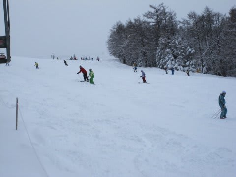

# 1月15，16日は菅平

📅 投稿日時: 2011-01-17 00:01:13

えー．

この週末は．

珍しく，志賀高原じゃないんですね～．

まぁ，いろいろあって．

今回，某都道府県連御用達スキー場である，

菅平は太郎山に行くことになったんですが．

しかし，あれですね．

このスキー場．

某都連（ぜんぜん某になっていない気がするのは思い過ごしか？）の

行事があるかないかで混雑度が全く異なるという．

菅平スキー場というよりは，菅平修行場に名を変えたほうが

実態を表すのでは…

って気がするんですが．

とりあえず，今週は行事がなかったらしく，結構すいてました．

講習とかポールトレーニングのスキーヤーの中に，

スキー場の選択を間違ったのでは？

という家族連れが時々場違いに混ざっている

このスキー場．

今回，私もなぜか講習に参加することに．

…講習の合間に子供を背負って滑るという，

よくわけのわからんスキーをやってきました．

さて．

土曜日の朝．

スキー場につくと，結構な勢いで雪が降ってます…

しかし，雪は降り始めたばかりらしく，ゲレンデはパフパフ

ではなく，圧雪の上に薄く5cmほど新雪が乗った状態．

上に載っている新雪は軽く，結構滑りいい感じですが…

天狗のスタートの急斜面は下地が完全人工雪なのか，

エッジが不自然に引っかかるような固めの下地．

コースは全面可能で，一見雪もいっぱいあるようですが…

夕方になってコースが荒れてくると，裏太郎の

小回り道はブッシュが一部出てきました．

あれ．意外と雪は薄いなぁ…

まぁ，ブッシュが出たのは裏太郎の小回り道のごくわずかな

部分だけでしたが，やっぱり今シーズンは雪が少ないんだなぁ…

この日の天気は，一日中降ったりやんだり．

残念ながら日は射さず．

雪も一時強く降りましたが，ゲレンデ上に大量に積もるほどには

降らず，一日中バーンコンディションは良かったですね～．

で．

あけて日曜．

…土曜夜からすごい降ったみたいで．

駐車場はこんな感じ．

…菅平にしては，珍しい！！！

迷わず一番リフトで山頂へ．

うげげげげ！

雪が少ない菅平で，こんな新雪が楽しめるとはっ！！！！！！

圧雪が終わってからかなり積もったみたいで，ゲレンデ全面パウダー．

天狗は．太ももくらいの深さのパウダー！！

今シーズン初のゴーグルに雪が降りかかり，

口をあけると自分の舞い上げた雪が入り込んでくる，

ディープパウダー！！！

うひょひょひょひょ．

数本滑っておいしいところをいただいた後は，

30分遅れで営業開始した裏太郎へ．

なんと！裏太郎も全面新雪！！

天狗よりちょいと薄く，ひざ上程度だけど，

コース全面きれいな新雪！

これまで菅平に何度も来たけど，

完全圧雪コースの裏太郎がこれだけの新雪になったのは

初めてじゃなかろうか…

ファミリーの半分，天狗の初級者コース，日の出あたりは

朝に圧雪が掛けなおされてたけど，それ以外は全山新雪に

覆われた菅平．

ファミリーはこんな感じ．

それも，午前中は時々日も射しました．

いやーーーー．

修行場，菅平とは思えないゲレンデコンディションに，

しかし，午前11時ごろになると，当然ぼこぼこのゲレンデに

なるわけですが．

昼前には，また雪が強くなってきました．

午後も時々強くふっていたので，明日はまた新雪が

楽しめるんじゃないでしょうか…

どうでもいいですが，子供を背負って新雪は滑りにくいですね．

＃朝イチの深いパウダーは滑ってませんよ

修行場，菅平では子供を背負って滑っている人は私以外に

全く見かけませんでした…

志賀だとちょくちょく見かけるんですけどね．

かなり目立っていたかも．
