# 明日から志賀高原で滑ってます～！…そして，焼額第2ゴンドラ部品劣化のため今シーズン営業終了(泣)

📅 投稿日時: 2025-04-28 00:01:25

🏷️ カテゴリ: [日記](cc4b5682fb7b8b144980957a978653fb0.md)

ってなことで．

今日は一日，白い粉の禁断症状に悶えながら，

家で娘に勉強を教えて一日を過ごしたわけ

ですが．

今日，焼額山スキー場のホームページを見ると．

こんなニュースが飛び込んできました…

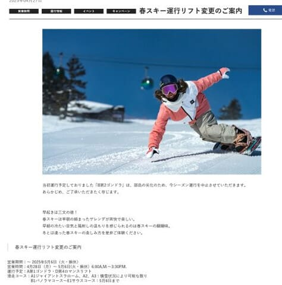

（[焼額山スキー場ホームページ](https://www.princehotels.co.jp/ski/shiga/informations/early_morning_skiing/)より，以下同）

拡大してみると…

ええええ？？？

第2ゴンドラ，今シーズンの運行中止！！？？

焼額はGWもゴンドラ2本動くと思っていたのに…？？

うーーん…

部品劣化が原因か…

第2ゴンドラ，もう35年以上たってるからなぁ…

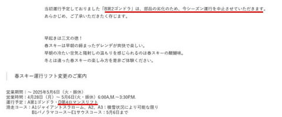

まぁ，第1ゴンドラが動けば，第2ゴンドラで

滑れるコースは全部滑れるので，第2ゴンドラが

止まっても困らないけど…

一番ヤバいのは，第2ゴンドラ側のコースから

第1ゴンドラへ戻るコースが途切れたら

ちょっとヤバいかも…

今シーズンは雪が多いから大丈夫かな？？

…ってところで．

私が滑ってない本日の焼額ですが．

さすがGWの日曜なので，写真を送ってくれる

特派員が多数いてくれて，大量の写真が

送られてきました～！

（そして私を禁断症状に落とし込んでくれた）

まず．

今日も朝は氷点下まで冷えてくれたようで…

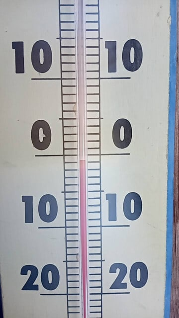

朝イチはいい感じの硬いシマシマ！！

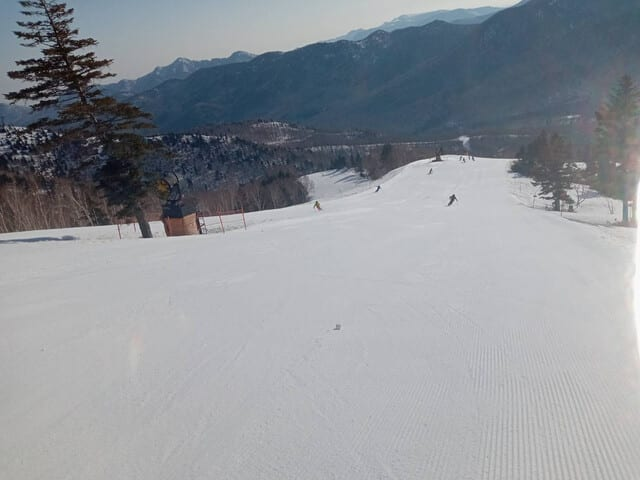

4月末とすれば，かなりいいコンディションの

早朝だったようですね…

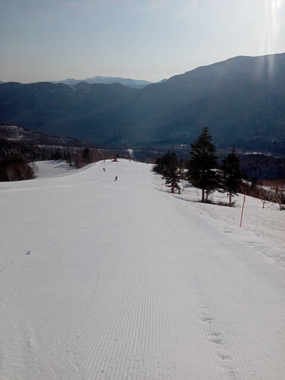

今日も朝から強い日差しで雪は緩んだものの，

10時近くまでは割とフラットでいてくれた

ようですが…

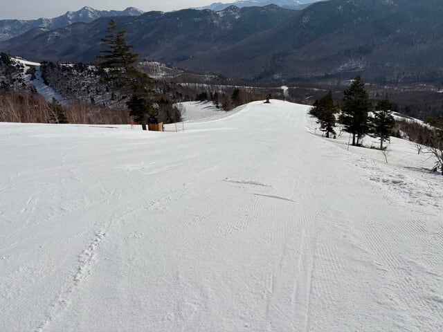

今日は昨日より気温が上がり，+10℃を

越えてきたようなので．

昼頃には雪も汚れてきて，滑りが悪く

なってきたようで…

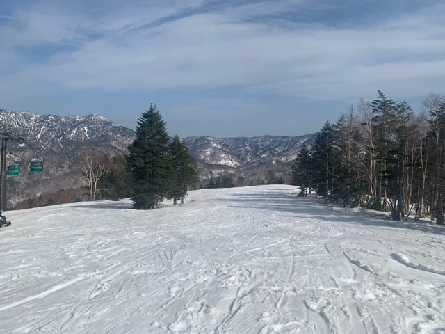

昼過ぎにはやっぱりバーンはボコボコに

なっていったようです…

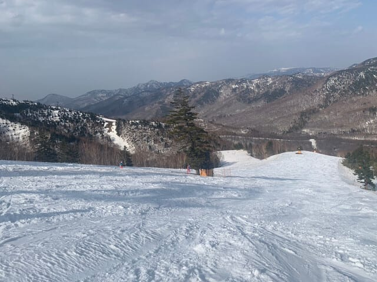

まぁ，急斜面の雪はそこまで滑りが悪く

なかったのが救いのようですが…

でも，これだけ雪が残っているので，

このGWは恵まれてますね．やっぱり．

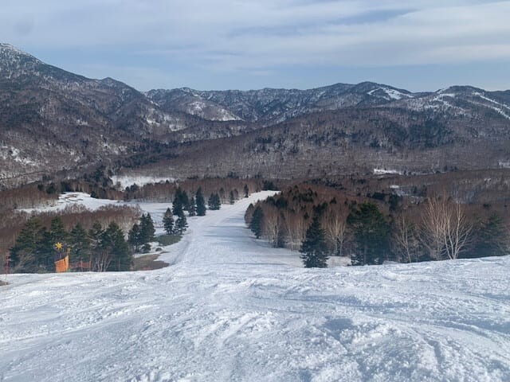

そして，2ゴンが止まって懸念の

2ゴン側から1ゴンへ戻るコースも，雪だし

されていて，あと1週間は意地でも切れない

ようにしてくれそうな感じ…

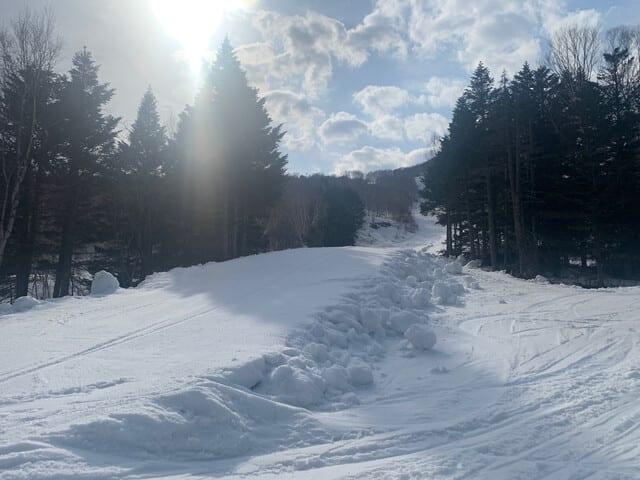

ってな感じで．まだまだ雪はあるので，

残り1週間ちょい，シーズン終わりまで何とか

GWコースとパノラマ・サウスコースの2本を

ゴンドラで滑れそうな感じですが．

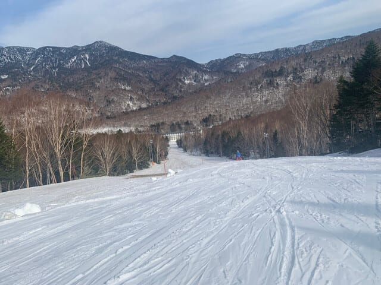

とりあえずこれから先は，

28日(月)：終日曇り，朝から気温は高め，

　日差しが無いから雪は緩まず，気温も

　+10℃を越えないので雪はそこまで

　荒れないかな？

　夜中に冷えて雪かみぞれが降りそう…

　

29日(火・祝)：朝までにうっすら雪が

　積もってるかも？

　朝はマイナス気温でバーンは硬め．

　その上にうっすら数mmの積雪？

　この日は気温が上がらず，曇ったり

　晴れたり雪が舞ったり．

　気温が上がらないので，バーンは

　そこまで緩まなさそうでいいかも．

30日(水)：終日晴れ，朝は冷えて

　ガチガチバーン，昼間もそこまで

　気温が上がらず午前中くらいは

　結構よさそう．

　午後は気温が上がりバーンが荒れる．

5月1日(木)：終日晴れて気温が上がる．

　朝から雪は緩めかな…

　午後は荒れる．

ってな感じでしょうか．

ということで．

実は明日，休みが取れたので

明日から志賀高原に復活します～！！

そして，いつも通りあと3時間後に

出発（泣）．

今日も睡眠時間2時間半で志賀高原へ

向かいます～！！
