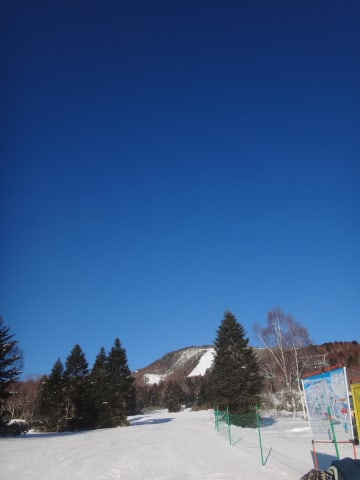
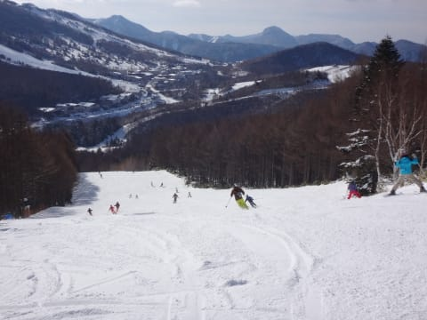
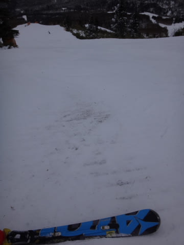

# 1月17日，日曜の志賀高原は…週末の積雪ゼロ．ゲレンデ状況はまた悪化…（涙）．

📅 投稿日時: 2016-01-19 02:37:52

今日は，志賀高原は強風でほとんどのリフトが

動かなかったようですが．

…とりあえず，[雪は積もっている](https://twitter.com/shigaofficial/status/688949511813660674)ようですね…

今週末．

今週末こそ…（懇願）．

ってことで．

昨日速報した，日曜日の志賀高原．

本日は，詳細モードにて…

先日も書きましたが．

晴れなくてもいいのに，すっきり晴天で始まった朝．

…普通なら．

普通なら，これは最高のスキー日和なんだけど…

…1mmでもいいから，積雪を…（涙）．

で．

晴天の放射冷却で，山頂の気温は今日も-10℃と，

冷え冷えの朝です！

朝イチの焼額山頂は…

ふむ．

雪質は，冷え冷えのシマシマ！

朝は別料金のファーストトラックが開催されていたので，

すでに滑った後はいくつかありますが…

でも．

通常営業開始スタート時は，人も少なく，

雪もしっかり締まった最高の圧雪！！！

晴天，最高のシマシマをかっ飛ばせるのだ！！

ふはははは！！！

朝の数本は，最高！！

…

…だったのだが．

やっぱり．

…じきに出てくる，人工降雪の固い下地…（涙）

出てこなくてもいい，氷のコロコロも大量出現（泣）．

そして．

晴天ってのもあり，午前中の人は，

土曜より多めだったかな～．

とはいえ．

ゴンドラ待ちのピークはこの程度で，

ぎりぎりゲートの外まで人がいるかどうか．

10時～11時がピークで，それ以外はほとんど待ちは

無かったですよ～！

でも．

午前中は，第2ゴンドラ側のパノラマコースも…

第2高速側の唐松コースも，

ちょいと人は多めだったかな．

午前中は，焼額のこれらのコース．

しっかり人工雪がついていたので，ブッシュが出てくるところは

ほとんどなかったですね～．

んで．

日曜は．

焼額の呪いがかかっていて，普段は焼額から外に出られない私が，

久しぶりに一の瀬方面に遠征してみました．←正月休みなんかも，結構奥志賀に行ってた気がするが…

一の瀬ダイヤモンドは…

ふーむ．

ここはしっかり人工雪がついていて，ブッシュの心配は

ほとんどなくないですね～．

一の瀬ファミリーは…

天狗コースは，一見雪がついているように見えるけど…

コース全面，小石地獄（涙）．

石を踏まずに降りることは不可能です…

で．一の瀬ファミリー正面バーン．

ここはいまだに毎晩人工降雪機がフル稼働しているんですが…

コース上部の，スタート直後．

え？？

ええええ？？

…まさかの，ブッシュだらけ状態（残念）．

そして，ブッシュがないところは…

ところどころアイスバーン（涙）．

そして，寺子屋まで足をのばすと．

なんだかうっすらと茶色いものが見えてますが…

ダメだ．

ダメです．

ここは，雪が薄すぎる…（涙）．

寺子屋スキー場，誰も滑ってませんでしたが…

いや，ここ．リフト1本滑ったら，みんな退散するのが

よく分かる…

人工雪が無いゲレンデは，こんな感じなんですね（泣）．

ってことで．

「やっぱり，焼額がいいなぁ」

と，東館や高天方面への遠征は諦めて．

焼額へ復活…

朝はすっきり晴れていた天気も，午後は曇り空．

…そして，やっぱり誰もいないんですが…

よーし，ガラガラゲレンデを思いっきり滑るぞっ！！

と，第1ゴンドラのGSコースへ飛び出しますが…

あれ？？

…あああーーー．残念．

ごく一部とはいえ，人工雪が剥げて，

土が…（涙）．

そして．

雪が剥げてないところも．

かなり下地のアイスバーンが出てきて…

滑りにくい…（泣）．

快感度が…

快感度が，低いよ（涙）．

と，悲しみつつ．

ゴンドラ営業終了の4:15以降，

4:30まで営業している第3高速へ行ってみると…

ああ．

ここは，人工雪がないから．

かなりダメな感じですね…（涙）．

コース上部の方は，かなり石ころエリア化してます…

うーむ．

残念．

残念だ…

と，嘆きつつも．

やっぱり今日も，リフト営業最後の16:30まで滑っていた，

Skier_Sなのだった…

とりあえず．

とりあえず，今週末は．

どっさり積雪で，全面滑走可能になるはず！！

19日は西風で，思ったほどの積雪にならないかもしれないけど．

20，21日と，積もる！

行けると信じたい！

## 💬 コメント一覧

### 💬 コメント by (ぴよ＠太田市)
**タイトル**: シマシマバーン
**投稿日**: 2016-01-19 09:00:52

プリンス系には良くいくのですが、今まで軽井沢と焼額山しかシマシマバーンには会ったことがありません

苗場とかぐらはなぜないのだろう？

かぐらには和田小屋泊のファーストトラックとかあるから

ただ単に行くのが遅いだけかな？

しかし今回の雪でも苗場、かぐらの積雪は全く変わらず！

なんでかなぁ〜(´・ω・`)？

### 💬 コメント by (デーコン)
**タイトル**: Unknown
**投稿日**: 2016-01-19 20:49:11

今週は、降りまっせ！

人工降雪機が凍るぐらい降りまっせ。

たぶん。。。。。。

信じましょう！

### 💬 コメント by (Skier_S)
**タイトル**: 今週は，来る．明日はすごいはず
**投稿日**: 2016-01-20 02:45:26

＞ぴよ＠太田市さま

あれ？ちゃんと朝イチに行くと，かぐらもシマシマの

はずですが…

でも，焼額山の朝イチ，人が少ないシマシマバーンは

病みつきになりますよね～．

…でも，今日はかぐらも晴れで，あんまり

積もらなかったみたいですね．

西風というより，南西に近い風だったので…

明日は積もりますよ！

＞デーコンさま

降りますよ～！降りますっ！！

リフトが全部埋まるぐらい積もります！←それ，困るから

