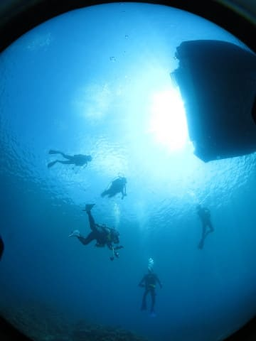

# 2023年8月，座間味で親子3世代ダイビング！その8…ダイビング初日の3本目，本日のラストダイブ

📅 投稿日時: 2023-09-20 04:48:58

なんだかいろいろクリティカル…

今日も更新がこんな時間です（涙）

もう朝5時近い…

ってなことで．

今日も[前回の続き](e571810dfa54648a8bb3ed05928f31ea8.md)，書き溜めておいた

ダイビング日記です…

ーーー

ということで．

ボートは3本目のポイントへ向かいますが…

どうやら最近，マンタが出ることもあるので，

運が良ければ水面からマンタが見れるかも…

ということで．

3本目に向かう前に，阿嘉島の向こう側の

屋嘉比島との間まで移動して，様子を

見に行っています…

15分ほど移動して，マンタが出るかも？

というポイントへ着きましたが…

流れがそこそこあって，マンタが出そうな

雰囲気はかなりありましたが…

マンタは残念ながらおらず（涙）

だもんで．

船はそこからちょっと戻って．

3本目のポイント，阿嘉島の北西側の

「儀名」へ向かいます…

ってなことで．

ポイントに到着したので．

慌ただしく3本目の準備！

まずは先行チームがエントリーして…

我々家族チームは後半エントリーですが…

さすがに我が父親は，3本潜ると疲れる

ということで，3本目は父親抜きの

4人＋ガイドの1チームで潜ります…

エントリー後，ガイドさんが何かを

示して，みんなが周りに集まってますね…

なんだろう？

と見に行ってみると．

ハナビラクマノミがいましたが…

イソギンチャクがめくれると，

あ！卵だ！

かなりハッチアウトに近そうな卵が

岩にはりついてました…

その後，ゆっくり移動を

始めますが…

うーん．

このポイント，サンゴはそこそこきれいだけど．

ちょっと魚影が薄めかな…（ちょい涙）

写真を撮っても，魚が少なめなので映えない…

で．

しばらく行くと，深度12m程度のところに

大きめの根がありましたが…

オーバーハングの下にアカククリがいたり…

ちょっとシャイで向こうを向いた

キリンミノカサゴがいたりしたものの．

うーん．

全体的にちょっと魚影が薄めなのが

残念…

ダイビング中にそう思っただろうことが

よくわかる感じで．

普段ならあまり撮らないハタタテハゼとかを

必死に撮っていました（笑）．

あとは適当にゆっくりとボートに戻りながら…

最後は，ボートの下で各自自由に

過ごしますが…

ダイビングタイム40分を超えたあたりで，

ガイドさんから浮上のサイン．

ボートに向かって，浮上…！

…ってなことで．

本日のラストダイブの3本目，終了です！

（[続く](eb5e1deaa2eddc1b288fed21a41697c6f.md)）

## 💬 コメント一覧

### 💬 コメント by (西舘)
**タイトル**: Unknown
**投稿日**: 2023-09-20 08:55:24

ということは、お母様は3本目いったのですね。

もしかしてS様家族の中の最強はお母様！？

### 💬 コメント by (Skier_S)
**タイトル**: ＞西舘さま
**投稿日**: 2023-09-22 01:59:53

コメント回答遅れました…

母親は3日とも3本全部潜りました．

確かに母親が最強かもしれません…

