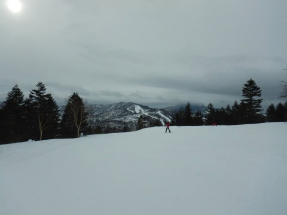
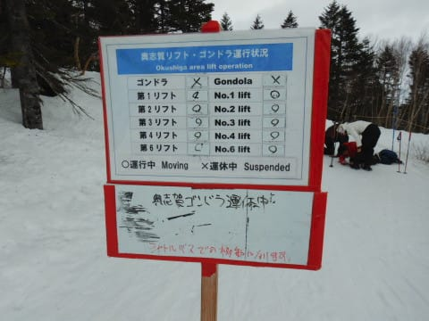
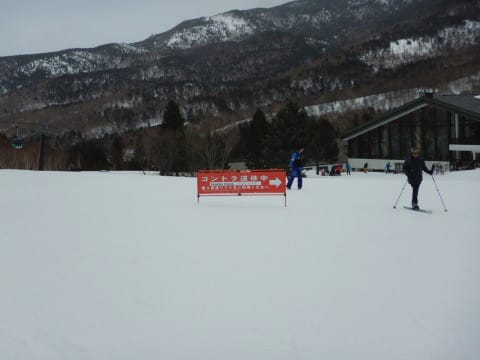
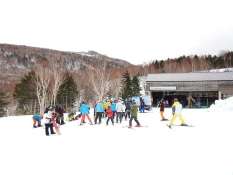
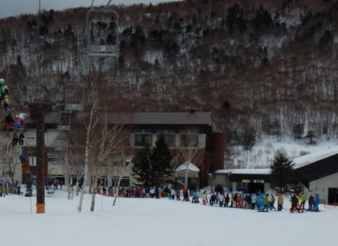
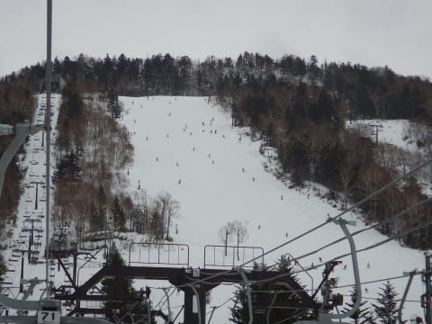
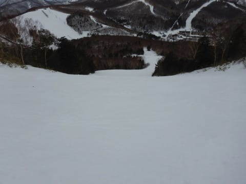
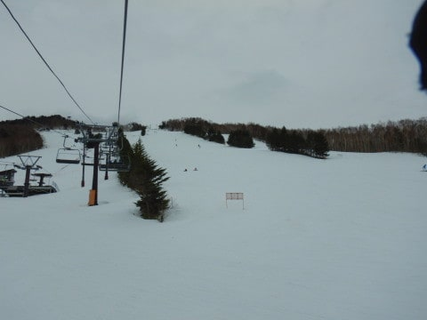
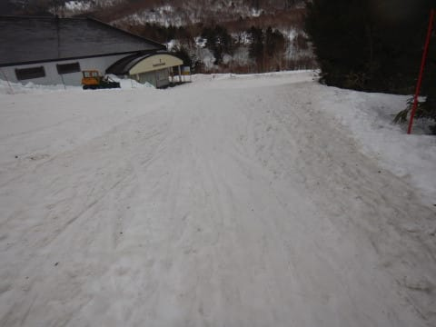

# 2020/2/16(日)の志賀高原スキー場，速報レポート！…高温，強風，雨の悪天候3連コンボ（涙），雨は小降りだったけど，雪が解けたよ（泣）

📅 投稿日時: 2020-02-17 01:52:31

🏷️ カテゴリ: [2020スキー滑走日記](c282e9230de179e245c7334eabeb0a3b3.md)

ということで．

本日もしっかりラストまで滑ったので．

帰宅はいつも通り深夜パターン…（涙）

だもんで．

日曜深夜恒例，速報モードにて，

本日の志賀高原レポートです！

えー．

まず．

本日朝．

朝早くは晴れていたものの．

ゴンドラ営業開始のころは雲が増えて…

そして．

営業開始時の気温はすでにプラス5℃近くて．

営業開始とほぼ同時に、

2月の志賀高原では降ってきて

いけないはずの液体が，

空からパラパラと落ちてきました（激涙）

そのおかげで．

朝のうちから，ゲレンデの雪は．

4月か？？？

という，水分をたっぷり含んだ

重い雪になってます…（涙）

さらに．

朝から，予想通りの異常に生ぬるい

南風が強く吹き付けたため．

ありゃ？？

朝9時過ぎに．

早くも強風で，奥志賀ゴンドラが

止まったよ！？？

奥志賀，北向きゲレンデなのに．

南向きのヤケビ2ゴンより先に

奥志賀が南風で止まるとは…

…で．

それに引き続き．

午前10時過ぎには…

強風で焼額第1，第2ゴンドラ，

揃って運休っ！！！！（激涙）

な，なんてこった…

運休になるほどの強風にはならないだろう

と思っていたのに，

まさか，1ゴン2ゴン揃って討ち死にとは…（泣）

さらに．第3高速も強烈な減速運転に

なったため．

山頂まで異常に時間がかかるうえ，

一気に混み始め…

そのため，さすがの私も焼額からの

脱出を試みようとしたけど．

ゴンドラが動いてない時に

乗らざるを得ない第4ロマンスリフトが…

oh…

激込み…（涙）

そんな苦労をしながら，一の瀬へ

やってきましたが…

一の瀬も4月の重い雪の荒れ荒れバーン（泣）

パーフェクターコースがまだ

フラットだったけど．

パーフェクターコースは，ところどころ

ブッシュが出始めてきていて．

今日一日で，なんだかすごい雪が減ったのかも？？

さらに，高天ヶ原に逃げてみても．

雪は重いし…

ヤバい感じで，ところどころ

雪が薄くなってるところも…（涙）

せめてもの救いは．

雨はそれほどひどくなく．

ウエアに水滴がつくくらいの降りで，

びしょ濡れになるほどの雨に

ならなかったことでしょうか…

ってなことで．

雨がひどくならなかったので．

しっかり営業終了時間まで滑り．

…最後は焼額に戻ってきましたが．

焼額も，なんだかゴンドラ乗り場前とか．

雪が薄くなって，ちょっとゲレンデが

茶色くなってきてるんですが！？？

あぁ…

ダメだ．

2月中旬というのに，

先週はたっぷり積もったはずなのに．

また，今日一日でかなり雪が解けて

しまいました…（激涙）

でも．

17，18日と，また冷えて雪が降るはず！！

来週末には，また2月の冷え冷えゲレンデに

復活することを祈って．

これからも引き続き，

熱烈激烈な冷え冷え踊りを，

ゲレンデが解けるほどの熱い情熱を込めて←だから，それはダメだってば

踊ってくださるよう，お願いします…

## 💬 コメント一覧

### 💬 コメント by (ほっぽ)
**タイトル**: 2/16
**投稿日**: 2020-02-17 06:59:06

Ｓさん

昨日は悪条件の中、ラストまで滑られて流石です。

朝一奥ゴンスタートで9:20の奥ゴン運休、10:15のヤケビゴンドラ運休、

11:35の第三高速運休を聞いて、奥志賀を離脱して横手へ。

昨日はラッキーにもリフト待ち殆ど無しで15:30まで滑れました。

ヤケビはゴンドラ運休して混雑したようですね。

Ｓさん、ｙａｍａさん、まうちゅうさんが

このコンディションの中でも滑られているのを確認して、

励みになりました。皆さん、スキーヤーの鏡です。(^^♪

今週末の天気に期待しています。

昨日の様子はblogにアップしておきました。

http://www2.tokai.or.jp/nana_hoppo/

### 💬 コメント by (ゆーき)
**タイトル**: Unknown
**投稿日**: 2020-02-17 06:59:11

あれまぁ、私は、朝は焼額山にいましたが、ギリギリに第一になった後、山の神から中央へ抜けたので、その混雑は知りませんw 昨日はサンバレーまで行きましたが、丸池とか、あっちはめちゃ空いてました。その後、西館で滑って、いつものごとく？、高天ヶ原、一ノ瀬と移動して、最後を迎えました。　しかし雨が多いですね、、、このあと雪ですが、来週土曜あたりまた、、、　困りましたね。　私。来週も志賀高原でお泊まり

### 💬 コメント by (いちと)
**タイトル**: Unknown
**投稿日**: 2020-02-17 11:29:23

今週末、いよいよ出動です

いまも仕事せず踊っています

カイロも買いました

寒いと思います

### 💬 コメント by (Skier_S)
**タイトル**: 18日に積もってくれることを期待
**投稿日**: 2020-02-18 00:35:10

＞ほっぽさま

16日は，雨はそれほどひどくならず，レインウェアを着るほどではなかったので，

なんとかラストまで滑れました…

でも．

雨がひどくないので，そんなに雪は解けないかと思ったけど．

甘かったです…（涙）

＞ゆーきさま

ええ！

あの状況の中，サンバレーまでいったのですか…

すごい．

西館，東館はかなり土が出ていたのでは？？

とりあえず，今週末までにドサドサ積もってくれるよう

祈りましょう…

＞いちとさま

今週末ですが，そんなに冷えなさそうな感じです（涙）

