# 3月１９日、３連休初日の志賀高原は…晴れ→曇り→ガス、ポツポツ雨（涙）

📅 投稿日時: 2016-03-19 23:04:31

🏷️ カテゴリ: [2016スキー滑走日記](c70c67ed5248e9432b899dcd5747048bb.md)

えー。

本日。

奇跡は起きませんでした（涙）

午前中は天気が意外と良かったものの。

午後はガス＆時々雨（泣）。

…せめてもの救いは。

雨がそれほどザーザー降りじゃなかったことくらいでしょうか…

ってことで。

本日。

焼額に到着すると…

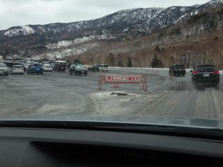

ありゃ？？

第２ゴンドラ、強風で運休ですか…

…まさか、第１ゴンドラは大丈夫だよね…

…

…

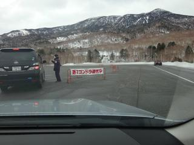

アウトーっ！！！！！

第１，第２ゴンドラ共に、仲良く討ち死に…（涙）

だもんで。

焼額スタートで、リフトを滑りますが…

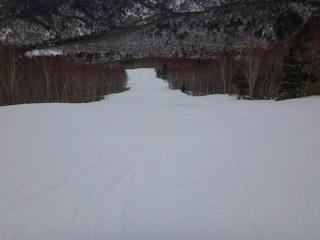

ゴンドラが動いていない焼額はガラガラですね～。

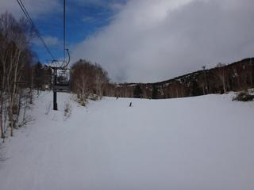

雪は…

まぁ、昨晩から気温が高かったようで。

…朝から春の雪です（涙）

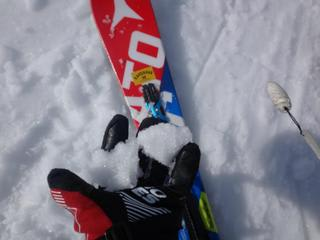

`

ゴンドラが動いていない焼額を脱出し、

一の瀬へ足を伸ばしてみますが…

をを！

朝９時半頃には、天気予想を裏切って、

青空も顔を出してきました～！！

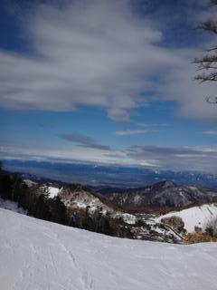

…でも。

気温も高く。

雪は４月下旬のザブザブ雪です…（涙）

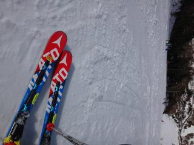

午前１０時過ぎに、焼額山の第１，第２ゴンドラ共に

運転再開したので、

我がホームゲレンデへ！

ゴンドラで山頂に登ると。

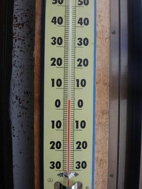

うーむ。

気温はプラス５度…（泣）

天気は、この頃になると曇り空に…

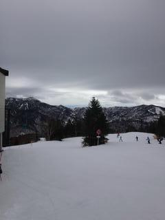

よし！

誰も滑ってないGSコースへ…っ！！！！

…って…あれ？？？

高温にやられたゲレンデは…

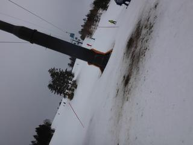

…

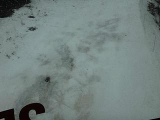

そして、今日もクローズのオリンピックコースは

こんな感じなので…

今シーズンはもう終わりですね（涙）

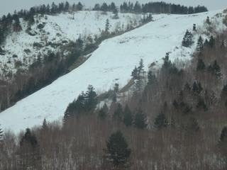

まぁ、でも。

１月に人工雪を打ったGSコース。

人工雪を打った部分は、土が出てくる様子もなく。

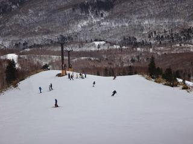

まーまー滑れますね～

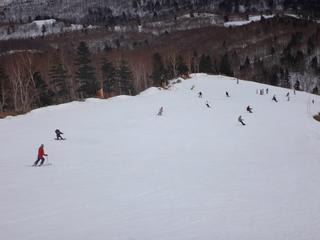

…と、思ったら…

あれ？？

雨…？？

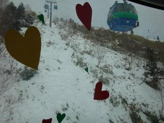

がーん。

昼過ぎには、予想通り、雨が降り始めました…

＃こんな予想は当たらなくていいのに

そして…

午後は、ガスもひどくなってきました（泣）

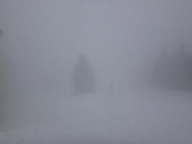

午後２時過ぎには、パラパラと雨が一瞬強くなったタイミングもあり…

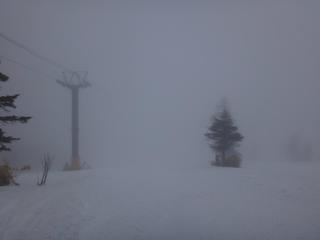

ゲレンデの雪は…（涙）

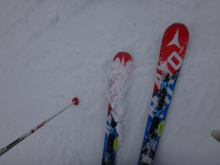

もう、多くは語りません…

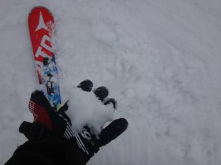

そして、この雨のおかげで。

一部、ゲレンデにやばいところが増えてきてます…

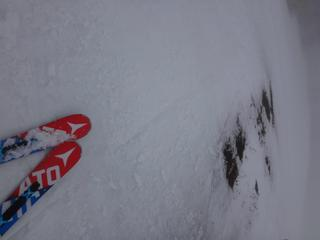

あぁ…

ダメだ。

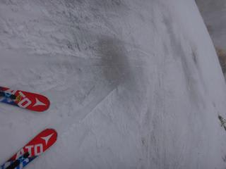

だめだよ、今シーズンは…（あきらめの境地）

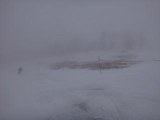

ってことで。

雨はそれほどひどくふらなかった本日。

午後３時過ぎにはやんだけど…

リフトストップまでひどいガスにやられ。

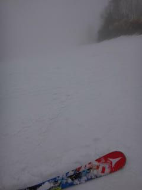

ダメダメな雪で、悲しい一日を過ごしたのでした…

で。

それでも行く。

ナイターへ、行く。

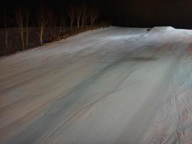

ナイターも、気温はそれほど冷えず。

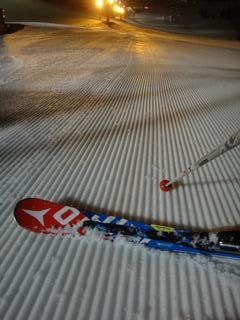

シマシマなものの、結構ザブザブした雪で。

あーーー。

４月下旬並だよ…（涙）

営業終了ギリギリくらいから、くくくっと

冷えだして、表面が硬くなってきたので。

…おそらく、明日はカチカチアイスバーンで始まるのかな…（泣）

ってことで。

まだ３月というのに。

いつものGWごろのレベルの、

シーズン終わり感を漂わせる志賀高原を、

悲しみながら滑った、Skier_Sだったのでした…

## 💬 コメント一覧

### 💬 コメント by (ＦＣＡＭＥＬ)
**タイトル**: Unknown
**投稿日**: 2016-03-20 02:21:25

こんばんは夜半到着しました。あああ、もう駄目なんですね。。。

ラブゴンドラ越しの景色が泣けます。。。

で、ここはあっさり話題を変えて質問ですが、Skier_Sさんほどの頻度で第一ゴンドラをお滑りになった場合、一日何回くらいラブゴンドラに遭遇するのでしょうか？

### 💬 コメント by (Skier_S)
**タイトル**: FCAMELさま
**投稿日**: 2016-03-20 07:36:45

ラブゴンは、1日1～2回くらいでしょうか…

64台中2台なので、1月30本ちょっと乗れば

そのくらいでしょうか…

### 💬 コメント by (べべ)
**タイトル**: ヤケビ
**投稿日**: 2016-03-20 10:58:21

今日久しぶりに来ましたが、何か悲しくなってきました…(TT)

こんなコンディションですが、リフトストップまで頑張りましょう！笑

1ゴン側はコースが滑りにくいのか空いてますね。

### 💬 コメント by (Skier_S)
**タイトル**: べべさま
**投稿日**: 2016-03-20 12:39:22

今シーズン最低のコンディションです…(泣)

私もやる気を失い、レストランでのんびりしてるレベルです…

あまりにひどい(T.T)

雪の固さで板が叩かれ、ブーツに足が当たって

痛くなってきました(涙)

なので、ゆるゆる滑ってます…

### 💬 コメント by (まいる)
**タイトル**: カリカリ
**投稿日**: 2016-03-20 13:07:19

Sさん、お疲れ様です。現在、高天ヶ原です。これから焼額に移動します。

ゲレンデ、カリカリ、ジョリジョリですねー(>_

### 💬 コメント by (Skier_S)
**タイトル**: まいるさま
**投稿日**: 2016-03-20 13:19:01

ヤケビ1ゴン滑ってます…

でも、今日は気合いの入ってない滑りしてます(涙)

ブーツが当たって痛いので…（悲)

### 💬 コメント by (まいる)
**タイトル**: お疲れ様でした(^^)v
**投稿日**: 2016-03-20 19:44:21

今日は、Sさんに会えてよかったです(^^)v

足が不調と言いつつ、ぜんぜんそんな感じではなかったです。

明日は、熊の湯にいって帰宅です。

### 💬 コメント by (Skier_S)
**タイトル**: まいるさま
**投稿日**: 2016-03-20 22:57:47

今日はわざわざヤケビまで私を探しに

来てくださいましてありがとうございます。

滑りは結構ヘロヘロでしたが…（笑）

明日の熊の湯、楽しんできてください。

また来シーズンに！

