# 2月2日の志賀高原は…Oh！壊滅～っ！

📅 投稿日時: 2013-02-02 22:43:56

えー．

もう．

本日滑り終えて．

言葉もない状況です．

大自然の驚異が，44年ぶりの異常な高温＆雨＆ガス＆アイスバーンという，

考える限りの悪コンディションを準備して，

日ごろの行いの悪いスキーヤーに試練を与えた一日でした…

まぁ，

朝イチは．

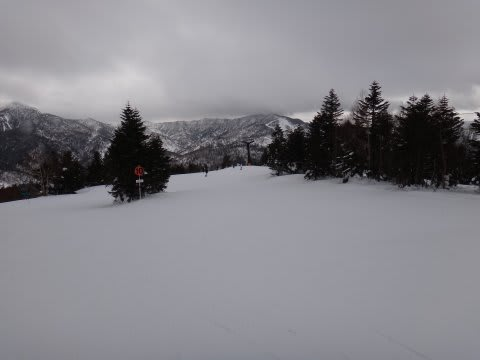

気温は山頂でもプラス2度と異常に高かったとはいえ…

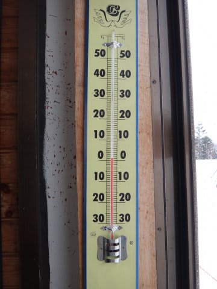

比較的きれいな圧雪で．

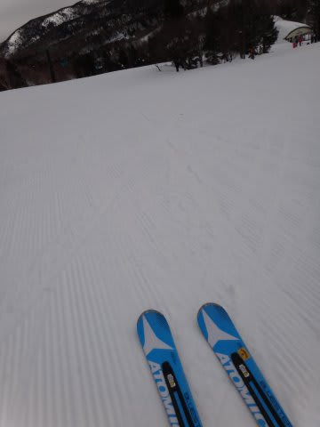

「4月だ．今は4月に違いない！」

と信じれば，そこそこ悪くないフラットできれいなバーンコンディション．

まぁ，雪質がこんなであることを我慢できれば…

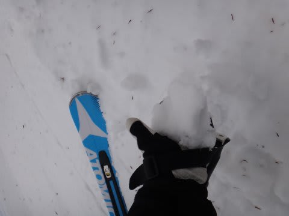

昨日の予想通り，時折日もさし…

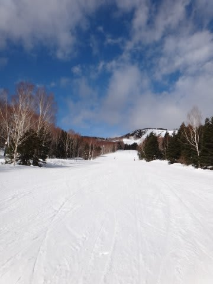

快適な春スキーの一日でした．

しかし．

しかーし．

あー．4月だ，今は春なんだ…

と，信じ込むことで幸せになれた時間は．

無常にも，午前で終わってしまいました．

なんだか，12時ごろには，にわかに掻き曇り．

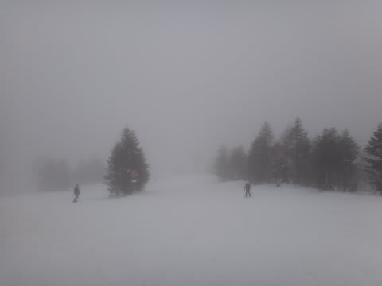

空からぽつぽつと，2月の志賀高原で，落ちてきてはいけないものが落ちてきた気が…

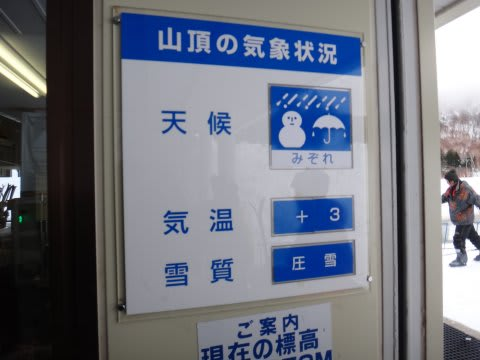

…どうやら，焼額の索道係員は，日本語について一部勉強が必要でしょうか．

固形物が混ざっているものを「みぞれ」と言うんだよ．

液体しかない場合，それは「雨」って言うんだよ…

と言う感じで．

雨に打たれた雪は，見るも涙，語るも涙，って状況に…

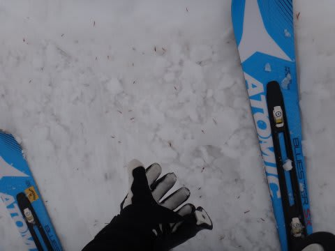

20分くらいで雨は止みましたが．

大自然の驚異は，次々と日ごろの行いの悪い人間へ鉄槌を下します．

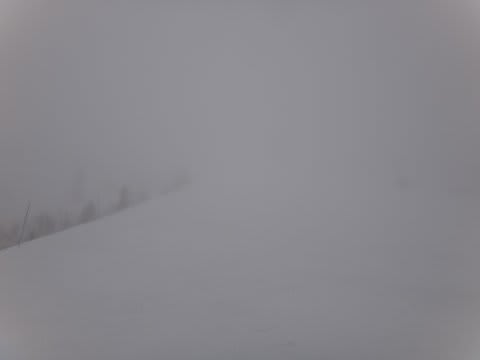

…今度はガスで前が見えないヨ(泣）．

これは，ガスと言うより霧雨で．

滑っているとびしょぬれになります(悲）

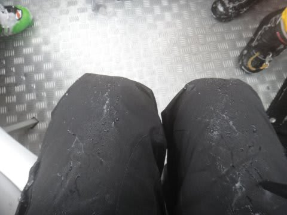

そしてその上．

第2ゴンドラが故障で昼から運転停止．

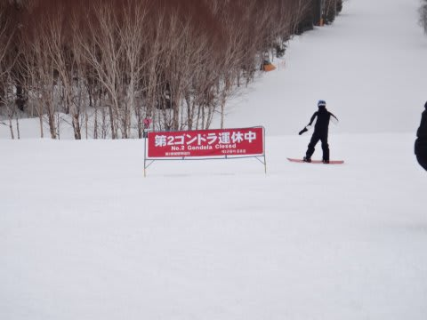

そのため，第1ゴンドラに5分以上の待ちが発生…

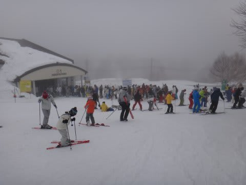

…これは．

あれですか．

踏んだり蹴ったりってやつですかっ！！？？？

だめだーーーーー！！！

って感じで．

だめだめな一日でした．

そして，ナイターまで視界悪し．

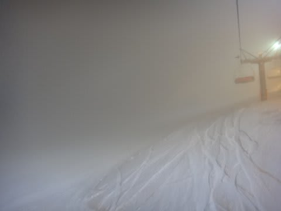

ショートターンの2ターン先の雪の状態が見えない！

…

で．

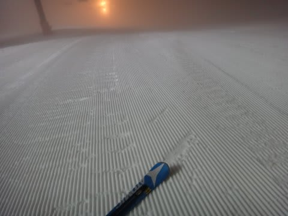

一見雪質がよさそうですが…

これ，氷です．

圧雪車のシマシマのまま，凍ってます．

…この日は，ナイターストップまで．

エッジが氷を削る甲高い金属音が，ゲレンデに響いていました…

…

…志賀高原．

今は小雪が舞っている程度．

とても積もりそうにありません．

…明日，志賀高原にいらっしゃる方は，アイスバーン地獄をお楽しみください．

ゲレンデだけじゃなく，スキー場までの上り道でも，今日の雨が凍った

アイスバーンをお楽しみいただけるかと思います(激泣）．

ふ，普通なら，コンディション最高の時期なのにっ！

なぜ，週末に限って…（;_;)

## 💬 コメント一覧

### 💬 コメント by (いか)
**タイトル**: Unknown
**投稿日**: 2013-02-03 00:01:00

まさかの2月のはじまりですね(；＿；)

早く雪降って隠れて欲しいですが…

ぼくは昨日雪がいいうちに八方へおじゃまして来ました。(学生特権ですね)

朝イチ先頭リーゼンは最高でしたよ！

### 💬 コメント by (Skier_S)
**タイトル**: まさかの2月です
**投稿日**: 2013-02-03 22:14:05

あー

学生さんですか…

うらやましいですね～（羨望）

また，学生時代に戻りたい…

しかし，金曜まで良かったのに，

狙ったように週末に降らなくても（涙）．

雪がいいうちに楽しめて，よかったですね～．

### 💬 コメント by (mari)
**タイトル**: Unknown
**投稿日**: 2013-02-05 22:48:30

この週末は毎年恒例、年に一度の八海山ツアーに出かけておりました。

、、、当然雨でしたよ（涙

雨の中せっかく来たのだからとちび連れてロープウェイ乗って山頂から迂回コースで下まで降りて終了～って感じでした＾＾；

まあ、あそこはあくまで宴会メイン、スキーはオプションだったのでいいんですけど。

今週末はいつものように志賀なので、チャンスがあったら焼額方面を目指してみますね＾＾

### 💬 コメント by (Skier_S)
**タイトル**: mariさま
**投稿日**: 2013-02-06 00:40:35

うはー．

日本海側の八海山は，志賀より雨がひどかったかと…

お疲れ様でした．

今週末，土曜日は残念ながら滑れませんが，

日・月で焼額を滑ってます…

