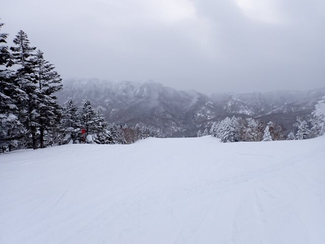
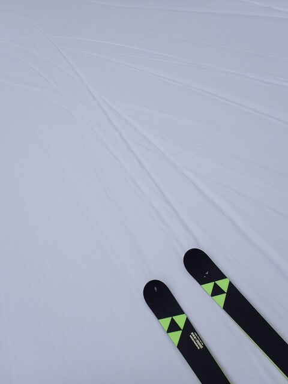
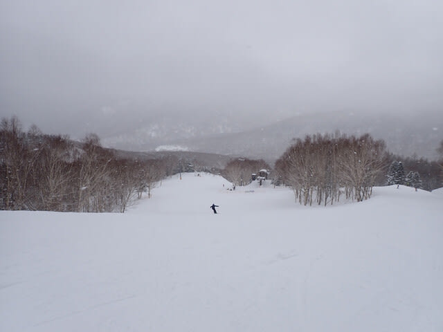
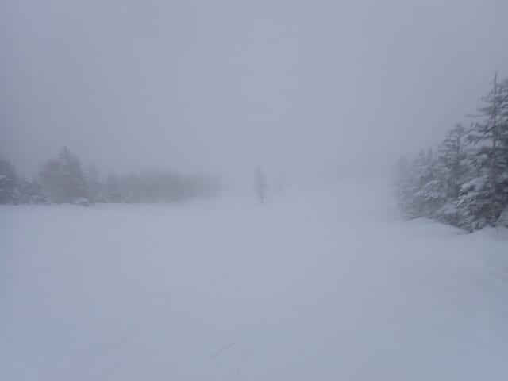
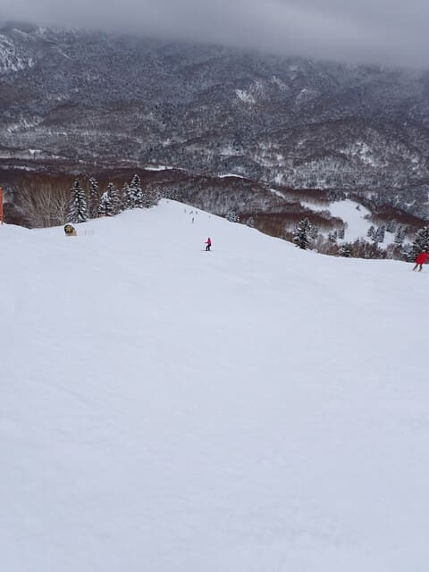
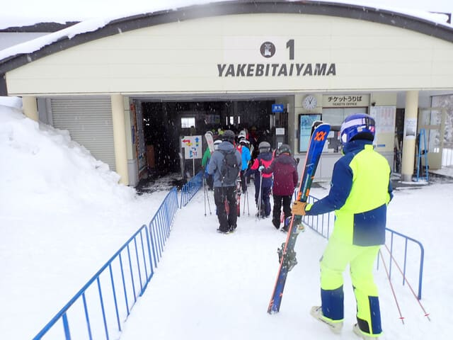
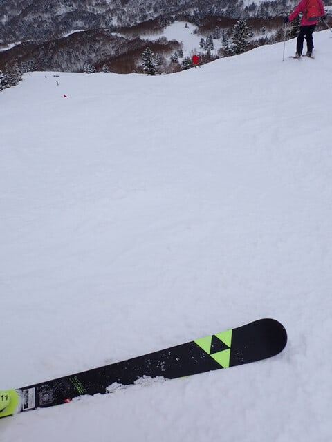

# 2025/2/2(日)の志賀高原焼額山スキー場，速報レポート！…パラパラ雪降り＆曇りの一日．雪は良かったし今日も混まなかったよ！

📅 投稿日時: 2025-02-03 02:16:07

🏷️ カテゴリ: [2025スキー滑走日記](cacd3fbf84d4a679ee61a5894c3f95e14.md)

ということで．

今日も洗車したりなんだりして

帰宅すると12時前…（泣）

それからまたバタバタやっていると，

もう深夜2時なんですが（涙）

昨日も3時間睡眠で家を出て，

夜はナイターが終わってから

中野の街中の宿まで降りて夕食

食べてなんだかんだやってると

寝るのは12時近く，睡眠時間は

6時間台（涙）

こんな状況で，明日ちゃんと起きて

仕事に行けるのか？？

乞うご期待！！←ラストまで滑らず，早く帰れば夜寝られるのに…

ってなことで．

今日はさすがに早く寝たいので，

帰宅日恒例の速報モードにて！！

まず．

本日は雪が降らない予想だったのが．

また予想を外して，ちょっと雪が

ぱらつく天気でのスタート．

朝に降ったので，圧雪バーンにも

1-2cmほど新雪が乗った感じだけど…

ほぼ圧雪を滑ってる感じで，

朝イチはいい感じでエッジが食い込む

気持ちいいバーンでしたよ～！！

ときおり雪がぱらつくことも

あったけど…

天気はおおむね終日曇り空．

そして，午後2時過ぎから1時間ほど，

結構ガスがかかってコースが見にくく

なったタイミングもあったりした

ものの．

ガスったタイミング以外は，

凸凹が見えないほどの曇り空では

なかったので，バーンの状況はしっかり

見えて滑りやすかったし．

ゴンドラの混雑具合も，午前10時半ごろから

11時ごろまでの間に，ゲートから出るか

どうか…というくらいまでしか混まず．

午後はゴンドラはほぼ待ち無しで

乗れたので．

今日もそんなに混まなかったよ！！

ってなことで．

今日も終日雪質も良く．

そんなに混まなかったし，

バーンもそこまでボコボコに

ならず，夕方まで大回りしたい

放題だったし…

いい一日でした～！！！

ってなことで．

今日も楽しい一日でした…

また明日，元気があれば詳細レポート

書きます！

…大体いつも，月曜は疲れて倒れたように

寝ちゃうから更新できないことが

多いけど

PS.明日月曜の志賀高原は終日曇り，

明後日火曜は曇り→雪って感じかな．

火曜は西風なので，志賀はそこまで

雪が積もらなさそうな気配…

水曜以降も数日間降り続けるので，

水曜以降に期待…！

## 💬 コメント一覧

### 💬 コメント by (Skier_Sファン⁈)
**タイトル**: Unknown
**投稿日**: 2025-02-03 06:47:13

昨日初めてゴンドラ乗り場近くでお声掛けさせていただいです。

緊張して何を話しているのかもわからず、うまく話せませんでしたが（笑）、お話し出来て嬉しかったです。

先週滑られてない中の、貴重な時間をいただきありがとうございました！

ステッカー家宝にします！！

これからも体調にお気をつけて、ブログ更新してください。

### 💬 コメント by (kbnt)
**タイトル**: Unknown
**投稿日**: 2025-02-03 11:40:01

はじめまして。いつもブログを楽しみにしております。

お陰で志賀高原に興味が湧き、熊の湯、渋横手で滑っているスノーサーファです。

志賀高原の宿についてご教示下さい。

オススメの宿はありますか？あまり教えたくないかもと思いながら、コメントさせていただきました。

ゲレンデ周辺、湯田中、中野市内など場所は問いません。

普段は道の駅で車泊していますが、やはり宿に宿泊は疲れも取れるし、次の日もいいコンディションで滑れるので。

### 💬 コメント by (レインボー77)
**タイトル**: Unknown
**投稿日**: 2025-02-03 18:30:53

月曜日の志賀高原情報

晴れて暖かい日。ニゴンスタート。白樺、唐松は裏切らない4点。

オリンピックは雪溜まりがあって私には今一つ3点。GSは人混みで3点。パノラマは快適5点。イーストはまずまず4点。

奥志賀ダウンヒルはニ壁がちょい荒れで3点。三高はやっぱり志賀一の雪質で5点。そのまま突っ込んだエキスパートは、私ごときには賞味期限切れで3点。

ダウンヒルからバスで高天原ホテル昼食。今日のメニューの選択は大失敗。西舘は標高も低いためか雪質がベッタリしていて3点。東舘から登った寺子屋はもはや足が売りきれていてがっかりの3点。ファミリーも足がふわふわ3点。ダイヤは短いので足が復活5点。最後のサウスは激荒れ2点。

今季２回目のレインボー(２時)まで頑張りました。足はヘロヘロです。人間、年相応に行動しましょうね。

### 💬 コメント by (モイストシルバー)
**タイトル**: Unknown
**投稿日**: 2025-02-03 20:56:36

土曜日は焼額、日曜日は奥志賀滑りました。

思ったより雪質も悪くなく、何といっても空いていてやはり志賀は最高でしたね！

昨日は、我が家にしては遅く、夕食食べてから帰ったので22時過ぎでしたが、何もできずバタンキューでした。この状態でクルマ洗ってブログ上げるなんて、どこまで体力があるのでしょうか。。。

### 💬 コメント by (Skier_S)
**タイトル**: コメント回答遅れてごめんなさい
**投稿日**: 2025-02-05 03:05:22

＞Skier_Sファンさま

日曜は声をかけていただきありがとうございました～！

私と会ったくらいでそこまで喜んでもらえるとは…こっちもうれしいです．

また志賀高原にお越しください～！！！

＞kbntさま

志賀高原の宿ですか…

余り教えたくないけど(笑)，ビワ池そばのアストリアさんがおススメです．

小さい宿ですが，この宿の食事が好きです．

ただ，ゲレンデから遠いのがちょっと惜しい．

ゲレンデに近いところだと，あとは一ノ瀬の一井ホテルを使うことが多かったですね…

ここも食事がビュッフェスタイルで種類が多いのがいい感じ．

あとは中野市街のルートインを使います…

＞レインボー77さま

久しぶりのレインボー，お疲れさまでした．

意外と気温が上がったみたいですが，平日なのにサウスはそんなに荒れてたんですね…

＞モイストシルバーさま

土曜は焼額だったんですか…！

しかし，日曜帰宅後は疲れますよね…

それでも洗車とBlogを書かねばならぬ辛さ．

それどころか仕事が残ってたら日曜帰宅後に仕事してます(笑)

