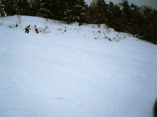

# 3連休最終日，3月21日の志賀高原

📅 投稿日時: 2011-03-21 23:28:55

えーっと．

3連休最終日．

月曜の志賀高原です…

営業リフトは昨日と変わらず．

普段の休日に営業しているリフトはすべて

通常営業してました

（ただし焼額は除く）←ちょっとしつこい

焼額は，今日も減速運転してましたが，

昨日のように，いつもの倍かかる，ってわけじゃなく，

2-3割増しの時間で済む程度でした…．

…さて．

昨日の夜から降り続いた雨は，明け方になっても

止む気配は無く，宿の屋根をたたく雨の音が

一晩中続いていたのですが…

朝．7時過ぎに雪に変わりました．

良かった，雪になったなぁ…

と，朝イチのゲレンデに出てみると．

これは雪か？雨か？

という，微妙な雪が，かなり激しく降ってます．

ウェアはあっという間にびしょびしょ．

雪質も，下地は雨を吸って透明になった雪の上に

重い新雪が乗った雪です．

ガスが出た上にゴーグルに雪がついて，前が見にくい…

気温は焼額山頂でマイナス2度だったので…

ふもとでは0度前後でしょう．

しかし．

10時ごろになると．

ちょっと気温が冷えてきたのか，ウェアについてすぐ

溶けるような雪ではなくなり，ちょっと雪質が改善て

きました．

さらに，降りも弱まり状況は改善．

視界も良くなり，ゲレンデの上に乗っている雪も改善して，

滑りやすくなってきたかな…

と思ったら．

重い雪が固まって，斜面が結構でこぼこになってきます．

下地の水を吸った透明な部分は冷えて固まってきました…

…ちと難しいコンディションだのぉ…．

午後は，雪は弱まり，さらに気温が冷えて降ってくる雪も

結構いい雪になってきたものの．

ゲレンデ状況が改善するってほどではなく．

結局，固めの下地の上に重い雪が溜まってでこぼこしているという

かなり手ごわいバーンコンディションの一日でした…

うーーん．

これからは，ゲレンデコンディションは悪化の一方か…

ちなみに．

帰路は．

信州中野のガソリンスタンドは，売り切れで閉まっている店もないし．

それどころか，列も給油量制限もなく．

普通に満タン給油できました．

さらに．

スーパーにも寄ってきましたが．

電池や水やトイレットペーパーが品切れになってるような

ことも無かったです…．

高速のガソリンスタンドは，東部湯の丸はやってましたが，

上里は営業しておらず，高坂は本線まであふれ出るような

給油待ち渋滞でした…

とりあえず．

この週末．

先週より，ちょっとだけお客さんが戻ってきた感がありました．

…といっても，ほとんどが関西・中京エリアナンバーの車．

リフト待ちが出るほど人はいないですけどね～．
