# 17日夜から18日にかけて，志賀高原は冷える！積もる！…志賀は19日には雪が弱まりそうだけど，日本海側は20日まで降り続けるよ！

📅 投稿日時: 2021-12-15 01:41:41

🏷️ カテゴリ: [スキー天気予想](c6554f5c3c106093b511a8daae23757e8.md)

本日も，おこみん特派員から志賀高原の

写真が送られてきましたが…

おこみん特派員，今日は奥志賀で

朝イチシマシマを楽しんでくるのかな？

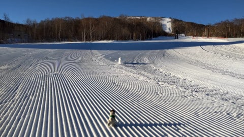

と思ったら．

本日，圧雪車故障で．

奥志賀のエキスパートコースは非圧雪

だったようですね…

でも，昨日積もった軽い雪が上に乗って，

下地はちょっと硬めだったものの

楽しめたようです！！

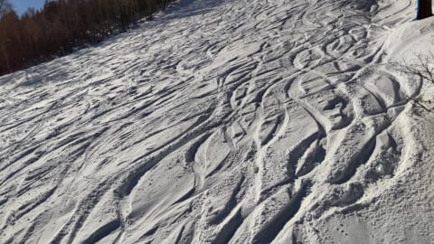

そして，奥志賀第エキスパートコース下の

緩斜面は…

うはーー！！シマシマっ！！

これは，ものすごく気持ちよさそうな

シマシマ！！

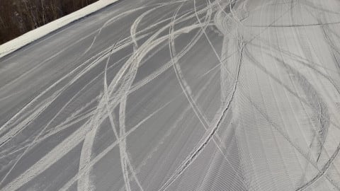

ここは人も少なく，柔らかいシマシマで．

すごい良かったみたいです…

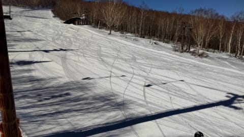

そして，天気は終日良かったみたいで…

うらやましい…！

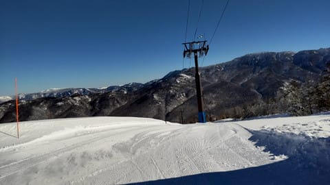

ってな感じの，ガラガラシマシマの

うらやましい写真が送られてきたけど．

ふはははは．

今週に限っては，平日に滑りに行けなくても

それほどうらやましくないのだ！！

今週末はパウダーなのだ！！！

15，16日の志賀には雪は降らず，

ゲレンデコンディションはこれ以上あまり

改善しなさそうだけど．

17日の午後から，どっさり雪が積もり始め，

まるで週末に合わせたかのように，

18日の土曜から激冷えパウダーが楽しめるのだ！

15日の水曜，0℃線は志賀の南にギリギリ

あるものの．それほど冷え込まないし…

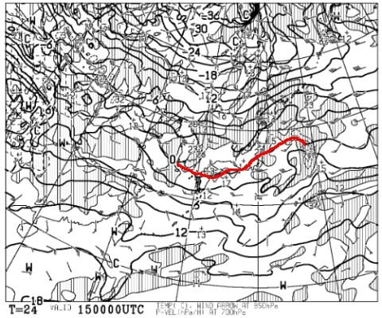

地上天気図は，等圧線が東西に延びる

西風パターンで，志賀は全く雪が

降らなさそう．

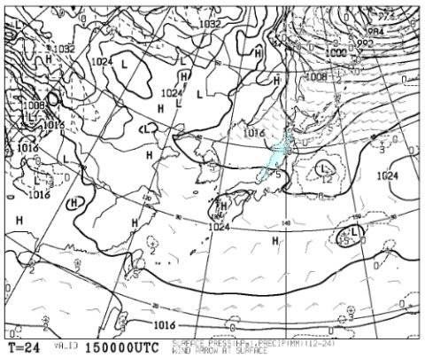

16日の木曜は，0℃線は志賀の北まで上がっちゃうし．

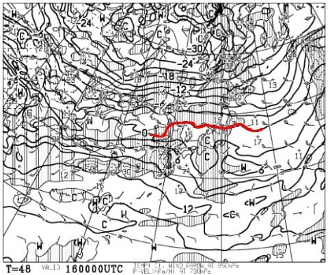

地上天気図だと，志賀は西風で晴れそうなので…

16日は，気温が上がって雪が緩みそう．

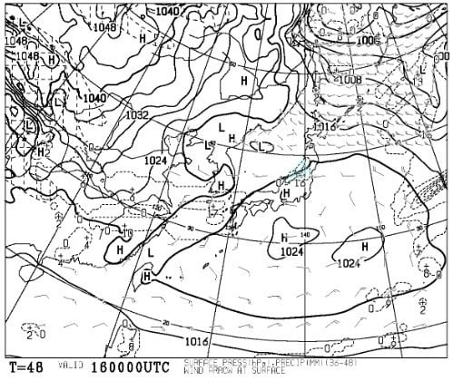

ということで．15，16日は全く雪が積もらず，

ゲレンデコンディションの改善は望めないけど…

けど．

だけど，

17日の夜9時の天気図は，すごいのだ！！

500hpa図を見ると…

ををを！

今シーズン初の，大雪になる目安，

赤く印した500hpaでの-30℃線．

こいつが東北から山陰にまで伸びていて…

さらには，ドカ雪になる目安の水色の

-36℃線が，北陸にかかっているのだ！

これは…降る．そして，積もる！

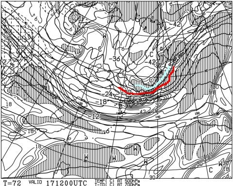

17日夜9時の850hpa図の方を見てみると．

赤い0℃線は沖縄近くまで下がってるし…

水色の-12℃線が北陸に近づいている

レベルです！！！

これは，冷えるっ！！！

これだけ冷えれば，降ってくる雪は，

冷え冷えの最高パウダーのはず！

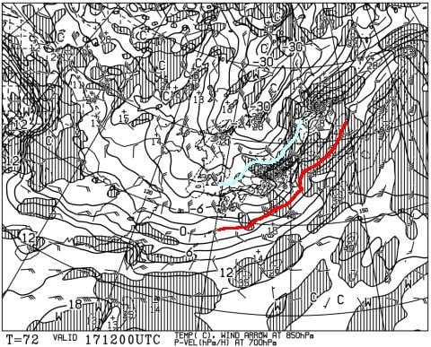

そして，地上天気図は…

見事に縦縞の冬型！！

北風が入るので，志賀高原にも降ります！

積もります！！

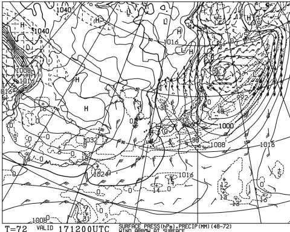

18日に入っても，850hpaの-9℃線が

志賀にかかるレベルで，昼間も志賀の

山頂では-10℃近い冷えをキープしそう…！

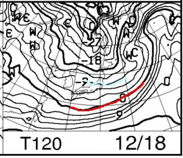

でも，地上天気図を見ると，

うーん．等圧線が北西-南東の右下がり

パターンなので，志賀は西風になり

雪が弱まってくるかも…

でも，降る．

18日は終日雪が降り続け，激寒なので．

根性の無いスキーヤーふるい落とし機能

がフルで働きそう．

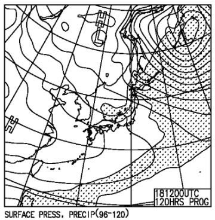

新雪が大好きな人はいいけど，

この日は終日寒くて雪が降る一日なので．

18日の土曜，新雪や吹雪で寒いのが苦手な人は，

やめた方がいいかも…

で．

そのあとは，19，20日も0℃線は日本の遥か南で，

冷えそうだし…

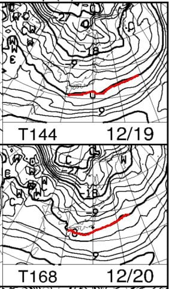

地上天気図は，日本海側に降水域の網掛けが

かかっていて，日本海側は雪が降りそうだけど．

等圧線が北西ー南東の西風パターンなので，

志賀ではあんまり積もらないかな．

白馬や新潟方面は19，20も積もるんじゃないかな？

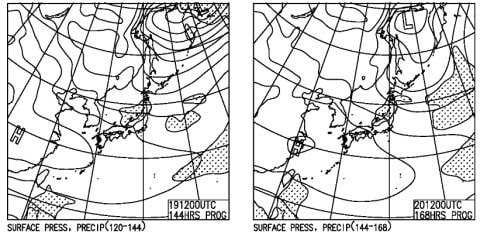

ってなことで．

まとめると…

15日(水)：終日晴れ．朝はマイナス．

　昼間もギリギリプラス程度で

　そこまで気温が上がらない．

　あさイチは締まったシマシマ，

　比較的いいコンディション．

16(木）：終日晴れ．朝はマイナスだけど，

　昼間は+3℃くらいまで気温が上がり，

　日差しもあって昼間は雪が緩む

17(金)：朝イチは曇り空．-2℃程度で

　それほど冷えてないが，グングン冷えて

　午後に雪が降り始め，だんだん

　激しくなり，夜は吹雪になっていく

18日(土)：激冷え．パウダーデー！！

　終日降り続ける．というか，激冷え吹雪．

　朝までの志賀高原の積雪はまだ読めない

　けど，30cm以上，膝パフくらいを期待…

　気温-10℃以下を覚悟．

　根性の無い人は滑れない天気

19日(日)：朝は-12℃程度？

　前日から10~20cm積雪かな？

　終日曇ったり雪が降ったり．

　時折日も射すかも．

　白馬，新潟方面は終日雪．積もる．

って感じでしょうか…

昨日も書きましたが．

17日夜中，かなり広い範囲で激しい

積雪になるので．

18日朝にかけて，高速道路も通行止めや

規制がかかる覚悟をした方がいいレベルです！

土曜にスキーに行く人は，移動時間は

マージンを見て計画しましょう…！

ってなことで．

パウダーが降りそうなのに興奮して．

いつもなら水曜にやる天気予想を火曜に

やってしまったけど．

この積雪で，焼額の第1ゴンドラが動いて

くれないかなぁ…（願望）

## 💬 コメント一覧

### 💬 コメント by (レインボー74)
**タイトル**: Unknown
**投稿日**: 2021-12-15 16:43:50

水曜日の志賀高原情報

朝の上林(海抜750m)0℃　 蓮池(1450m)-5℃。

晴れっぽい曇りで視界良好。焼額の圧雪はやっぱり最高です。

パノラマの壁をちょっかるも、安全確認で減速してからなので、さほど出ない。

３本目は上手なボードの人が何人もいて滑った気がせず、バスで奥志賀へ。

エキスパートは今日も非圧雪。仲間は勇んで飛び込んだけど、私は目指せ三高。そこは今季一番の気持ちよさ！

そしてゴンドラ休止中のダウンヒルへ。

仲間以外に踏みあとなし。しましまバス回しを三回もしてしまいました！

こんなことができるのも今週限り。早くあちこち自由に移動できる季節がきてほしいですよね。

### 💬 コメント by (なるなる)
**タイトル**: Unknown
**投稿日**: 2021-12-15 22:04:01

今週末、シーズン初滑りの志賀高原なんですが、いきなり、ふるい落されちゃいますかね

雪が無いとか液体が落ちてくるより良いと思って頑張りますかね

まぁ、行くと決めたら行くのですが、無事に辿り着けるか不安になっちゃいました

### 💬 コメント by (Skier_S)
**タイトル**: 17日午後から20日まで冷えるよ！
**投稿日**: 2021-12-16 02:13:03

＞レインボー74さま

奥志賀ダウンヒル，ゴンドラが動かないのに今日も圧雪かかってたみたいですね！

バスで3本も行っちゃいましたか．

それでも，バスは1時間1本くらいなので，3時間以上かかりますね…！

＞なるなるさま

お久しぶりです！

今週末からですか！いいタイミングですね…

吹雪＆パウダーなので，シーズン初日には厳しいかと…

道路も吹雪いて大変だと思うので，時間の余裕をもって出てきてください…

（志賀に着く前にふるい落とされたりして）

