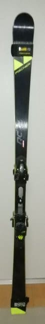
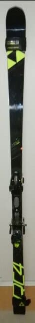

# 2022シーズンをともにするマテリアル…スキー板はこの6セット！

📅 投稿日時: 2021-12-22 02:43:47

えー．

今日も志賀高原は晴れて冷え冷えで．

結構いいコンディションだったように

見えますね…

一の瀬はモーグルバーンもオープンし，

全面滑走可能になってるし．

本日オープンした焼額のオリンピックコースも，

あさイチは見事なシマシマ！

…シーズン初日で，まだ圧雪やり初めだからか，

ちょっとところどころ均しきれてない

凸凹もあったようですが…

でも，晴れてて冷えてて気持ちよさそう！

…果たして．

このいいコンディションはしばらく続くのかな…？

と，水曜と木曜の志賀高原の天気を見てみると．

22日の水曜は午前中はかなり冷えて

雪が降りそうで，朝は10cmほど新雪が

乗ってるかな？

午後に雪は弱まっていきそう…

23日は終日曇り～晴れ．積雪はなさそうです．

22日も冷え冷えの良い雪がゲレンデを

覆うだろうし．

23日の朝はシマシマ最高圧雪で，太陽も

顔を出しそうだし…

ここ数日，ゲレンデコンディションは

良さそうです！

で．

週末は…

25日の雪の降り始めは遅く．

むしろ26日の朝の方がパウダー狙いかも？

…とりあえず，明日，水曜恒例の週末の

天気予想やりますので，週末の詳しい天気の

予想は明日までお待ちを…！！

ってなことで，本題へ．

2022シーズンも無事始まって，

そろそろ2か月がたとうとしている

わけですが．

[昨シーズン死に絶えていったマテリアル](e552cb5a8079a289192ae2a5036c9b279.md)も

いろいろあったわけだけども．

昨シーズン終わりに，[史上最大規模の負けを
喫した物欲選手権](ed9f378aafcc4eb8620e941a8c06dd4a7.md)で新たにGetしたマテリアル

たちと共に，2022シーズンを過ごします…！

ってなことで，今回は，

2022シーズンを共に過ごす相棒たちを

紹介してみましょう…！

1．'17 ATOMIC Bluester SX 165cm

こいつは，[昨シーズンに利用わずか40日ちょいで剝離してしまった](e00384be212f646ebb76a332e7f1d9142.md)

根性無しの板だったので．

今シーズンはシーズンイン・終了時の

雪の悪い時用の板として，最後の活躍を

してもらいます…

 2． '18 SALOMON X-race GS Master 182cm

おそらくシーズン途中で死ぬ…というか，

もう死にかけている大回り用なので．

こいつもまだ雪が少ないコンディションが

良くない時の大回り用として活用予定．

3.  '21 FISCHER RC4 SC 165cm

こいつが小回り用メイン機になりますね．

この板は，昨シーズンスタート前に

購入したものの，コロナのせいで

昨シーズンは滑走日数が少なく，予想外に

SXの四朗君で昨シーズンは滑り切って

しまったので．

ほぼ今シーズンデビューと言っていい

板ですね…

4. '20 FISCHER RC4 RC 180cm

大回り用メイン機．

GWの物欲選手権に敗れ買ってしまった，

今シーズンデビューの板です！！

SALOMON X-raceがもう3シーズン滑って

ヘタリかけているので，こいつが

今シーズンはメインの大回り板になります．

5. '19 FISCHER Worldcup GS Master 189cm

朝イチ焼額用，ハイスピード自由落下用マシン．

こいつもGWの物欲選手権に敗れ買ってしまった，

今シーズンデビューの板．

189cmって…カービング板を履くようになって

から購入した板では，最も長い板ですね…

殺人ハイスピードマシンです．

まさか，自分がR=27の板なんて履くように

なるとは思ってなかった…

6.  '16 LINE Sir Francis Bacon

パウダー用太板．

こいつは四朗君と同時，2018シーズンに

買った板ですが…

なぜかこの板を買ってから，パウダーに

なることが少なく．

昨シーズンは2回，その前のシーズンも

数回しか履いてないので，全然ヘタって

おらず，5シーズン目の今シーズンも

バリバリ現役で働いてもらいます…

…ってか．

今シーズンこそ，太板の出番がガンガン

あるようなパウダー天国になってほしい…

ってな感じで．

今シーズンは，型落ちで半額でGetした

4，5の2台の大回りマシンが追加され．

この6台体制で臨みます！

…って書くと．

6台ってすごいな…と思いますが．

実際，1，と2，はもうヘタって死にかけてる

ので，実質は4台体制です…

太板，小回り，大回り，朝イチ用マシンの

4台の使い分けです．

しかし，私はATOMICを履いている

イメージが強いと思いますが．

今シーズンは，メインマシン3台が

FISCHERになっちゃいました…

…いや．違う．

FISCHERの板を2セット並べて置いておいたら，

ATOMICの時みたいに，

[勝手に繫殖しちゃった](e8a53c5e38b2ebcf1a084dc391aaad69d.md)んだったかな…？←そんなわきゃない

## 💬 コメント一覧

### 💬 コメント by (毎日読者K)
**タイトル**: Unknown
**投稿日**: 2021-12-22 04:29:37

いつも楽しく拝見しております。

今シーズンもご無体の中、恵まれたコンディション楽しんでおられるようで無理はなさらないでくださいね。

コメント2回目です。

今回もマテリアルについて質問です( ・ω・)

1～6のそれぞれのRをお教えいただけませんか。

### 💬 コメント by (大阪のK)
**タイトル**: Unknown
**投稿日**: 2021-12-22 05:44:11

板、ブーツ、ウェア、ヘルメット、今シーズンは大幅に変更されましたね。

私たちも早く見慣れなきゃいけないです。

### 💬 コメント by (アリス)
**タイトル**: Unknown
**投稿日**: 2021-12-22 14:45:45

Ｓ様

こんにちは☺

志賀高原滞在は、23日までで次は年始1日からとなります🎵

今日も朝イチのGSコースは至福の一時でした☺

またオープンした寺子屋も極上です🙆

Ｓさんの本日の天気予報はピタリ賞です☀

圧雪の上に新雪がうっすら❗

ラデイウス27mって、どんな弧を描くんでしょう😅

ほぼ直線に近いかなって想像力しちゃいます🎵

### 💬 コメント by (レインボー74)
**タイトル**: Unknown
**投稿日**: 2021-12-22 15:53:30

水曜日の志賀高原情報

湯田中では朝になって小雪がぱらつきだしました。上林0℃　蓮池-5℃。

朝はいつものようにパノラマから唐松へ。硬い上に新雪がふんわり乗って、と～っても滑りやすい。GSも然り。しばらく遊んでからファミリーへ行くと、あれっ！しばらくぶりに圧雪してある。

しかしそれにしても寒い。

高天の銀嶺ざるそばのあと、西たてへ。

昨日の第一快適バーンは今日はガタガタ硬め。

目的の今日から始動のブナゴンドラ。だめだ！期待はずれ。枝にあたるからなのか、板を持ち込まなくてはならない。リフトの方がはるかに効率がいい。夏のお客様のためなのかなあ。

本日の失敗は、このあと寺子屋オープンに引き付けられてしまったこと。

ガスって視界悪、極寒、強風、重い雪の四重苦。アリスさんは快適だったとか。私たちは午後だったからかな？

風で吹きだまった雪は細かくて湿ってもいないのに、密度が高いからなのか、重い。

寒すぎるので、目指すはヤケビのゴンドラ。やれやれ、やっぱりヤケビだ。楽だし、荒れてもいない。

帰りの高天の温度計が-8℃と、朝よりも寒い。湯田中の温泉が至福でした。

### 💬 コメント by (レインボー74)
**タイトル**: Unknown
**投稿日**: 2021-12-22 20:18:06

エス様、なんという意思の強さ、感服いたします。欲しいものには全く我慢する制御が効かないんですね。最低です。でも、最高です。

今日はエキップさんの後ろを滑らせていただいて、スイッチオンになるときの傾きやらリズムを、学ばせていただきました。しばらくはそのイメージで、毎日が過ごせそうです。やっぱり本物は凄い！

### 💬 コメント by (Skier_S)
**タイトル**: 今週末もパウダー！
**投稿日**: 2021-12-23 00:54:00

＞毎日読者Kさま

毎日読んでいただきありがとうございます…

それぞれの板のRは，

ATOMICのSX：11m

SALOMON X-race Master: 17m

FISCHER RC4 SC: 13m

FISCHER RC4 RC: 18m

FISCHER WC GS Master: 27m

LINE太板：不明

です．

＞大阪のKさま

簡単に見つけられないように，いろんな格好をしているんです(笑)．

今シーズン，いろんな格好をしてゲレンデに現れると思います…

＞アリスさま

天気予想当たったようで，ホッとしてます…

23日まで滞在ですか！

明日もいい天気＆コンディションだと思うので，楽しんでください！

で，R=27の板ですが，思ったより曲がります…

スピードをすごい出してやると，びっくりするくらい良く曲がります．

最近のGS板は良くできてる…

＞レインボー74さま

やっぱりヤケビですよね～…

そして，私はいつも物欲に負けない強い意志をもって，物欲選手権に

臨んでいるのですが…

