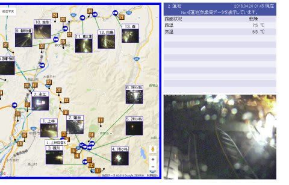
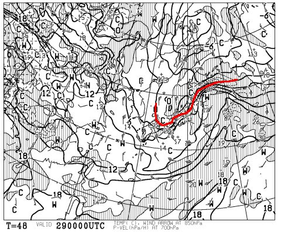
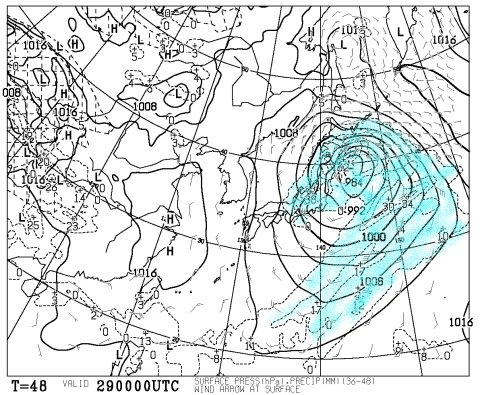
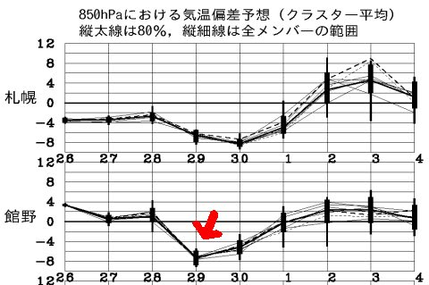
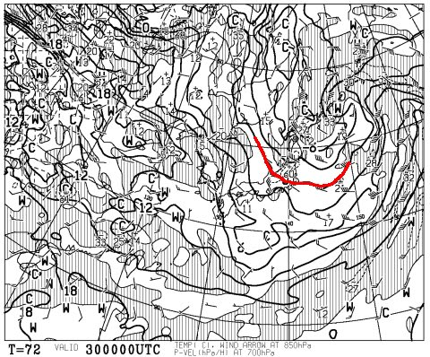
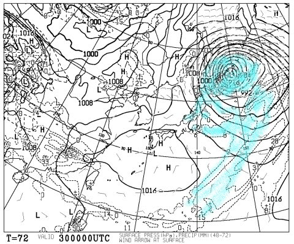
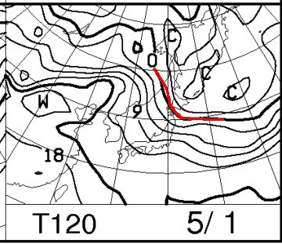
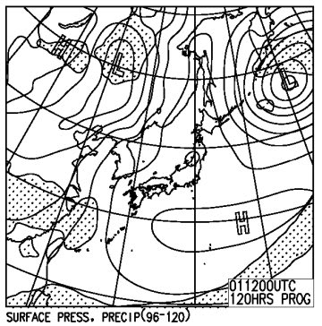

# GW前半3連休のスキー場の天気は？…29日は終日雪？？極端な天気なんですけど…

📅 投稿日時: 2016-04-28 02:36:05

🏷️ カテゴリ: [スキー天気予想](c6554f5c3c106093b511a8daae23757e8.md)

どうやら．

根性で営業していた一の瀬ファミリースキー場が．

本日をもって，営業終了となったようですね…

っていうか．

横手も奥志賀も終わってしまった後まで

営業し続けた根性はすばらしいものがありますね…

しかし．

平日運休となった高天ヶ原．

29日から営業再開と言ってますが…

ホントに営業できるのかな？？？

短いトリプルリフト側に雪を付け始めたようなので．

山頂からの営業は諦めた気がしますが．

でも，下半分も大丈夫なのかな？

で．

現在．

予想通り，志賀高原でも雨が…（涙）

この雨は，28日一日中降り続けます．

…ええ．降り続けますよ．丸一日．

28日は，Full day，降るdayです…（泣）←終わってる．こんなオヤジギャグ言うようになったら終わりだ

そして…

この雨は．

28日の夜更け過ぎに，雪へと変わるだろう…

って感じで．

まぁ，雪になるタイミング．

厳密には，志賀高原のように標高が高いところでは29日の明け方．

かぐらとかは，もう少し後かな…

とりあえず．

詳細な天気図を見てみると…

29日，金曜の朝9時の850hpa気温図は，

こんな感じで，0℃線は志賀やかぐらにかかってますよ～！

そして…地上天気図は，見事な冬型で．

強烈に発達した低気圧に北風が吹き込んで，

日本海側には降水域が予想されているので…

29日は雪になります．

そうです．雪ですっ！

…でも．

この時期の雪って…かなり重いので，中途半端に積もると

抵抗になって，スピードが出なくて滑りにくくなることも…

うーむ．

ゲレンデ状況が回復するほど積もる雪じゃないし，

道路は雪道になるし．

降ってくれて嬉しいのかどうか，微妙な感じ…

スキー場までの道路は，スタッドレスが必要になるか

もしれないので，ご注意をっ！！

しかし．

この29日だけ，平年比-7℃って…

極端すぎませんかね？

なんだか，今シーズンは．

基本的に気温は高めだったけど．

時々こんな感じで，一瞬異常低温に陥るパターンが多い気が…

で．

翌30日，土曜の朝9時の850hpa気温を見てみると．

うむ．0℃線は相変わらず志賀やかぐらより南側．

そして，降水域は相変わらず日本海側にかかっているので…

土曜の朝まで，チラチラと雪は降り続けますね．

でも，朝のうちに雪は止んで，

気温も徐々に上がっていくかな～．

そして，3連休最終日．

日曜の850hpa気温図は…

ああ．

もう，これまで通りですね．

平年並みの，+6℃線が志賀やかぐらより北に上がってます．

で，この日の地上天気図は…

高気圧に覆われてるので，晴れそうです．

うーむ．

だもんで．

晴れて気温が高くなる，まぁ典型的春スキーの

感じ…

ってことで．

まとめると．

29日(金)：夜明けごろまでぽつぽつ雨．朝に雪に変わり，終日雪がチラチラ舞う．

　朝の道路は凍結，うっすら積雪の可能性があるので…スタッドレスがないと

　厳しい状態かも？

　気温は終日マイナスをキープ．寒いよ！しっかり防寒していきましょう．

　ゲレンデは，固い凍結バーンの上にうっすら重い雪が乗る感じ．

　積雪が多いと，雪が重くて滑りにくいかも…

　昼間も雪が緩まず，しっかり雪が踏まれればコンディションは

　良くなっていくかな．

　ただ，下地が固くなるので急斜面やコブはつらいかも．

30日(土)：明け方まで雪がちらつく．天気は終日曇り空．

　午後は太陽も顔を出し始めるかな？

　この日も，朝はマイナス気温のため路面凍結の可能性大．

　朝のうちは，ノーマルタイヤでは厳しいかも…

　朝は気温が冷えてゲレンデはガッツリ硬い．

　昼間に向けて雪が緩み，午後は気温が上がって

　時折日も射すようになり，残念ながら緩んだ雪になっていく．

1日（日）：朝から晴れ．朝イチは放射冷却でゲレンデは多少締まるか

　もしれないけど…気温は平年並みに戻るので，あっという間に

　緩み始める．その後は典型的なザブザブ春スキーの雪に．

　天気は終日雲が多めかもしれないけど，晴れ．

という感じでしょうか…

まだ，29日の雪の降りはじめタイミングや1日の天気（晴れか曇りか）

の正確な予想ができてないので，毎日の記事の中で，

適宜予想の修正をしていきます．

しかし，夏タイヤに替えてしまった人は，29日

凍結路面で厳しいかも…

どうせ降るなら中途半端に降らず，どっさり1mほど

積もってほしいものだな！！←そんなこと起きたら，すでに異常気象ではなく天変地異レベルだな

## 💬 コメント一覧

### 💬 コメント by (山さん)
**タイトル**: 予定どうりで行きます。
**投稿日**: 2016-04-28 05:55:02

何時もの天気予報ご苦労様です。29日30日で志賀高原に行きます。まだスタッドレスタイヤなので安心して行けます。Sさんは最後の親子スキーになりますか。熊ノ湯で会いましょう。

### 💬 コメント by (Skier_S)
**タイトル**: 山さんへ
**投稿日**: 2016-04-29 02:14:26

今日は帰宅が深夜1時を過ぎたので，

29日にスキーに行くのは諦め，

30日日帰りにしました…

娘は「こんなゲレンデなら滑らなくていい」

ということなので…

私一人で日帰り予定です．

ということで，30日にお会いしましょう！

### 💬 コメント by (山さん)
**タイトル**: 熊ノ湯
**投稿日**: 2016-04-29 20:32:23

熊ノ湯のですが、予想どうりで雨を含んだ雪が凍りスケート場の様でした。真冬に戻ったようで、北風が吹いているにもかかわらずガスも晴れず大変な一日でした。一日ただ同じリフトに乗るだけで飽きてきたので、午後は、アスペンの試乗会に参加しました。申し込みも身分証明も要らないとのことで、アトミックのSXとLX、ホルクルのSWとCDの4本に乗りました。先週よりは、確実に良かったです。明日も、試乗会があります。

### 💬 コメント by (Skier_S)
**タイトル**: 山さんへ
**投稿日**: 2016-04-29 22:21:02

やはり，予想通りでしたね…

さらにガスっていたなんて，かなり

コンディションは悪かったのでしょうか…

試乗会やっているなら，明日楽しみに行きます！

一人で行く予定です…

草津越えは，積雪通行止めになってないのでしょうか…？？

