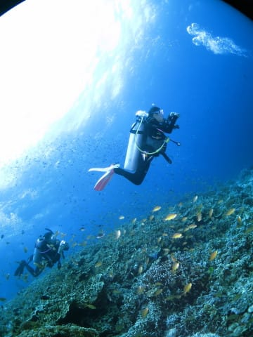
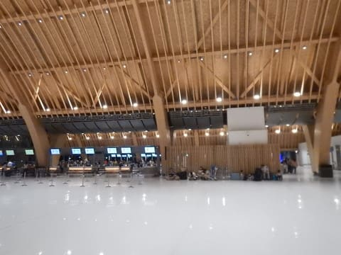
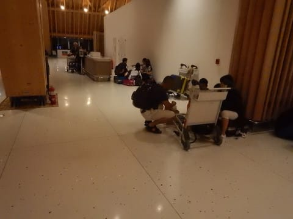

# 本日モアルボアルから帰るけど…なんという不運！こんな日にドンピシャ当たるとは（涙）

📅 投稿日時: 2018-08-05 06:35:06

ということで．早いことにモアルボアル滞在の

3日間が終わり．

娘も無事，海洋実習が終了．

Cカードを取得しました～！

そして，念願の家族3人そろっての

ファンダイブを経験し．

本日帰国するわけですが…

なんとも運の悪いことに，本日セブ島で

トライアスロン大会が開催されるということで．

到着した日に，ダイビングショップで衝撃の

事実を知らされたのでした…

「帰国日はトライアスロン大会があって，

朝4時から市街地の道路が閉鎖されるので，

空港への送迎は空港朝4時着になります」

…って．

え？

ええええ！？？

うちの飛行機，午後3時発なんですけど！？？

それまで11時間，空港で過ごせってことですか？？？

…ってことで．

今，セブ国際空港の床に座って時間を過ごして

います…（涙）

同じように，空港で時間を過ごさねばならぬ難民が

そこかしこで床に座って途方に暮れてます…

セブ空港，チェックインエリアには，ショップとか何かの

時間がつぶせるところは全くありません…

チェックインしないと，何もないのですが．

チェックインできるのは，搭乗2時間前から．

あと8時間，床に座って過ごさねばならない

ようです…（泣）

いつもはフィリピン航空で，朝9時の

飛行機で．

空港まで3時間くらいかかるので，朝3時半

ごろにホテルを出ねばならず，大変だったけど．

今回は午後3時発の飛行機だから，朝ゆっくり寝て．

ホテルで朝ご飯を食べてから，のんびり空港に

いけるから，楽でいいなぁ…

と思っていたのに．

なぜ，深夜1時にたたき起こされて空港に連れていかれた上に．

空港で11時間床に座って待つ

という目に合わねばならぬのか…

年に一回の，セブのトライアスロン大会の日に

ぴったり帰国日が当たってしまったという，

この不運（涙）

ジンベエに当たって，

「自分は運が強いなぁ…」

と思っていましたけど．

…私はいろんな意味で引きの強い人間のようです…（泣）

しかし．

国際空港のあるマクタン島の主要道路が全部

閉鎖って．

もう少しうまいやり方があるんじゃないかなぁ…

…あと10時間．

どうやって過ごそうかな…（激涙）

## 💬 コメント一覧

### 💬 コメント by (yama)
**タイトル**: 夏休み
**投稿日**: 2018-08-05 07:54:39

タイミングが悪かったですね。こちらの夏休みは１０日からです。台風の影響が心配です。空港なので熱中症の心配はないとしてもなにもできないのも困りますね。気をつけて帰ってください。

### 💬 コメント by (yumi)
**タイトル**: すっごぉ～い💧💧💧
**投稿日**: 2018-08-05 22:03:31

Ｓさぁ～ん✈️✈️✈️

大変でしたね。

まさに、絵に書いたような｢天秤の法則｣でしたね。

また、良いことがありますよ。🏝️🏖️🎆

### 💬 コメント by (Skier_S)
**タイトル**: 無事帰国しました…
**投稿日**: 2018-08-06 02:05:12

＞yamaさま

年に一度のあたりを引いてしまいました…

家族3人，6時間以上空港の床に座って

過ごしました…

とりあえず，無事戻ってきました．

また詳細はあとでレポートします～！

…このモアルボアル旅行記が執筆できるのは，

来年になりそうですが…（笑）

＞yumiさま

いやーー．

この引きの強さ．

私はいろいろ持ってる人間のようです（笑）

とりあえず，何とか無事帰国できました…

さらに飛行機が遅れたり何だり．

疲れました…

明日仕事に行けるのかなぁ（心配）

