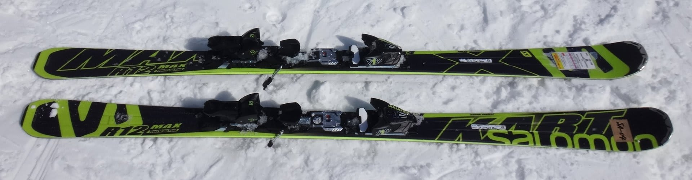
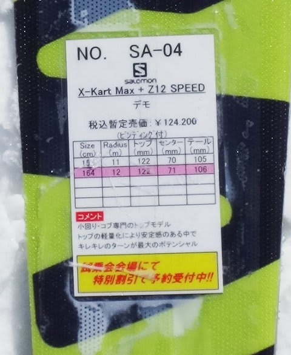

# まだ続いてるよ！2015シーズンモデルのスキー試乗レポート16…SALOMON編その3

📅 投稿日時: 2014-05-02 22:03:44

えー．

明日からGW4連休ということで．

ラスト志賀高原に，4日間こもりに行くSkier_Sです．

で．4連休の天気．

おおむね昨日の天気予想通りで．

明日，初日は天気良さそうだけど．

でも，夕方一瞬崩れるかも…

2日目は曇り～晴れって感じ．

で．

3日目の5日は曇りで，雨が降らずにすみだけど．

…南風が強くなるので，雪は解けちゃうし，

ゴンドラは減速運転かな～．

6日は，やっぱり今のところ雨になりそうな予感…

って感じで．

4連休初日で道路が混みそうなため．

早めに出発予定ということで．

あと4時間後に出発です．

だけど．

GW前半のレポートでしばらく中断していた試乗レポート．

まだまだ続きます．

今回は，SALOMON編その3です．

今日は時間がないので1種類だけ…

どうぞ～

----

SALOMON X-Kart Max 164cm

基礎小回り用．

この板も．

テールが効いて回ってくる板ですね～．

トップを押さえてもトップは全く仕事をしない感じ．

くるぶしよりテールよりを抑えると，トップが浮き

上がってくるような感じで，

ありえないくらいくるくる回ります．

切り替わった後も，トップを押さえてもだめで．

しばらく谷回りで落ちていった後，テールがグリップしてから

回りだすという，不思議な感じ．

ブーツから板のトップ側が無くて，テールだけで

滑ってるような，独特な印象を受けます．

板のテールを押さえやすい，ATOMICブーツとは

相性悪くないかも，って気がしますが…．

とりあえず，ブーツセンターよりテール寄りに

乗っていると，完全オートマチックに

クルクル小回りで回ってくれるのですが．

…でも．

自分の行きたい方向より，ちょっと板の行きたいように

回されてしまう感じ…

これは．たぶん．

この試乗板も，以前SALMONの方からコメントを

頂いたように，ちょいとエッジの仕上げに気合いが

入りすぎていたみたいで．

もう少しエッジをダリングすると，もう少しコントロール性が

上がるのかな～．
