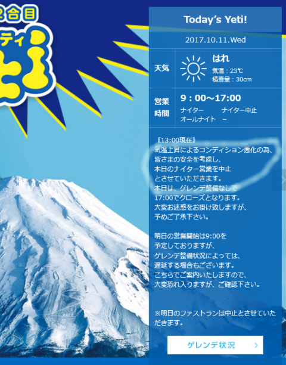
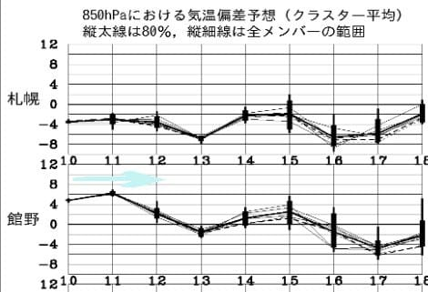
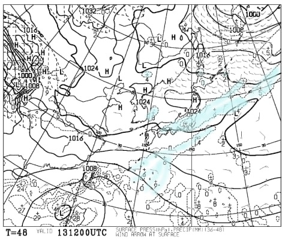
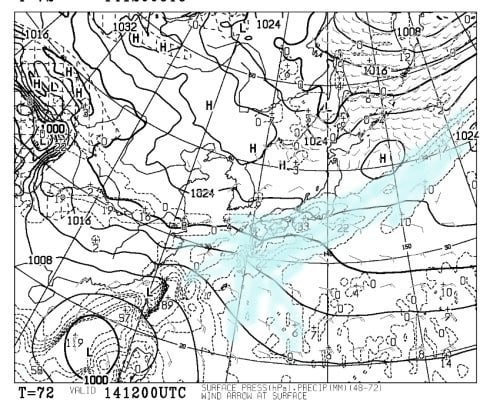
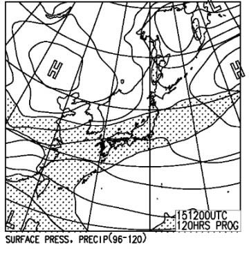

# 今シーズン初のスキー天気予想！今週末，10月14，15日のYetiは…土日とも雨だな（涙）

📅 投稿日時: 2017-10-12 02:42:35

ということで．

かなり高温だったこの3連休で，

イエティの雪もかなり減ってしまったわけですが…

そのせいで．

なんと．

昨日から，ナイター営業を中止しているようですね…（涙）

（[スノータウンイエティ](http://www.yeti-resort.com/)ホームページより）

さらに，シーズン券所有者が30分前から滑れる，

ファストランも中止になっているようで…

うーむ．

水色の矢印で示すように，

今日，11日まではちょいと気温が高かったので，

やむなしといった感じですが．

12日以降は，まぁ平年並みまで気温が

下がるので．

大丈夫かな…

…

…

と，思いたいところなのだが．

13日の金曜日の地上天気図を見ると…

あう？？

水色の降水域が，静岡近辺を覆っているので…

金曜は雨，ですね．

そして，14日．

肝心な土曜日の地上天気図ですが…

…これは，ダメダメだ…（涙）

水色の降水域，見事に太平洋側にかかっています（泣）．

…この天気図では分かりにくいけど，見事に

秋雨前線が太平洋側に停滞するので．

…これはおそらく．

土曜は終日，しとしとと降り続けますね…（涙）．

この日滑りに行く方は，びしょ濡れになることを

覚悟で行きましょう．

で．

15日の日曜日ですが…

この日の地上天気図も，降水が予想される

網掛け部分．

見事に本州を覆っているので…

ダメです．

日曜も，雨です．

これも終日降り続きそう…（泣）．

なんということだ…

ということで．

まとめると．

土曜：朝からしとしと雨．時折パラパラと強くなる．

　気温は平年なみ．Yetiで10℃前後かな？雨が降って

　るので，気温より寒く感じるかな．

　雪は，雨で解けていき，昼ごろにはかなり危険な

　コンディションになるかも…

日曜：この日も朝からしとしと雨．終日雨．

　時折やむタイミングもあるか…

　気温は平年並み．

　この日も，雨で雪が解けて…

　ヤバいでしょう．

　

って感じで．

うーーーーん．ダメだ．

ダメだっ！！

3連休の高温でかなり雪が減りましたが．

今週半ばから気温が平年並みまで落ちるから，

何とかなるか…

と思ったら．

今度は雨．

今週も，雪がかなりやられちゃいそうです（激涙）

ヘタすると，リフト乗り場・降り場の雪は

キープしきれず，板を脱いでの乗り降りか，

Pislab上を滑る形になるかも…

間違っても，

「雪不足のため一旦クローズ」

とならないことを祈るばかり…

うーーーーん．

やっぱりちょっと，オープンが早すぎたのかな？？

とりあえず．

今のところ，17日以降は冷え込みそうなので…

そこに期待っ！！！

## 💬 コメント一覧

### 💬 コメント by (ほっぽ)
**タイトル**: ナイター中止
**投稿日**: 2017-10-12 07:50:35

一昨日も昨日もナイターに行く気マンマンどしたが、まさかの営業中止。

13日も行ける予定ですが雨降りだと営業しない可能性が高いですね。(>_<)

史上最速のオープンはやはりムリがあったのかと思います。。。

### 💬 コメント by (Skier_S)
**タイトル**: ほっぽさま
**投稿日**: 2017-10-12 11:22:24

ナイター中止，残念でしたね…

やっぱりちょっとオープンが早すぎたのか，

3連休があったかすぎたのか…

14，15日の週末，雪がもつか心配してます．

この2日とも雨っぽいので，もしかすると

日曜あたりもう雪がダメになり，

昼間も営業短縮または中止にならないか

心配です．

来週は冷えそうですが…

### 💬 コメント by (ほっぽ)
**タイトル**: 茶水
**投稿日**: 2017-10-12 18:55:14

Sさん

イエティの今週末、私も心配しています。

週末の雨で破壊的ダメージを受けてしまうのではないかと。

来週寒くなるようなのでそれに期待するしかありませんね。

ところで、今日営業活動中に茶水見学してきました。

ストーンなお店の16SXは既に160cmが一本しか残ってませんでした。

X12VAR付きで半額です。

一方、16のSLpro、通称皆川賢太郎モデルは165cmが数本あり、X12VAR付きで半額以下でした。

確か、konsuke様が履いている板です。

17SXは在庫沢山ありましたが、35％オフとまだまだお高い感じでした。

### 💬 コメント by (Skier_S)
**タイトル**: ほっぽさま
**投稿日**: 2017-10-13 00:53:57

いや～．

今週末どころか，12日から営業中止とは！

Facebookの写真を見ると，今週末も営業は

厳しいとみておいた方がよさそうです…

まだ17SXはいっぱい残ってるのですね！

うーむ．

でも，35%オフは，まだ高いです（涙）．

石井スポーツはビンディング抜きで

売ってくれないので，高くなるんですよね…

私は，ビンディングは要らないので

安くしてほしいのですが…

