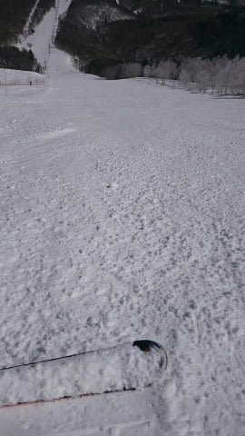

# 2021/3/15(月)の志賀高原スキー場は…朝のうち雪が降ったけど，晴天でそこそこ冷えたいい一日！

📅 投稿日時: 2021-03-16 01:35:24

えー．

今日も机に突っ伏して寝てしまい．

「寝てしまった…」

という更新になりかねないギリギリだったのですが．

なんとか起きて更新！

…でも，夜ごはん食べる時間が無くておなか減った…

17時から休み無し4件Web会議が続き，

終わるのが23時過ぎってのはどうかと思う…（涙）

ってなことで．

いろいろ切羽詰まっているので．

明日以降，しばらくこのBlogの更新が無くても

「あぁ…大変なんだなぁ…」

と，暖かく見守ってやってください．

…その場合も，コメント欄の特派員レポートが

志賀高原の詳細情報を伝えてくれるはず…！

すみません．ホントにギリギリです

という感じなので．

2022年モデルのスキー板の試乗もしたところなので，

試乗レポートを書きたいところですが．

試乗レポートを書いている暇もなく…

本日も，志賀高原の特派員レポートです！

えー．

まず．

あさイチは-6℃と冷え冷え！

積雪は0と思ったところ…

朝は雪が降り，1-2cmほど積もって

いたようです！

ってなことで．

15日の月曜は，雪降りで始まった

ようですが…

リフト営業開始の頃には雪も止んで，

雲も減り始め…

9時には予想通り，すっきり晴れに

なったようです！！

ただ，晴れたものの．

GSコースやオリンピックコースは，

シマシマが崩れると，全面殺人コロコロバーンに

なったようで．

ちょっと快感度は低かったみたいですが…

奥志賀エキスパートコースも，

一見フラットできれいに見えますが．

実体はコロコロバーンだったようです…

ただ，コロコロも午前10時ごろには

緩んでいき，滑りやすくなったようです！

しかし，今日は天気も良く．

おこみんも気持ちよさそうにゴンドラに

乗ってますね…！！

…焼額のゴンドラは，そこそこ人が

いたみたいですが．

でも，バーン自体は人も少なく．

パノラマコースはちょっと雪が

緩んだらしいけど．

午前中には朝のコロコロもつぶれて，

滑りやすくいい感じだったようです…！

そして．

残念ながら本日も焼額第2高速は直らず，

運休．一の瀬からはバス移動だったんですが…

そのおかげで，唐松コースは一の瀬へ

滑りこむ人のみ立ち入り可能な，限定

コースになり．

午後までシマシマが残っていたようです！

一の瀬方面は硬めの下地の上にうっすらと

柔らかい雪が乗った感じで，全体的に

滑りやすかったようで…

一の瀬ファミリーは午後になっても下地は

硬く滑りやすかったみたいですね～．

ただその代り，下半分の緩斜面は

午後になってもコロコロバーンだったようですが．

高天ヶ原も午後まで雪が緩まず，

晴天なのにいいバーンコンディションの

一日だったようです…

ってなことで．

すっきり晴天なのに，そこそこ冷え込んで

いい感じの一日という，ほぼ昨日の

私の予想通りの一日だったようですが．

16日(火)は，雲が多く．

夕方から風が強まり，雪になるかな…

降り始めは雨っぽい湿った雪かもしれませんが，

まぁ完全な雨になる可能性は低そう．

で．

20，21日の週末ですが…

昨日の予想より，トラフの位相（≒低気圧の移動）

が遅れる予想になり．

もしかすると，土曜は降らずに，日曜が

液体襲撃デーになるかも…

…いや．分からない．

まだ，分からない…

これからみんなで，祈って踊れば何とか

なるかもしれません！！

…が．今週末にスキーの夢を見れるか

どうかわからない私は．

「まぁ，槍が降ってもいいかな…」

という投げやりな気分になっている

のでした…←槍が降ってもいいという投げやりな気分って…まさかダジャレ？

そして今日も時間が無いとか言いながら，

長い記事を書いてしまった…大丈夫か？＞自分

## 💬 コメント一覧

### 💬 コメント by (レインボー73)
**タイトル**: Unknown
**投稿日**: 2021-03-16 16:02:03

火曜日の志賀高原情報

朝の上林３℃　蓮池1℃　2ゴン上0℃。暖かいので一枚脱いでスタート。ＧＳ硬過ぎやろ！　オリンピックの隊員曰く『かったーい！圧雪に谷間がある』カチンカチンの朝の圧雪は難しいですよね。

その後、１ゴン→パノラマ３回しはまずまず。

１時間もするとＧＳも丁度いい感じに。

ダイヤモンドは未圧雪。

そして待ってました！　寺子屋様は今日も裏切りません。誰もが必死に勘違いを楽しんでます。それは実力upじゃないよ、寺子屋様の実力ですよと、自分にも言い聞かせます。

東舘林道で４人で番号カード探し。1 2 3 4 5 6   8 9        13 14 15

あんなに丁寧に探したのに、7  10  11  12はない。風で飛んだのかなあ。

ブナ平ではズクズク雪で高校生？団体が四苦八苦している。あんなとこでは楽しくないよと心配しながら西たてへ。

### 💬 コメント by (レインボー73)
**タイトル**: Unknown
**投稿日**: 2021-03-16 16:20:00

火曜日の志賀高原情報２

西たてはやっぱりズックズク。今日も太板が活躍です。

高天の橋への短いバーンで、出ました妖怪！

妖怪板つかみの手を、エッジで切って切って、何とか橋を渡れました。

でも、妖怪足つかみが出たら、エッジで切れないし、どうしたらいいのでしょうか？

高天で時間をつぶして、11時44分のバスで2ゴン着。

明日から仕事に戻る、哀愁ただよう隊員に付き合って、本日の業務完了。その後もリフトが動いているから帰れない病の仲間は、空からの液体にもめげず、ラストまで働き続けました。勤勉な男です。

### 💬 コメント by (Skier_S)
**タイトル**: ＞レインボー73さま
**投稿日**: 2021-03-17 05:02:12

今日もレポートありがとうございます．

やっぱり空から液体が降ったのですね（涙）

朝にかけて雪が降るかと思ったところ，

降らなかったようなので…

明日の朝は，ゲレンデがまた硬いかも？

