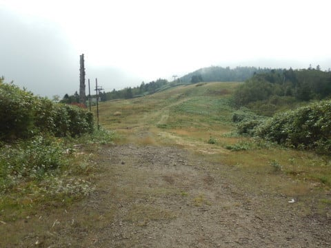
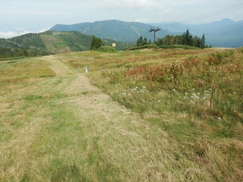

# 志賀高原の岩菅山に登ってみた2…シーズンオフの寺子屋スキー場を歩いたけど，筋肉痛で歩行ペースがヤバい！

📅 投稿日時: 2020-10-18 02:47:01

🏷️ カテゴリ: [登山・旅行](c1d637a11a25b457ac978d197adbdafc5.md)

えー．

本日．

志賀高原では，雪が降ったようです！

（[横手山公式ホームページ](https://yokoteyama2307.com/news/10529/)より）

雪が降っただけじゃなく，真っ白に

なるほど積もってますね…！

（[横手山公式ホームページ](https://yokoteyama2307.com/news/10529/)より）

高天ヶ原ライブカメラを見ても，

早くもゲレンデが真っ白になってましたが．

いやーー．

白いものを見ると，そろそろシーズンインという

実感が湧いてきますね…！！

でも．

今，冷え込んでくれるのはいいけど．

11月になったら10月より暖かくなってしまった

…とかいう事態にならないよう，必死に願い，

踊り続けている，Skier_Sです．

ということで．

本日はしばらく間が空いていました

岩菅山登山レポートの続きです…！

ーーー

ってなわけで．

[前回](e671f69bc95c9ee3a9e9a1bfecc605d37.md)は朝イチの東館ゴンドラで山頂駅まで登って，

朝9時ごろ，山頂駅から登山をスタート

したわけですが…

うむ．

東館ゴンドラを降りた東館山高山植物園．

9月下旬で花のシーズンも終わっているので．

全く花が咲いてませんね…（涙）

そして，植物園を過ぎ，木道を歩くと…

おっと．

見慣れた道に突き当たりました．

この道はあれですね．

スキーシーズンは寺子屋から東館

林間コースに抜ける，途中で漕ぎが

入る連絡路ですね…！

なので．

連絡コースを抜けると当然，

現れるのは寺子屋スキー場！

寺子屋スキー場の斜面をとぼとぼ

登っていきますが…

ヤナギランの枯れたやつばっかりで．

花のシーズンは見事に終わってます（泣）

おかげで登山道はガラガラ．

良く見ると，わが生息地焼額の，

オリンピックコースとGSコースが

見えますね…

…しかし．

昨日，妙義山で身体を使いすぎたため．

寺子屋スキー場を登っているこの時点で，

太ももやふくらはぎの筋肉痛と，

膝の痛みが…（涙）

…ちょっと，ヤバい．

やはり今シーズン，コロナ騒ぎで外出が

少なく，運動不足気味だったか…

うむ．

この筋肉痛だし，引き返そうか？

と思ったけど．

筋肉痛は厳しい運動していると分からなくなる

という，これまでのスキーで得られた経験から．

しばらく歩いていれば痛くなくなるはず

と，歩き続けたのでした…←ホントか？

ってなことで．

寺子屋クワッドリフト降り場の横あたり

にある，登山道入り口までやって

きましたが．

うーむ．

東館ゴンドラを降りてからここまで，

40分近く…

そもそもここまでのコースタイムは，

40分弱のはず．

ここまでにかかった時間，コースタイム

同等か，それより遅いとは…っ！

うーむ．

コースタイムギリギリだとすると，

東館ゴンドラ山頂から岩菅山頂まで

コースタイム3時間15分．

山頂での休憩を入れ，往復7時間

見ておきたい．

朝イチで東館ゴンドラに乗ったけど．

ゴンドラを降りたのが9時．

そして下りゴンドラ最終が15:50らしいから…

その間，許された行動時間，6時間50分．

うわーーー．

ギリギリじゃないかっ！！

これは，今日は山頂を諦めないと

いけないか…？

…とりあえず．

岩菅山頂はもう登ったことがあるし．

今日は，寺子屋から岩菅に向かう尾根沿いの

コースを，景色を見ながらゆっくり歩くのが

目的だった…ということで．

行動時間の半分，12時半までに山頂に

着けなければ，諦めて戻ろう…

と．

山登りで無理はしちゃいけないと

自分に言い聞かせ，登山スタート！←いや，ここに来てる時点で無茶してない？

今の標高は2100m．

ここから2時間半の，岩菅山頂手前30分地点

（ノッキリ）の標高は2070m．

山頂を諦めれば，ほぼフラットな尾根沿いを

2時間半歩く，お散歩道のはず…！

ってなことで．

登山というより，ゆっくりお散歩感覚で

歩き始めたのでした…

## 💬 コメント一覧

### 💬 コメント by (Northfox)
**タイトル**: Unknown
**投稿日**: 2020-10-18 08:50:33

実は昨日、志賀高原に行ってました！

お昼ごろにゲレンデ前を通ったときは積雪は無かったです。

でも横手山の上部や渋峠のゲレンデは真っ白になっていました。冬の景色でテンション上がりました。

しかし万座ハイウェイで帰るつもりが、R292の渋峠から先が通行止めになってしまい。。。あわてて中野まで戻ったりとドタバタしてしまいました。

### 💬 コメント by (西舘)
**タイトル**: Unknown
**投稿日**: 2020-10-18 10:09:58

Northfoxさま、それは大変でしたね。無事のご帰還良かった。

我が家は来週末、5本+ショート1本+電動ローラー、バイスなどなどの納品を兼ねて、きのこ食べに志賀高原入りします。

紅葉には遅いことは分かっていたけど、りんごに食販売会を道の駅山の内で行っているのが今日なので、それ以降に行って、りんごとシャインマスカット、様々なきのこを買って帰るには来週が都合が良くて。（今週は御岳+南木曽岳。いつも「しなの」から見るあの山を、ってSさんと気が合うねぇ）

降雪は嬉しいけど、草津温泉へ足を伸ばす夢は消え去りました。

それどころか、上林から上がって行けず、お宿にご迷惑をお掛けしたりして。

### 💬 コメント by (Northfox)
**タイトル**: 草津も良いけど渋温泉も良い
**投稿日**: 2020-10-18 20:14:44

西舘様

ビワ池や蓮池は紅葉がきれいでしたよ！来週もまだ楽しめると思います。

昨日／一昨日は草津～渋峠を通る予定が火山活動と降雪に翻弄されました。

草津温泉に行かれる予定でしたか。私は一昨日は渋温泉に泊まりました。渋温泉が好きで何度もリピしています。外湯が沢山ある温泉街を下駄をカラコロならして巡るのが楽しいのです。

渋温泉から志賀高原へ直通ゴンドラがかかると最高なのですがねぇ。

### 💬 コメント by (Skier_S)
**タイトル**: ついに志賀も初雪！
**投稿日**: 2020-10-18 23:50:27

＞Northfoxさま

志賀行ってらしたんですか！

横手は真っ白みたいですね…

雪と紅葉，きれいだったんじゃないでしょうか？？

道路は渋峠で積雪通行止めだったんですか．大変でしたね…

>西館さま

板と道具の納品ですか（笑）．

そして…御岳＆南木曾岳行かれるんですね！

またどんなだったかレポートお待ちしてます～！

