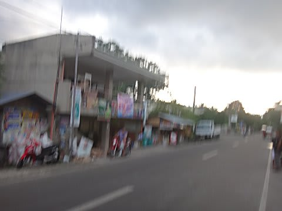

# 2014年8月　オスロブagain…再び，子連れでジンベエザメと泳ぐぞ！　その12

📅 投稿日時: 2014-09-18 01:59:52

🏷️ カテゴリ: [ダイビング日記](ce3a7a8d424d112fce83ee85c81a0e344.md)

とゆーわけで．

寂しい1本道の突当りに建っているこのホテル．

鉄格子の門で入口が閉じられているし．

外になんか出れないと思っていたのに…

街に遊びに行けるの…？

と，驚いた私だったのですが．

私「え？歩いて行ける範囲に街なんてあるんですか？

　　治安は子連れでも問題ないんですかね？」

ガイド「坂道を15分ほど歩いて登れば行けますよ．

　　…街っていうか，素朴な商店が数件ある程度ですけど．

　　治安は全然大丈夫．私も毎日出歩いてますけど，

　　平和な街ですよ」

私「…そうなんですか…」

ガイド「ちょうど車も空いてるようなので，行きは送りますよ～．

　でも，帰りは歩いてきてくださいね…」

ってことらしく．

こんな感じの町（というか，集落？）があるようで．

治安も良いらしいので．

ちょっと車に乗って，出歩いてみましょうか…

車に乗って，坂道をごとごと登っていくと…

「サンタンダー」の街中へ到着です．

…これが，サンタンダーのメインストリート．

長さ200m程度に，商店が並んでいる素朴な街．

この，ローカルな感じがいいですね～

こういうのが，私にとっての海外旅行の醍醐味．

ただ，時間が遅く，もう日も暮れかけていたので，

そんなにゆっくり見て回る時間はないですね（残念）．

まずは市場を見に行きますか．

やっぱり市場があると聞いたら，見に行きたいでしょ！

なんだか，かなりローカルな感じの．

いかにもと言った市場でした…

あとは，ガイドさんおすすめのこのお店．

（ちょっと写真がぶれてる…）

地図で言うと，紫色で記したメインストリートの，

矢印の場所のお店ですが．

このお店．

お店は狭いけど，

結構いろんな品数があって．

ばらまき系のお土産とか，

お酒やお水をGetできます！

そして，いっぱい買ってもすごい安い！！！

たくさん買っても，1000円しない！

フィリピンの物価の安さを痛感したのでした…
