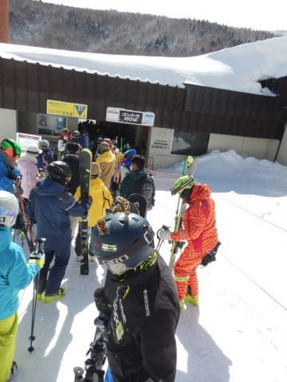

# 2021/3/14(日)は，志賀高原スキー場を滑った夢を無事に見ることができたよ…それも昼前に晴天，雪もいい感じのすごくいい夢だった…

📅 投稿日時: 2021-03-15 00:48:19

えー．

昨日は一日Stay homeでお仕事だったわけですが．

今日は素晴らしいことに．

志賀高原へ行った，大変いい夢を見ました…っ！！

ええ．夢です．

先週と同じく，夢です．

あぁ…素晴らしく良い夢を見ることができた

なぁ…（感激）

とりあえず．

あさイチに志賀高原へ登る夢から

見るわけですが．

上林チェーンチェックを過ぎてしばらく

ドライだった道は，サンバレーに近づく

あたりで，昨日の雨で濡れた路面が凍った

テュルンテュルンの上にうっすら積雪という，

根性の無い車ふるい落とし機能（どこかで聞いたことがある機能だな…）

を備えた道路になってて，

登れずに息絶えている車が多数…

やっぱり，雨の次の日はぬれた路面が

凍ってテュルンテュルンになるので，

ご注意を…！

で．

志賀高原の駐車場についたら…

…もう少し積雪があるかと思ったけど，

今朝の積雪は5cm強．10cmは無い感じ…（涙）

(いつものおこみん特派員の写真を使わせてもらいました～！)

山頂に登ると…

あさイチの天気はかすかに雪がぱらつく

天気．

そして，山頂の気温は-6℃と，結構

冷えてます！！！

…が．

気温が冷え冷えで，昨日の雨の後の

積雪量がそれほどないということは．

下地のガリガリ君が表面に出て，

かなり滑りにくいバーンか？？

と，覚悟したところ．

数cmとはいえ，上に乗っている雪が

バーンを覆ってくれていたので．

をををを！！！！

これは，意外と良いバーンではないか！！

冷え冷えの雪で，しっかりエッジが効いて

傾ける，結構楽しいバーンだよ！！！

いや…

気温が冷えているので，雪も思ったより

いいし．

夢を見るのが昨日じゃなく，今日で良かった…！！！

…と，思っていたら．

9時半には，焼額第1ゴンドラに列が

つき始めました…（涙）

うーむ．

今日は第2高速リフトが故障のため，

一の瀬からリフトで焼額にやって来れ

ないので，そんなに混まないと思ったん

ですが…

一の瀬から焼額方面のバスが満員で乗れない

ほどの人が来ていたのと，

第2高速が止まっているのと．

奥志賀も第2，第3高速ペアが強風で止まって

いたらしく．

午前10時過ぎのピークには30分待ちまで

行っちゃいました

2ゴンも最大20分待ちまで伸びたようです…

で．

そのおかげで第3高速リフトもちょっと

混みましたが．

せいぜいこの程度の混み具合だったし．

まぁ，許せるレベルかな…？

そして．

終日曇り予想だった本日．

10時ごろにはちょっと雲の切れ間が

見えてきたな…と思っていたら．

なんと．午前11時ごろには，予想が外れて

晴れ間が覗いてきましたよ…！？？

なんだか，すごいいい感じに晴れて

きましたよ！？？

…多分．

どうやら私の日ごろの行いが良いのに，

スキーに行けなかったことを憐れんで，

神様が私がスキーに行く（夢を見る）日を

わざわざ晴れにしてくれたに違い

ありません！！←いや，絶対100％確実に違うから

そうじゃなきゃ，私が曇りと予想した

今日，こんなに晴れるわけが

ありません！←いや，単に予想外しただけでしょ

…終日曇り予想だったにもかかわらず．

12時過ぎには完全に雲一つなく晴れ上がり．

そして．

12時の昼間休み時間帯はゴンドラも

ほぼ待ちなく，ガラガラ！

それでいてこんなに雪がいいなんて…

あぁ…シアワセ…

いや…

昨日のびしょびしょ悪天候の中

スキーして，今日滑れなかった人は

発狂するレベルだな，これ．

昨日滑らず，今日滑った人はラッキー！

ただ，今日は午後になってもちょっと

ゲレンデの人は多めで…

そのため，いつもなら日曜の午後は

ガラガラになるはずが，今日は昼休み

タイムが終わるとまたゴンドラが

混み始めましたが…

それでも，ゴンドラ乗車定員が少なくて

混んでるってこともあり．

ゲレンデはそれほどひどい混雑ではなく．

ゲレンデの麓近くは一部バーンがあれた

ところもあったものの…

今日は一日，夕方まで比較的いい雪を

キープしてくれて．

心配した，昨日の雨による下地の

ガチガチに悩まされることもなく．

3月としてはいい感じの雪を，

すっきり晴天のもと，ラストリフト

まで滑れるという．

恵まれた一日だったのでした…！

いやー．

いい夢を見たなぁ…

で．

このあとの天気は．

15日（月）は終日晴れ，

　午後は雪は緩むかもしれないけど

　結構いい感じの一日．

16日（火）は曇り，午後から雪がぱらつく．

　…降り始めは雨かも…

　でも，本降りにはならないはず．

17日（水）は朝は積雪5～10cm．

　風が北向きなら10cm．西なら5cm以下．

　結構冷える一日．

…という感じなんですが．

週末の20日土曜日は…

ううむ？

なに？この水色…+9℃線？

志賀高原，この日は+10℃を超える，

5月並みの気温？

これで，地上天気図に降水域が

かかっていたら，完全にアウトなんだけど…？

果たして？？

…（即死）

だめだ…

これは，土曜は液体が降る可能性大だ…（涙）

でも，21日日曜は冷えるよ！

そして，地上天気図も，

網掛けの降水域が，志賀高原を

すっぽり覆ってるので…

雪がちょっと積もってくれそう．

…これは，また次の週末．

土曜は雨，日曜にかけて雪が積もる

というパターンを繰り返すのか…？

…まだ，分からない．

あと1週間で予想がどう変わるか

なんとも言えないけど…

土曜に気温が上がる確度は高そう

なので．

覚悟しておいた方が良さそう…（涙）

## 💬 コメント一覧

### 💬 コメント by (ikkun)
**タイトル**: Unknown
**投稿日**: 2021-03-15 01:45:14

はい🎵新潟も同じく…雨の中でキッズの講習でした❗ そしてあけた日曜日？雨の筈が？青空でした❗雪はやはりザクザクですね(泣)そんな中でも体感のいい女の子にはビックリのでした❗_…実は来シーズンのスキー試乗会予定でしたが雨予想で止めてしまいがっかりな日曜日になりました😢

### 💬 コメント by (新米パパ)
**タイトル**: Unknown
**投稿日**: 2021-03-15 06:34:45

良い夢みられてたのですね！

ご挨拶出来ず残念でした。

月末の週末、もう一度志賀高原に行きたいなー、

雪あるのかなー。

ヤケビの壊れた高速リフトは修理道具を苗場に取りに行ってます！というお話でした。

早く直ると良いですね。

### 💬 コメント by (ダウンヒル)
**タイトル**: Unknown
**投稿日**: 2021-03-15 10:15:44

22、23日出勤予定なので踊らねば。

♪雨が降ろうがミサイルが降ろうが

朝から晩までスキー板担いで

ワッショイワッショイワッショイワッショイ

そーれそれそれお祭りだあー♪

ところで、｢冷え冷え踊り｣って···

好きな曲で踊っていいんですか!？

ひば◯サン、北◯三郎の｢まつり」なんかじゃなく、若い世代が好む曲の方がお天道様は喜ぶんかなあ？

### 💬 コメント by (レインボー73)
**タイトル**: Unknown
**投稿日**: 2021-03-15 11:44:51

エス様には悲しむべきお知らせです。

ファミリーのリフトで、パトロールの人と乗り合わせました。彼は、エス様のブログの特に天気予報をいつも参考にさせてもらってます、とのことでした。

そんなところまで！

これを知った責任感の強いエス様はきっと、なお一層睡眠とスキーを削って、ブログに、励まなければならなくなることでしょう。心からお悔やみ申し上げます。

### 💬 コメント by (スシネコ)
**タイトル**: Unknown
**投稿日**: 2021-03-15 12:31:10

レインボーさん、Uさん、Uさん。（本名出していいのか分からなかったので失礼します）

昨日はお世話になりました。定時？までご一緒させていただきまして大変楽しかったです。

先輩方を追いかけるのが精いっぱいでしたが、あの「誰もいない謎のバーン」は過去最高クラスでした（笑）。

またいろいろなお話お聞かせください。

ありがとうございました。

### 💬 コメント by (レインボー73)
**タイトル**: Unknown
**投稿日**: 2021-03-15 16:49:41

月曜日の志賀高原情報

朝の上林３℃　蓮池ー２℃。晴れる予報が遅れて、ガスったりしてる。二高が故障（明日もだめらしい）も何のその、パノラマ快適。フラットにうっすらと雪が。今日は終日（私の終日ですけど）誰もが俺ってこんなに上手かったっけって、勘違いして夢中にさせてくれる日でした。またまたスキーが好きになっちゃった。ちなみに95日目です。

オリンピックは途中から大きなコロちゃんをよけるという難事業があって、一本でやめ。ＧＳサイドは太板でなくとも全くイージー。私ごときでも普通に抵抗なく滑れるレベル。ＧＳも気持ち良すぎ。この快楽を、来られない皆様にお分けしたいくらいです。

瞬間移動した寺子屋がまたユートピア。極楽すぎて極楽すぎて、私も極楽スキーヤーになった気分（腕前は天と地ですが）。ひたすら１時間も寺子屋回し。

そして今日こそはビーフシチューをと、タンネのチウホテルへ。でも、またまた休業。

やっぱり銀嶺に忠誠を誓うべきだということなのか！

### 💬 コメント by (レインボー73)
**タイトル**: Unknown
**投稿日**: 2021-03-15 17:04:33

昼食後は西館を降りたけど、やっぱりぐちゅぐちゅ。でも、太板はけばそれも楽しい。

パーフェクタがポールのあとに迎えてくれたけど、最後の急斜面がコロコロで、一本でやめ。

ファミリーはフラットで楽しいけど、緩斜面はコロちゃんが意地悪する。

そして、ダイヤの13時16分のバスには長蛇の列が。二高が動いていればもっと滑れるのに。

あ、宴会開始。明日また。

スシネコ様、またよろしくお願い申し上げます。

### 💬 コメント by (真美子)
**タイトル**: Unknown
**投稿日**: 2021-03-15 23:03:31

いい夢を2週連続でみたのですね。おめでとうございます。私は13日は雨の苗場を滑りましたよー。ウエアが重たかく、下着まで濡れました。1４日はみつまたかぐらで軽い雪の上を滑る予定が、強風でみつまたロープウェイで上がった2本コースのみ。あとはクローズ。午後は苗場に戻りましたが、春雪。15日月曜日はゴンドラ動き筍山滑る事が出来ましたー!

### 💬 コメント by (Northfox)
**タイトル**: 今こそ踊るとき
**投稿日**: 2021-03-16 00:32:28

そういえば今シーズンはS様から読者への冷え冷え踊りの呼び掛けが無いですね．．．

やはり滑りに行けないので雨が降ろうが槍が降ろうが知ったこっちゃない、となってしまうのでしょうか（嘘です笑）

今週末は何とか雨を回避できるよう頑張って踊ろうと思います！

### 💬 コメント by (Skier_S)
**タイトル**: 今日はいい天気だったようで
**投稿日**: 2021-03-16 01:25:31

＞ikkunさま

雨の中の講習お疲れ様でした．

日曜はいい天気になってよかったですね！

＞新米パパさま

いい夢を見ました…

で，焼額第2高速は火曜に修理するような噂を聞きましたが…

まだ，それで直るかどうかわからず，営業開始日は未定のままです（涙）

まだまだシーズンは続くので，一度と言わず2度3℃と志賀へお越しください！

＞ダウンヒルさま

冷え冷え踊りは…

正当なものは一子相伝のため，それを見たものは他にはいないという伝説の踊りです（噓）

…いや．

皆さんが冷え冷え踊りだと思うものが冷え冷え踊りなので，好きな曲に

合わせて踊ってください．

でも，雨に唄えばとかそんな曲は微妙ですが．

＞レインボー73さま

あら．

ヤケビスタッフが参考にしているのは聴いていたのですが…

中央エリアのパトさんにも見られてましたか．

うーん．熊の湯，横手のスタッフさんも見ていたりして…

そしたら手を抜けませんね．

あ，熊の湯は犬熊さんがいるから，私の天気予想はいらないか（笑）．

＞スシネコさま

一気に知り合いが増えていって覚えるのが大変だと思います（笑）．

また志賀高原でお会いしましょう！

＞真美子さま

あら．雨の日に滑ってらしたんですね．

あの日はスキーヤーの根性を試すような日だったかと（笑）．

14日も強風だったんですね…

今日は天気も良く楽しめたようで，良かったですね！雪は重くなかったですか？

＞Northfoxさま

…はい．

私が滑らない週末は，槍が降ろうがミサイルが降ろうが関係ないので，踊りに身が入りません．

というより，晴れたり冷えていい雪だと悔しさが倍増するので，むしろ晴れたり冷えたりしない方が精神衛生上望ましいので…（笑）．

