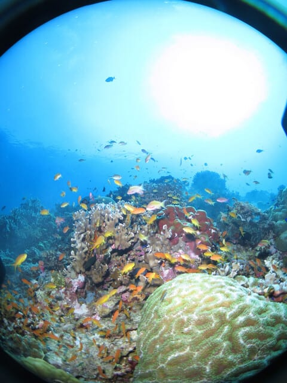
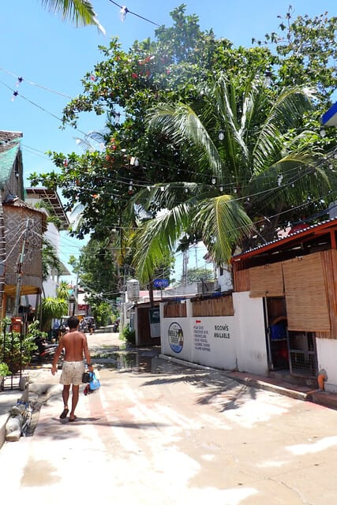

# 2024年8月，5度目の子連れモアルボアル，コロナ後初の海外へ！…プロローグ

📅 投稿日時: 2024-10-01 01:25:03

ってなことで．

長きにわたった座間味旅行のレポートが

終わりましたが．

立て続けに今度はモアルボアルレポートです！

…この週末も家でずっと仕事している

合間に記事用の写真を整理していたのですが．

写真を眺めていたら，もう仕事やめてすぐに

モアルボアルに行きたくなってきました…

ということで，モアルボアル旅行記．

初日の今日はプロローグから！

ちなみに，今回からちょっと写真サイズを

大きめにしてみました…

スマホの人はわからないと思いますが（笑）．

ーーー

ひとつ前の座間味旅行のエピローグで書いたように．

何かのリミッターが外れ，座間味のダイビング

旅行から帰って，中3日で再びモアルボアルへ

出発という無謀な計画を立てたわけだけど…

なんでまた，今回もモアルボアルに

行きたかったかというと．

とりあえず，確実に目の前のハウスリーフで

眺められる，他では体験できない壮大かつ

ダイナミックなイワシの群れ．

運が良ければジンベエザメにも会えるという，

恐ろしいハウスリーフと，

(2018年に行った時の写真)

そして，誰もがきれいと思う，カラフルな

サンゴとハナダイ系の魚がお花畑のように

広がるペスカドール島エリア．

さらには，砂地のハゼエリアと，

ダイビングポイントのバリエーションが

豊富で．

それでいて，ダイビングフィーがめちゃくちゃ

安く，宿代も食費もリーズナブルなので，

沖縄に行くよりもよっぽどお財布に優しい…

という，夢のような場所．

モルジブやパラオも，コモドもいいけど．

家族3人全員がダイバーとなった今，

経済力を考えると，モアルボアルが

間違いなくコストパフォーマンスが高い

場所なわけで…

コロナの間で潜りに行けない時．

ずっと「次はいつモアルボアルに行けるのか…」

と願っていて．

コロナが明けたらまずはモアルボアル再訪！

と決めてたわけだけど．

ホントなら，昨年にモアルボアル再訪を

計画していたところ，

昨年は遠征2発入れるほどの夏休みを

取るのが厳しそうというところと．

さらに昨年はまだコロナから復活しきって

おらず，飛行機の料金も高止まりで，

ちょいとモアルボアル再訪は厳しそうな

状況…

だもんで，両親もつれていける座間味に

しておこうか．

と．コロナ明けの昨年の復活ダイブは

3世代で座間味にしたわけですが．

今年は旅行客も戻ってきたのか，国際便の

飛行機の本数も戻ってきて，セブ直行便の

本数もようやく増えてきたし．

そのおかげで，飛行機チケットの値段も

だいぶこなれてきたし…

今年はモアルボアルに復活できる！！！

…でも．

さすがに80歳前後の両親は，国際線＆

車での長距離移動はきつく，モアルボアル

には連れていけないな…

でも，いつまで両親と一緒に潜りに行けるか

分からないということもあり．

なるべく今年も両親と一緒に，3世代で

潜りに行っておきたいぞ…

うーん．

どうしよう…

そうだ！！！

座間味とモアルボアル，両方に行けばいいん

じゃないか！！！

と．

すごく単純な解決策に気づき．

座間味をいつもより1泊削って3泊4日，

モアルボアルも同じくいつもより1泊

削って5泊6日とすれば，海の日と

夏休みを絡めて仕事は何とかなりそう…

（何とかならなかったけど）

という感じで，何かのリミッターが外れて

しまった今年，何も考えずにかなり激しい

夏休み計画を立ててしまったわけだけど．

[座間味](ec177fb85d6b57aca2bc5000eb94bf2fd.md)から帰ってきたら，中3日で

器材を洗って干して，服なんかも全部

洗濯してまた詰めて出発という，

慌ただしい夏休みの谷間を過ごし，

再びモアルボアルへの旅路に

向かったのだった…

（[続く](e8ef004b281217b28cb88063817f87aa8.md)）

　

　

　

## 💬 コメント一覧

### 💬 コメント by (1kamakura)
**タイトル**: Unknown
**投稿日**: 2024-10-01 07:00:28

江戸の秋

わーい🙌また始まりましたね、ダイビング記事

きれいな海の中の写真を見るだけでワクワクしちゃいます🎶

### 💬 コメント by (Skier_S)
**タイトル**: ＞江戸の秋さま
**投稿日**: 2024-10-02 02:52:55

モアルボアルの海はきれいなので，いい写真が一杯撮れます…！

またこれから長い旅行記が続くので，お付き合いください…

### 💬 コメント by (ねも)
**タイトル**: Unknown
**投稿日**: 2024-10-02 08:08:31

何と、３日おいて、今度は海外の南の島ですか⁉️　やる～！

わが家も今春、６年半ぶりに海外旅行しました。台湾に４泊だから楽勝のはずなのに、何だかかなり緊張しました😅

(１ヶ月後に、骨折・入院(((ﾟдﾟ;)))　まあ｢後｣で良かった、笑)

続編も楽しみにお待ちしています。

### 💬 コメント by (新米パパ)
**タイトル**: Unknown
**投稿日**: 2024-10-02 08:23:01

懐かしい！

モアルボアルとか、ドウマゲッテイ、アポとか行きましたわー。

なぜか、参加者が1人で王様ダイブさせてもらい、日焼けして最後は現地の金持ちのドラ息子と勘違いされ、現地語で対応され、、、、

### 💬 コメント by (Skier_S)
**タイトル**: Unknown
**投稿日**: 2024-10-03 01:45:16

>ねもさま

6年半ぶりの海外ですか！

台湾に4泊ですか…台湾は仕事でしか行ったことが無いので，観光するイメージがあんまりないです（笑）．

しかし，ケガしたのが旅行後でまだよかったですね…

＞新米パパさま

おっと．モアルボアルに行ったことがある人，珍しいと思います…

ドゥマゲッティとかアポとかが有名ですが，私はやっぱりモアルボアルが一番気に入ってます．

しかし，現地の人と間違えられましたか（笑）

