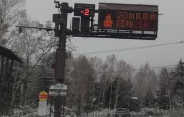
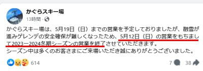

# 本日5月9日の渋峠スキー場は特派員によれば雪！だけどかぐらスキー場は雪不足で予定1週間前倒しの5月12日ファイナル（涙）

📅 投稿日時: 2024-05-10 03:09:42

えー．

本日の渋峠スキー場の状況が，

久しぶりのおこみん特派員より

送られてきましたが…

今日の志賀高原は，雪が積もったようです！！

まぁ，雪と言ってもうっすらと積もる程度

だったみたいですが…

でも，陽坂の駐車場で気温は-2℃．

朝からかなり冷え込み，バーンは硬い雪の

上に雪が積もって，久しぶりに板が滑る

コンディションだったようですね…

いやー．

この気温が，GW中に一度来てくれれば

焼額もラストデーまでゴンドラが

動いたかもしれないのに…

ちょいと遅かった（泣）

でも，渋峠はまだしばらくは滑れそうに

見えますね～！！

ってなことで．

志賀高原だけじゃなく，どうやら今日は

かぐらも雪だったようですが…

それでも，これまでの高温による

雪解けには勝てず．

5月19日までの営業予定を切り上げ，

今週日曜の5月19日で営業終了となるよう

です…！！（激泣）

（[かぐらスキー場Facebook](https://www.facebook.com/snowkagura/posts/pfbid02JrLXCLxNW6hK4Q7zdYjuAvqgEm7i4W4YjgXECw9MFo9ccdPEKkUc1h9W1bHr73Xjl)より）

ガーン…

ショック！ショック～！！！！

来週まで滑れると思ったのに，

今週末で終わるのか…っ！！！

そのあとは月山まで行かないと滑れないよ（涙）

とりあえず．

今週末のファイナルかぐらに行かない

わけにはいくまい…

ということで．

今週末のかぐらの天気ですが．

11日(土)：朝から気温は高く，当然朝から

　この時期の標準のザブザブ雪．

　気温が高く晴れるので暑さを感じる．

　雪も一気に緩んで昼頃にはもう

　完全全面凸凹バーン．

　かなり雪解けが進む(泣)

12日(日)：この日も朝から気温は高い．

　雪質は期待しないでおきましょう．

　朝のうちは晴れ間もあるかもしれない

　けど基本的に曇り空．

　リフト営業中は雨は降らずに済む．

　気温が高いけど，日が射さない分

　土曜ほど暑く感じない．

　でもやっぱりこの日も雪が解け，

　昼にはコブコブに…

って感じでしょうか．

うーん．12日，コブ溝に土が出まくるような

状況じゃなきゃいいんだけど…

とりあえず．

どれだけ雪不足でも，

「そこまでやるか！！！」

という人海戦術の雪付け努力＆コースの

雪が土だらけのチョコアイスになっても

営業するといういろんな意地で，

ここ数年は確実にファイナル予定日まで

営業していたかぐらだったけど…

焼額が予定通りGWラストまで頑張った

今シーズン．

まさかかぐらがファイナル予定日より

早く終わるとは…（かなりの涙）

ということで．

今週末は土日どっちかでラストかぐらに

参戦予定です…

あぁ…スキーシーズンが終わっていく…
