# 11月28，29日の志賀高原スキー場の天気は？…そして11月25日の熊の湯スキー場ゲレンデ状況特派員情報

📅 投稿日時: 2020-11-26 02:34:37

ということで．

本日から熊の湯スキー場がオープンしましたが．

早速，優秀な本ブログ特派員から状況が

送られてきました！

本日は平日というのもあり，リフトは

ガラガラで，朝イチもほとんど人は

並んでおらず．

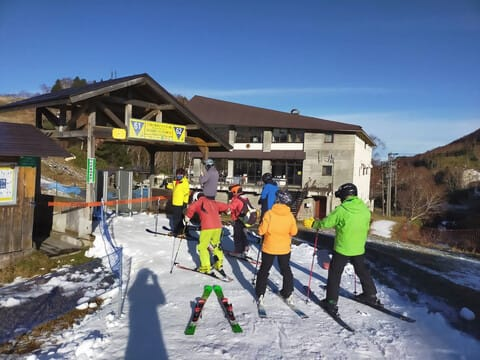

そして，天気は朝から晴天っ！！

うらやましい…

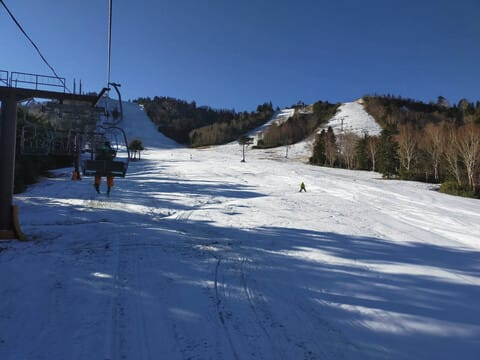

ゲレンデ状況は，全面白くなってるので

幅が広そうに見えますが…

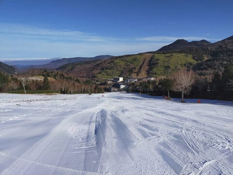

滑れる幅は実際これだけ．

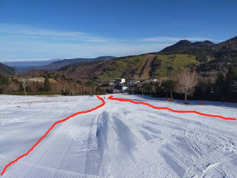

狭いところは狭そう…

そして，リフト乗り場はピスラボが

出てるし．

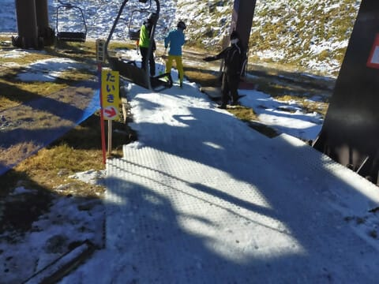

あさイチから雪が薄いところもあり…

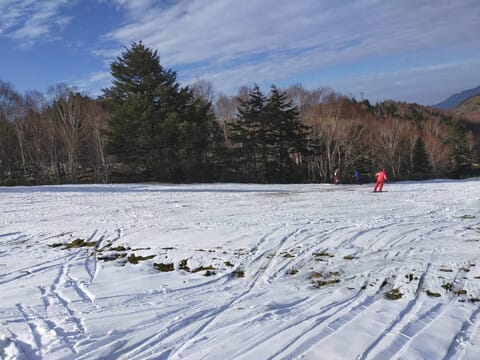

朝からヤバかった，リフト乗り場前の

リフトをくぐるあたり．

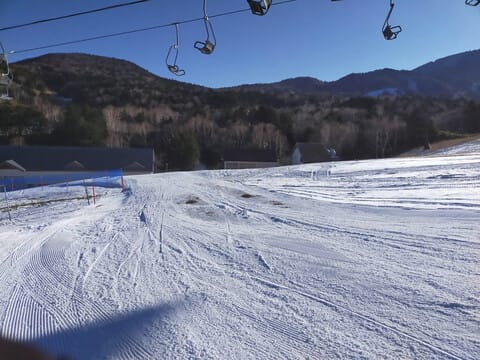

ラストはこんな感じになっていたようで…

この，向こう側のわずかにつながった

白い部分を通るしか無いようです．

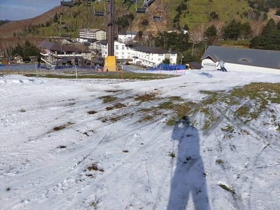

とはいえ，雪もしっかりエッジが嚙む

いい感じで．

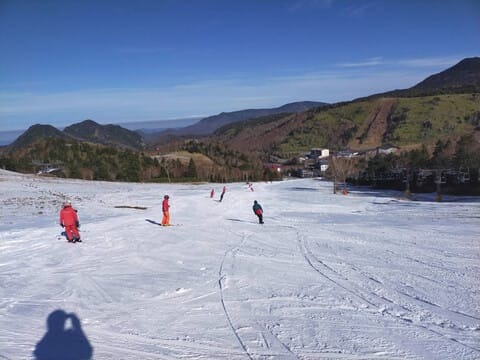

滑ってきた人曰く，イエティの100倍

楽しいそうです…

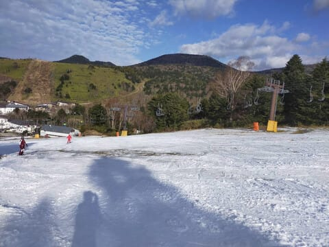

うーむ．

しかし．

25，26日と人工降雪がまともに

打てなさそうなので．

リフトをくぐるあたりの一番ヤバいところ，

明日以降大丈夫か心配…

とりあえず．

今週末に向けて，これからどんな天気になるのか，

天気図を見てみると…

まず，26日午後9時のの850hpa図．

赤い0℃線がギリギリ新潟にかかるかどうか…

これは，昼間は志賀の人工降雪は

厳しいけど．

標高の高い志賀なら，26日は夜から

人工降雪が打てるかな？

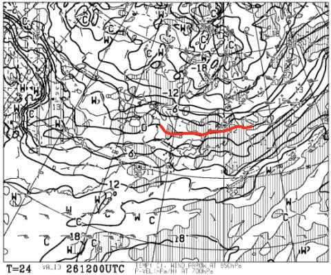

そして，翌27日金曜の850hpa図は…

うむ．+3℃線が志賀に近づくレベル．

この日も，夜は志賀の標高が高い横手・熊なら

人工降雪が打てるだろうけど．

昼間は人工雪が打てるかどうか微妙なレベル…

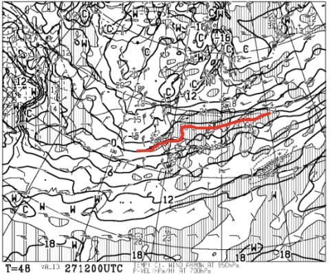

で．肝心な週末，28日土曜の850hpa図は．

をを！0℃線は太平洋岸．

志賀高原は-3℃線がかかっているので…

冷えてます！

人工降雪機がガンガン頑張れる気温！

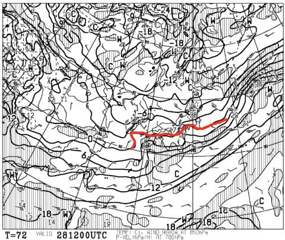

そして，28日の地上天気図は…

おお！

久々の冬型の天気図！

日本海側は，20cmほど雪が積もりそう！

志賀高原は…10cm，運がよければ

20cmほどの積雪になりそう！

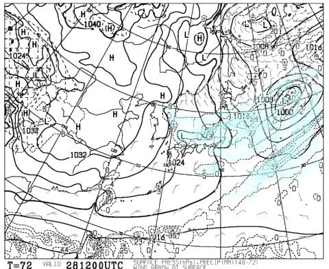

さらに，29日日曜の850hpa気温図を見ると．

うむ．

この日も0℃線は太平洋岸で，

志賀は問題なく冷えてます！

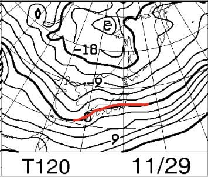

…ただ，地上天気図を見ると，

降水域が志賀にかかっておらず．

天然雪は望めないので，

「人工降雪機，フルパワーだ！」

と言った感じでしょうか…

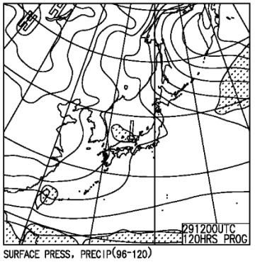

とりあえず．

まとめると．

26日（木）：晴れー曇り．昼間は気温が高く，人工降雪機は無理．

　熊の湯のゲレンデも雪解けによりきわどい感じに…

27日（金）：基本的に曇り．時々晴れるか？…気温は朝にちょっと

　人工降雪機が動かせ，夜になったらまた人工降雪機が

　稼働できそうな気温に

　熊の湯のこの日のゲレンデ状況はかなり厳しいかも．

28日（土）：朝から雪！終日気温は上がらず，一の瀬エリアも

　フルパワーで人工降雪が行ける！

　この日だけで10~20cmの天然雪の積雪もあり

29日（日）：この日もいい感じで冷え冷え．雪がぱらつく天気．

　昼間もガンガン人工雪が行けそう！

　志賀は一の瀬・熊の湯ともコンディション改善．

という感じでしょうか…

とりあえず，今週末．29日は横手も熊もいい感じで

滑れそうな予感…！

## 💬 コメント一覧

### 💬 コメント by (レインボー73)
**タイトル**: Unknown
**投稿日**: 2020-11-26 07:21:08

条件のいい予報、ありがとうございます。おかげさまで

今日タイヤ交換して湯田中入りします。明日は古い板にワックスかけて、土曜から100日のスタートです。今年もよろしくお願いいたします。

### 💬 コメント by (Skier_S)
**タイトル**: ＞レインボー73さま
**投稿日**: 2020-11-27 03:49:54

土曜から志賀入りですか！

私も今週日曜は志賀に行こうと思いますので，またよろしく

お願いします～！！

### 💬 コメント by (ikkun)
**タイトル**: Unknown
**投稿日**: 2020-12-01 20:01:20

熊の湯 マイクロバスにスキーを積んだ学生？を朝のコンビニで見送りましたが❗それか( *´艸｀) 実は先輩指導員 準指導員に誘われた明日でしたが？朝早くでないので断りを入れた昨日でしたが、こうゆう画像を見ると大変さを持ちながらワクワクさしてしまいますね🎵

