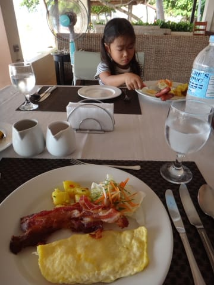

# 2013年11月　フィリピン・オスロブ　子連れでジンベエを見るぞっ！　その3

📅 投稿日時: 2014-07-08 01:15:33

🏷️ カテゴリ: [ダイビング日記](ce3a7a8d424d112fce83ee85c81a0e344.md)

スキーシーズンが終わったばかりというのに．

私に似たのか．

毎日のようにわが娘が．

「泳ぎに行きたい～！」

と，言い続ける今日この頃，

いかがお過ごしでしょうか．

＃私も潜りに行きたいよ…（涙）．

＃早く夏休み決まらないかな…

ってことで．今日もダイビング旅行記が続きます…

---

ダイビング初日の朝がやってきましたが．

起きてみると…

ふむ．

今日は晴天ですな！！

昨日の到着は夜中なのでわかりませんでしたけど．

ホテルの部屋の前からは，海が見えて．

海の前に建つ，こんな感じのホテルだったのか…

で．

こんな感じの，海の見える海辺に建つ

オープンスタイルのレストランで朝食です．

こんなところで海を見つつ…

朝ごはんが食べられて．

なかなかおしゃれなホテルですな！

朝食を食べた後は．

朝9時のダイビングの集合時間まで，

前の海岸をうろついてみますか…

うむ．

今日は，海も穏やかですな～．

予定通り，ジンベエ様を見に行けるといいな…！

…という，期待が高まる中．

ダイビングショップへ向かいます．

…っつーても．このダイビングショップ．

ホテル敷地内にあるので．

部屋を出て2分で着きますが…．

ダイビングショップに着くと．

まず，説明開始なわけですが．

このショップ，基本的に日本人向けで．

今回のゲストは，すべて日本人でしたね～．

当然，ガイドも日本の方で．

ちゃんと日本語でブリーフィングが行われます．

さて．

本日．

「海況が荒れているので，ジンベエのポイントへは行けません～」

という．

タイ・サムイでの恐怖の毎日を繰り返すことなく．

無事，ジンベエ様を見に行けるのかっ？？
