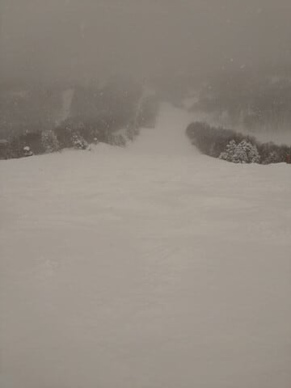
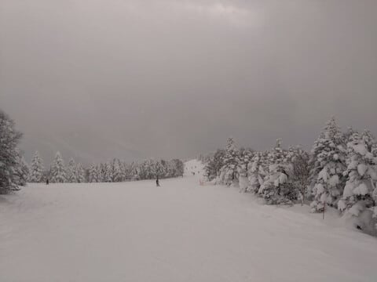
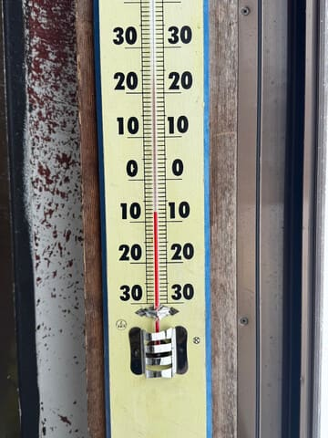
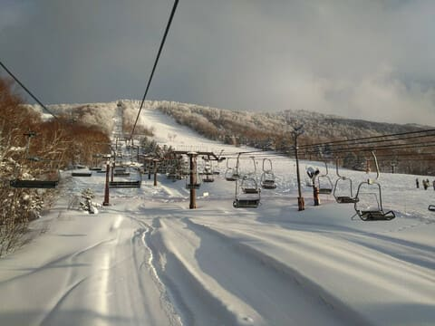
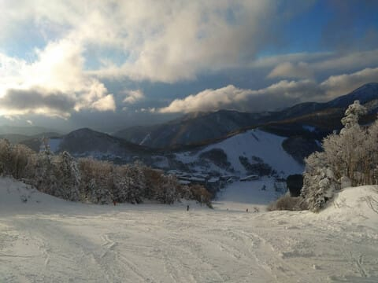

# 2月4日(火)の焼額山特派員レポート…雪のち曇りのちちょっと晴れ…これから数日間はこんないい雪の時期が続きそう

📅 投稿日時: 2025-02-05 03:29:39

🏷️ カテゴリ: [2025スキー滑走日記](cacd3fbf84d4a679ee61a5894c3f95e14.md)

えー．

今日も帰宅が深夜0時を過ぎていて．

それから家で仕事をやっつけていると

もうこんな時間…

ダメだ．最近は3時過ぎまで起きている

体力がなくなってきた…

でも．

眠いけど，意地で更新！！

まず．

今日…というか，もう昨日ですね．

2月4日の志賀高原の特派員情報ですが…

4日は昨晩から20cmほど積雪があり．

そして朝方にまた10cmほど積もったらしく…

ゲレンデは朝方から雪降り～曇り空．

圧雪バーンでも積雪10cm，ブーツパフ

くらいを楽しめたようですね…！

天気は朝から昼頃まで雪～曇りで，気温も

午前11時ごろで-8℃とかなり低く．

朝10時前まで激しく降ったいた雪も

弱まり．

夕方には晴れ間が出てきたようです…！

うーん．

夕方のわずかな時間とはいえ．

晴れてくれたのはいい感じだったな…

ってなことで．

ここしばらく雪が降っていなかったところ，

ようやっと再びの雪となり，それも

数日間降り続けそうな状態です…！

…明日は西風ですが，思ったより激烈な

寒気になってきたので，普段の西風の時に

比べれば降りそうな予感ですが…

そこまでドサドサ激烈な降りには

ならなさそう…

とりあえず，また明日に週末の天気予想

やります～！

…そして．

今日はもう眠くて死にそうなので，

日曜志賀高原の詳細レポートを書く体力がない…

もう寝ます．

おやすみなさい…
