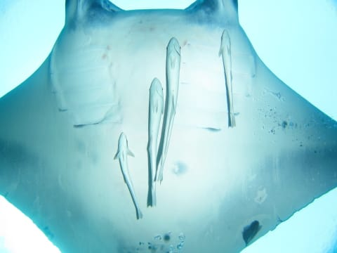

# 2014年9月　3連休，子連れ石垣ダイビング　その8

📅 投稿日時: 2014-11-20 02:18:46

という感じで．

頭上に娘が浮かんでいる中，

しばらくマンタを眺めていましたが…

そろそろ戻りましょうかね～，

と，ガイドが船へ戻るルートを取り始めたので，

みんなもぞろぞろついていきます．

その時．

遠くから，こちらへ近づいてくるマンタの影が…っ！！

図で書くと，こんな感じで．

赤く示したのは，自分たちがいる深度より

1mほど高い岩．

この赤く印した岩に向かって，

図の上からマンタが近づいてきていて．

図の左側の●が，ダイバーの位置を示してるんですが…

まぁ，ここで大体みんなは．

マンタが岩に邪魔されずに見えるよう，

岩のマンタ側に回り込むわけですね．

「そっちだと，マンタは横からしか見えないっ！」

と．私一人，赤丸のように岩の反対側に回り．

岩の上から体を出さないように，

マンタの進行方向を確認して．

進行方向の真下に来るように，岩の反対側を移動して…

ふふふふ．

他のメンバーは，マンタを横からしか

見えてないはずだ．

ダイバーが真正面に見えるとマンタは避けちゃうけど．

私の体は岩の影に上手く隠れているので．

マンタはまっすぐ岩を超えて，私の真上に来るはずだっ！！

来たーっ！！！

…そして，岩の上を通過したマンタは…

見事に私の…

頭の真上を…

まっすぐ通過していきました．

…ふっ．

ドンピシャだったな～！！

というところで．

船の下に戻ってきて．

あとは，安全停止タイム…

とりあえず．

今回は．

画角165度のドームレンズいっぱいの

マンタ様，いただきましたっ！！
