# VMG LEVORG君7万km突破！…そして2021/4/15(木)の志賀高原スキー場特派員情報

📅 投稿日時: 2021-04-16 02:07:57

今日は朝7時に最初のWeb会議が始まり．

最後の会議が終わったのは日付が

変わる直前という，極めて安定した

ご無体勤務状態が続いている，Skier_Sです．

ってなことで．

先週志賀高原に行ったときに，

走行距離70000kmを無事超えた，

我がVMG LEVORG君．

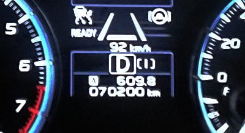

2年9か月で7万kmですか…

いつもなら，一回目の車検までに10万km

近く走る我が車としては．

コロナで外出が減った影響で，かなり

走行距離が少ないですね…！！

そして．

[フロントダンパー交換](ee207ef0909a693896d92eec8da439062.md)をしてから，

志賀高原を2往復してみましたが．

高速道を走ると，ちょっとショックが

柔らかくなったかな？

という感じがする程度で．

意外と，そんなに大きな差を感じません…

ふーん．

異音が出る不具合はあったものの．

ビルシュタインダンパー，7万km程度では

それほどヘタらないんだなぁ…

で．

7万km走った生涯燃費が約13km/L．

まぁ，燃費がいいとは言わないけど．

ルーフボックスつけっぱなしの

LEVORG 2Lとしては，かなり燃費は

いい方かな？

とりあえず，エンジンパワーもあるし．

4WDは雪道で信頼性バツグンだし．

アイサイトツーリングアシストは

便利だし．

これはきっと，長距離走ってスキー場に

行く目的のために作られた車ですね！←違うから

ってなことを思うくらい．

スキーに行くには最適な車で．

気に入ってます…

と言いながら．

新しいLEVORGがちょっと気になる自分…

なんだか，新型のVN LEVORGのB型で

2.4L追加という，某スバル筋からの

情報がありましたが．

今の1.8LのSTIでも軽く400万円を超える

車なので．

2.4LのSTIって，乗り出し500万を余裕で

超える車になりそう…

うむ．我が家では買えないな．

あきらめよう．

新しいLEVORGなんて，買わないぞ～（棒読みで）

ってなことで．

本日も志賀高原特派員からの写真が

届いているので．

今日の志賀高原レポートです！

えー．

まず．

今朝はなんと，5mmほど積雪があったようです！

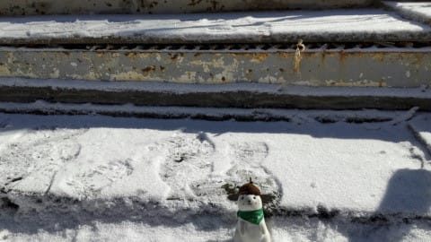

うーん．

どうせなら，5mmじゃなく5mの積雪が

欲しかった…←一晩5mって，リフトまで埋まるから！！スキーどころじゃなくなるから！！！

なので，朝イチはうっすら新雪が乗った

シマシマで…

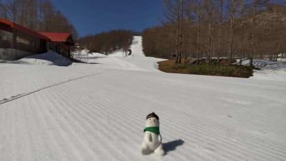

そして，すっきり晴天で…

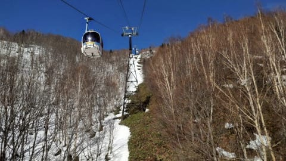

それでいて，朝イチはマイナス気温

まで冷えてくれたので．

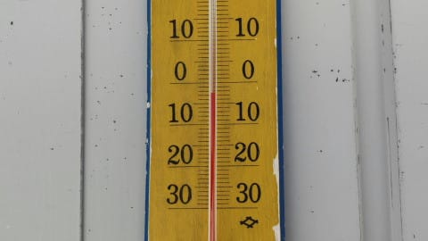

あさイチは，硬く締まった雪の上に

うっすら新雪で．

天気も良かったってのもあり，

この時期にしては，いい感じの

バーンコンディションだったようです…！！

う，うらやましい…

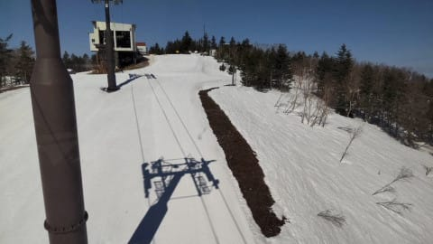

ゲレンデは，午前10時くらいまで

荒れずにフラットないい感じを

キープしてくれたようで…

ぐはぁ！！！うらやましい…

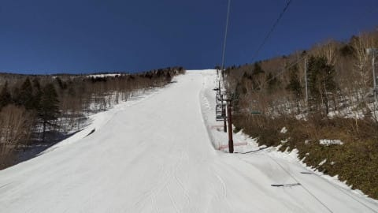

昼間もそんなに気温は上がらなかった

みたいですが．

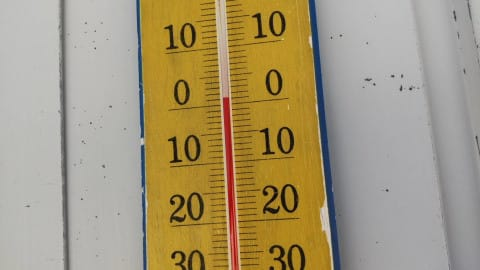

でも，日差しが強かったので，午前中の

うちに雪の表面はしっとりし始め．

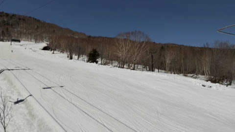

昼近くには，結構荒れてきちゃった

みたいです…

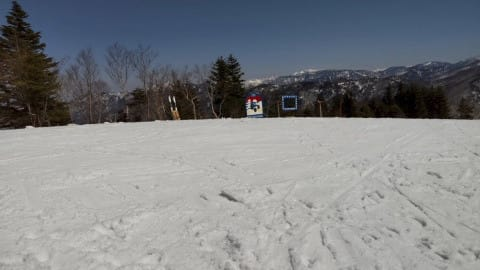

でも．

今日は気温が低めだったのもあり．

昨日から今日にかけては，雪は

そんなにとけなかったようです…

でも，焼額オリンピックコースも

かなり雪が消えましたね…（涙）

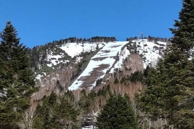

…ってな感じで．

2週間ほど早く雪が消えてる感じの

志賀高原ですが．

でも，最新の天気図を見ると…

17日土曜は，朝からずっと雨っぽくて．

風も強そう…（涙）

そして，雨は土曜夜中まで降り続け．

18日の日曜朝の営業開始時も降ってそう…（泣）

でも，日曜朝から雪になる可能性が高く．

日曜朝も1cmほど積もってるかも？？

…もしかすると，日曜午前中はずっと雪

（だけど，ウェアに着くと濡れるレベル）

がパラパラ舞い続けるかも…

うーん．

土曜の雨でかなり雪が解けそうなので．

日曜はやっぱり1mほど積もってほしいん

だけどな…（懇願）

## 💬 コメント一覧

### 💬 コメント by (ノーザンレインボー)
**タイトル**: Unknown
**投稿日**: 2021-04-16 05:54:29

Sさん

シーズンインの熊の湯からご無沙汰しています。

我が家のフォレスターも2シーズンで3万キロでよく走ったなと思っていたのですが、Sさんの足下にも及ばないですね。

さて先日の日経にジャイアント下から東館山山頂までのゴンドラ新設の記事が出たようですね🎵我が家は日経なんて高尚な新聞は取っていないで又聞きですが、本当なら嬉しいニュースですね。

### 💬 コメント by (NONAME)
**タイトル**: Unknown
**投稿日**: 2021-04-16 06:53:23

新車購入決定、おめでとうございます♡

### 💬 コメント by (オオスギ)
**タイトル**: Unknown
**投稿日**: 2021-04-16 13:02:47

よくある「懇意にしているお客様への早期新車オーダー」というものですね！

まだ、70000kでしたら、相当下取りも良さそう！！

新車レポート、お待ちしていま~す‼️

### 💬 コメント by (ゴン太＠SALLOT CLUB)
**タイトル**: リゾート開発の新たな設備投資
**投稿日**: 2021-04-16 18:34:25

日経（3月2日）の記事によると、

夏場の誘客を目的に、

東舘山山頂テラスを四方に拡張する。

冬場のみ運行の発哺リフトをゴンドラにすることで夏場の乗り降りも可能にする。

一連の設備投資は、2021年にも着手し22年の夏に向けて完成を目指す。

投資額は1億5千万円ほどを計画。

白馬岩岳でも18年に山頂テラスを設置し、それ以前にも夏山整備を進めた結果、19年にはグリーンシーズンの来場者が冬期を上回った。

とのことです。

山の駅から、パルスゴンドラ、新・発哺ゴンドラ（？）、東舘山ゴンドラに乗せたいのでしょうね。

圧倒的に冬場の来場回数の方が多い我が家からすると、西舘山の地滑り改修とか、蓮池・丸池・サンバレーへのアクセス改善とかに投資してもらいたいと思いますが、「今のままでも貴方達は来てくれるでしょう」と判断されたのでしょうね。

### 💬 コメント by (Skier_S)
**タイトル**: 今週末も志賀高原！
**投稿日**: 2021-04-17 00:05:41

＞ノーザンレインボーさま

おっと．お久しぶりです．

パルスゴンドラと東館山ゴンドラを繋ぐゴンドラを架ける…

という話は，昨年から噂で聞いていたのですが…

聴いた時は，「中央エリアがそんな投資できるの？？」

と思って，信じてませんでしたが．

ホントにやるんですね…

＞NONAMEさま

買いません…まだ買いませんから！←いつかは買うのか？

＞オオスギさま

次にLEVORGを買うとしても，おそらく1.8Lにすると思います…

2.4Lはすごく高そうだし，中古のリセールバリューは1.8の方がいいかも？？

でも，自分はどうせ車乗りつぶすんだし，新車にこだわりはないし，

次は中古にしようかな…

と考えていたりします．

＞ゴン太さま

夏山シーズンをメインに考えているようですね．

しかし，1億5000万でゴンドラ設置は無理なんですが…

搬器1台500万，30基ですでに1億5000万．

搬器だけで，駅舎や設備のお金が無くなっちゃいます…

パルスゴンドラが万博会場の中古を持ってきたように，

またどこかの中古を持ってくるんでしょうかね…

ゴンドラ新設もいいけど，確かに西舘中級コースの復活とか，

ジャイアントリフト高速化もやってほしいですね…

### 💬 コメント by (うえいと)
**タイトル**: Unknown
**投稿日**: 2021-04-18 18:23:01

ゴンドラの掛けかえではなく既存リフトの改変によるゴンドラ化ですね。

もともと東館のゴンドラ自体の架替を考えなくてはならないくらいオンボロなのに。

寂しいけど志賀高原の、一部は夏のほうが集客されており冬季を諦め夏だけにしている施設もありますから。（前山リフトがこれです。）

夏山の運行をバスの乗り継ぎプランや高天の夏山リフトからよりも山の駅を起点にしたほうがお金も取りやすいと考えてますからね。

寂しいほど減っている夏山の循環バス。

どうなることやら

### 💬 コメント by (Skier_S)
**タイトル**: ＞うえいとさま
**投稿日**: 2021-04-19 01:22:31

あ，発哺クワッドの支柱とかそのまま利用するんですか？？

それでゴンドラ化できるとは…！

発哺クワッドの設備も，30年を超えていてそろそろヤバそうな

感じですが．

かなり年季が入ってきた東館ゴンドラも，架け替えを検討したけど，

結局搬器新規導入で落ち着いたんですよね…

しかし，山の駅始発でゴンドラ3本乗り継がせようという

夏の営業戦略のようですが．

いやー．

どうなることやら…

