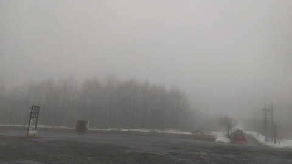
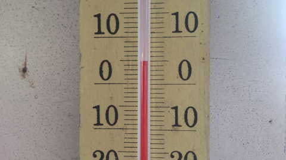
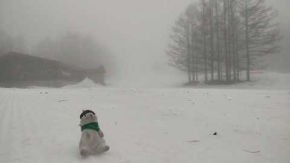
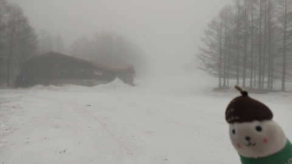
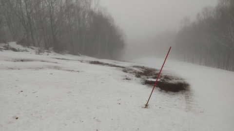
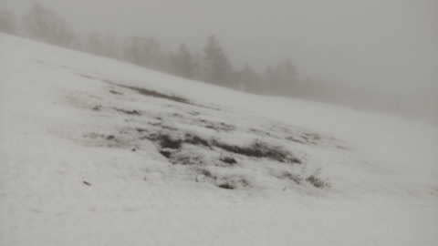
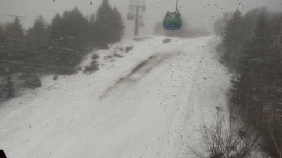
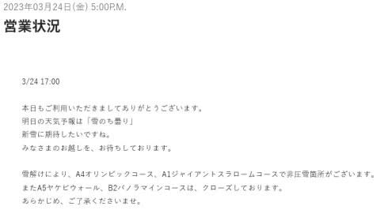

# うがーーー！！志賀高原の雪が解けていく！！…そして，3/25,26の週末は土日とも雨~限りなく雨っぽい雪になりそう(泣）

📅 投稿日時: 2023-03-25 01:14:35

🏷️ カテゴリ: [日記](cc4b5682fb7b8b144980957a978653fb0.md)

まだ，3月というのに．

4月にすらなっていないというのに．

現在の志賀高原．

すごいことになってるみたいです…(涙)

一応，本日24日(金)は，水曜に予想した通り，

朝のリフト営業開始ギリギリまでに雨は

止んだようですが…

でも，あさイチの気温は+5℃近くて．

一昨日夜から降り続けている雨で…

ゲレンデはGW後半並みのひどい状況に(激泣)

…これ，ホントに[去年のGWの5月](ea1abb06cc7b46884cec3e4aa3957b128.md)の方が，

よっぽどマシなゲレンデ状況では？？

で．

さらに．

焼額だとブナコースや…

オリンピックコースに，早くも穴が！！（激泣）

なんとーーー！！

なんと，まだ3月ですよ！！

3月に，こんなところに穴が開くなんて…

早い…早すぎる…っ！！！

とりあえず，焼額もオリンピックコースは

雪不足で圧雪できなくなったようです…(泣)

（[焼額山スキー場ホームページ](https://www.princehotels.co.jp/ski/shiga/winter/)より）

西舘，東館，ブナとかのエリアも

かなりヤバいところが多いみたいで…

今シーズン．

あの強烈な雪不足で，GW前に志賀高原が死に絶えた

[2016シーズンの3月末](e78702b77f77d0fa0af152a14bbbfc24d.md)より雪が少ないよ！？？

ヤバい…

今シーズンはヤバすぎる(泣）

そして．

明日の土曜は雨が降らない予想だったところ…

わずかに低気圧が北にずれて．

ギリギリ志賀高原が降水域に入りました…(泣)

明日午前中…というより，深夜3時ごろから

志賀高原では雨が降り出し．

明日の午前中まで，降ったり止んだり，時折

強く降ったりしそうです…(泣)

まぁ，山頂付近は雪っぽいかもしれないけど．

重くて湿って，ゴーグルに着くと前が見えなく

なるような雪だと思います…

で．

日曜も雨か雪か微妙…

朝はギリギリ雪かな？？

あさイチは重い雪が積もってるか，

あるいは雨ですごいことになってるか…

昼間は…標高が低いところはみぞれ~雨．

とりあえず．

今週末はダメっぽい（涙）

なぜ，2週間ぶりにスキーに行ける週末を

狙ったように…(泣）

頑張って睡眠時間削って，死ぬ気で仕事を

終わらせたのに…

…多分．

神様がこんな私を憐れんで．

明日は雨じゃなく，冷え冷え雪にしてくれるはず…！！！

きっと大丈夫！！！←んなわきゃない

ってなことで．

あと2時間半後に出発です…

2時間ちょいしか寝れない…

さぁ．2日間の合計睡眠6時間の状態で．

朝3時半に起きて4時間運転して，

無事志賀高原に行けるのか？？？

乞うご期待！！

## 💬 コメント一覧

### 💬 コメント by (大阪のK)
**タイトル**: Unknown
**投稿日**: 2023-03-25 03:22:07

Sさん、睡眠不足での運転、気ぃつけなはれやっ！

### 💬 コメント by (ヒータロゥ)
**タイトル**: Unknown
**投稿日**: 2023-03-25 16:38:12

本日、２ゴンでお見かけしましたが声かけずに軽く頭下げただけで終わってしまいました。今シーズンはどうもすれ違いとかが多い感じです。

午後に所要あったので早めに切り上げましたが今日のコンディションでは我が家はもうこれでいいかな、と言う感じでした。雪があと数日で無くなりそうな勢いで今年はもうダメそうTT

ところで朝登って来るときに中野ICからずっと後ろにいた赤い車が私ですｗ

### 💬 コメント by (レインボー75)
**タイトル**: Unknown
**投稿日**: 2023-03-25 19:55:36

土曜日の志賀高原情報

小雨模様の朝、パノラマからサウスへ気持ちよく一本。雨の日はやっぱり滑る。

なんとその一本で終了して、フキノトウ採りに。

大猟です。欲張り爺は当然あとの始末で苦しむことになりますよね。

こうしてだんだんと志賀高原から離れる準備をしておかないと、早すぎる春が辛すぎます。

### 💬 コメント by (炎の北海道民)
**タイトル**: Unknown
**投稿日**: 2023-03-25 20:31:35

いや〜北海道も相当雪解け早いですが、本州も酷いですね。これが普通になっていくのでしょうか。

しかしながら、Sさんは何故4時間もかけて志賀高原に行くのでしょうか？いまいち距離感がわかりませんが、近場のスキー場ではダメなのですか？

### 💬 コメント by (Skier_S)
**タイトル**: 今日は残念な一日
**投稿日**: 2023-03-25 22:41:21

＞大阪のKさま

2週間ぶりのスキーというテンションで，全然眠くなかったです～！！

でも，スキー場についてテンションダダ下がりでした（涙）

＞ヒータロゥさま

ゆっくりお話しできずすみません…今日はこちらは久々に娘と滑っていたので…

しかし，中野ICからずっと後ろを追いかけられてたのですね（笑）

＞レインボー75さま

雨だったので，板は終日走りましたよ～！

やっぱりスキーは雨の日に限る！！（開き直り）

＞炎の北海道民さま

すごいです…ここ20年で雪の量は最低かもしれません．3月末で比較すると，小雪といわれた2016シーズンより少ないです…

で，志賀高原は規模も大きく，標高が高いので雪もよく．

一度志賀に行くようになると，ほかのスキー場は行けなくなります

