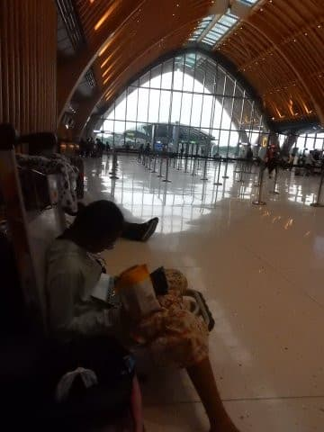
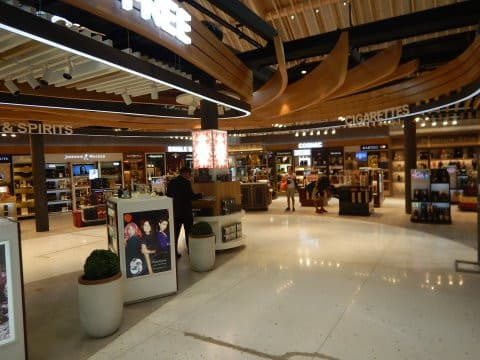
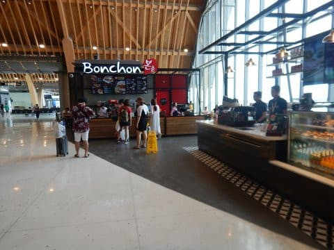
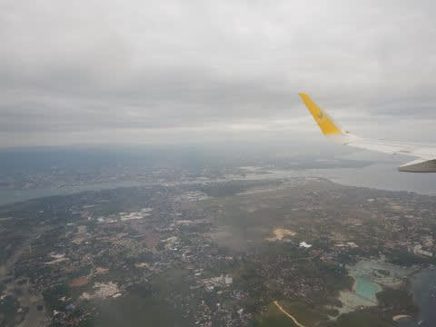
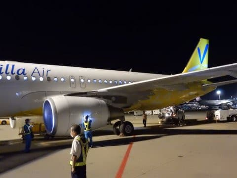

# モアルボアルから無事帰国

📅 投稿日時: 2018-08-06 02:24:20

ってなわけで．

空港での11時間待ちという苦行を乗り越えて．

無事帰ってきました…

いや．

しかし．

フィリピン・セブ国際空港．

セキュリティーチェックを受ける前の，

チェックインカウンターエリアにあるお店は，

コーヒースタンド1件だけ．

それ以外はチェックインカウンター以外何もなく．

椅子も数少ないので．

朝4時過ぎに空港に着いてから，

昼前に登場する飛行機のチェックンカウンターが

開くまでの8時間近く．

家族3人，ずっと空港の床に座って過ごしてました…

まぁ，わが娘．

10歳にして，人生のいろんな経験を

してますね…

チェックインカウンターが開いて，

チェックイン終了のあとは．

出国審査＆セキュリティーゲートをくぐった

先には，お土産物屋さんがあったり…

食事ができるところがあったりして．

ここなら残り2時間ちょい，

暇つぶしをすることができました…

なぜ，出国審査前のエリアには，

こんなお店を全く作ってくれないのか…（涙）

ってな感じで．

11時間待った後，無事飛行機は飛び立ちましたが．

こんどは．

この飛行機の到着が，1時間ほど遅れて．

成田着9時半過ぎ（涙）

家に帰宅したら，日付が変わって，夜中の0時半

でした…（泣）．

それから荷物をばらしたり，ダイビング器材を

水に着けたり何だりで，こんな時間（涙）

現地の深夜2時．

日本時間深夜3時にホテルを出てから，

約23時間以上．

疲れました．

明日仕事行けるのかな～…

今日はもう寝ます．

おやすみなさい…
