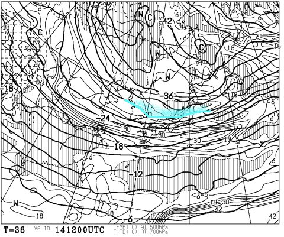
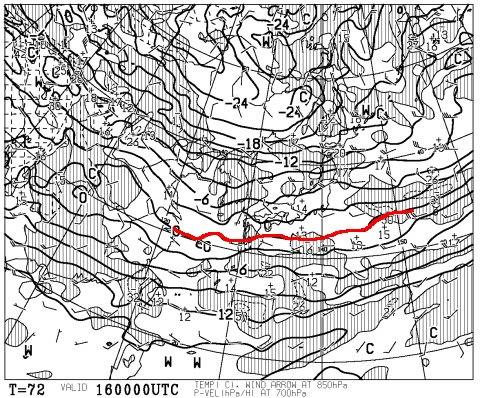
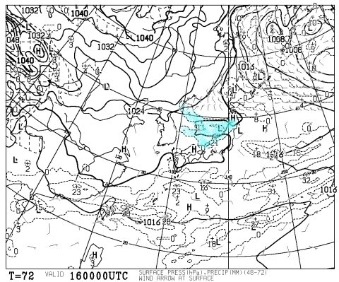
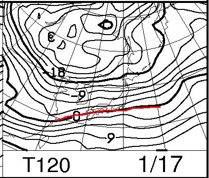
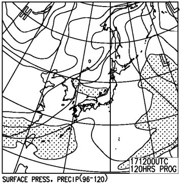
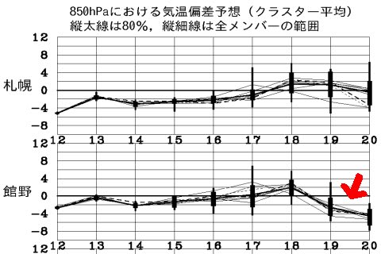
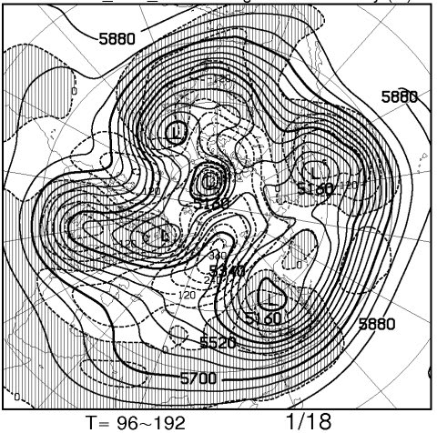
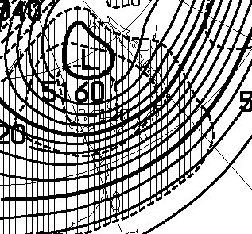
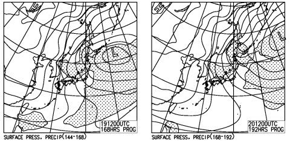

# この週末の志賀高原の天気は…雪は積もるのかっ！？？

📅 投稿日時: 2016-01-14 01:52:55

🏷️ カテゴリ: [スキー天気予想](c6554f5c3c106093b511a8daae23757e8.md)

当初，正月休みスペシャルの営業予定だった，

焼額の4ロマ＆3高のリフト2本体制でのナイターですが．

なんと．

なな，なんと！

[3月12日までの毎週，引き続きリフト2本体制で
ナイター営業してくれるようです！！](http://www.princehotels.co.jp/ski/shiga/news/news_120202_01.html/)

それも，正月スペシャルの2100円ではなく．

リフト1本時のお値段である，1600円で滑れるようですっ！！

素晴らしいっ！！

…あとは．夜9時まで営業してくれれば，言うことは無いんだけど…

ってことで，本題．

今週末の志賀高原の天気予想ですが…

…うーむ．

14日の木曜日は，こんな感じで，

そこそこの雪が降る目安．

青く印した500hpaの-30度の寒気．

こいつが信州まで下がってきて，

そこそこの雪が降ってくれそうな天気図に見えるんですが…

…でも．

風向きが悪いんだよなぁ．

西風なんだよなぁ…

そんなにバッサバッサと積もらなさそうなんだよなぁ…

…でも，まぁ．

14日はそこそこ雪が降ってくれるでしょう．

ゲレンデ状況は，ちょっと改善するかな．

15日の金曜も，風向きが悪いので．

冷えて，海沿いは雪が降る天気なんだけど．

志賀では雪が降らなさそう…（涙）．

で，

土曜，16日はというと．

850hpa予想図はこんな感じで．

赤く印した0℃線は日本のはるか南．

志賀高原には-6℃線がかかってます．

だもんで，朝は-10℃クラス，昼間も山頂は-5度程度までしか

上がらない，この時期の志賀高原として平均的といえる，

良く冷えた一日になりそう…

地上天気図は，こんな感じで，

水色に塗った降水量が予想されるエリア．

日本海沿いの全域に広がっています．

だもんで，日本海側は降りますが…

強烈な西風なので，志賀高原はそんなに降らなさそう．

…てか，晴れ間が広がりそう．

…うーむ．

土曜も，志賀高原ではドサドサ積もる天気図じゃないなぁ…（涙）

で，日曜は，というと．

850hpa図はこんな感じで．

赤くマークした0℃線は日本の南側．

引き続き，志賀高原は-6℃線がかかる程度．

まぁ，気温は土曜と同じ程度ですか…

そして，地上天気図は…

うーん．

日本海に細く伸びた，JPCZに伴う雪雲が予想されてますが．

この日も上空の大気の流れがゾーナルで．

西風が強く，志賀高原にはそんなに雪が降らなさそう…

っていうか．

この日，晴れかも…

ってことで．

まとめると

土曜：木曜の積雪で，ゲレンデ状況は改善しているけど…

　この日の朝，志賀高原は積雪ほとんど無し…（涙）．

　でも．朝の気温は冷え冷え．朝イチはピカピカ圧雪の

　いいコンディション．

　天気は晴れ．時折雲が流れてくることもあるだろうけど，

　雪が積もることは無い（涙）．

　昼間も気温は低いけど…やはり，午後にはゲレンデの

　石ころ危険エリアが出てきそう…

　＃日本海側は積もりそうな一日

日曜：この日も，日本海側は結構雪が降りそうな感じだけど…

　志賀高原では，積雪はほとんど無し（涙）．

　天気は曇り時々晴れ．

　気温は終日低いけど…

　雪が積もらないので，朝イチはきれいな圧雪が

　滑れたとしても，だんだん石ころエリアが出てきて，

　午後は人工雪部分はアイスバーン化するかも…

という感じで．

木曜の積雪でちょっと状況は改善するかもしれないけど．

土日の積雪があまり期待できず．

どうも，この3連休と似たような状況になりそう…（残念）．

しかし．

しかし，だ．

来る．

来週は，来るっ！！！

19，20日．

平年より2-4度低い気温が予想されていて…

そして，

FXXN519の500hpa偏差を見ると…

ふむ．

この日本付近を拡大すると…

日本がすっぽり網掛け部分に覆われています．

…これは…

今シーズン初の，日本が負偏差領域に

すっぽり覆われてる状況に！

…つまり．

今シーズン初めて，平年より低い気温の領域にすっぽり

覆われている状況です！！

だもんで．

地上天気図を見ると…

19，20日と．

今シーズン初の，本格的な冬型がやってくる！

このままの天気図だと，19，20日はドサドサ積もって．

来週末の志賀高原．

ほぼ全面オープンになるんじゃないかな～．

…

…今週に間に合わないのは残念だけど（涙）．

＃19，20日はゴンドラが動くかどうか心配な，

＃荒れ荒れ吹雪になりそう

とりあえず．

来週末に，期待！←今週の天気予想じゃなかったの？というツッコミ多数

## 💬 コメント一覧

### 💬 コメント by (れお)
**タイトル**: 冬将軍カモ～ン!!
**投稿日**: 2016-01-14 12:06:39

まだ雪が増えないですね…

年末お会いした後も、志賀で滑っていたのですが、何度も石を踏んじゃいました…。ワンシーズン分のキズを、数回の滑走でつけてしまった感じです（泣）

今週末はスキー行けないんですが、来週21日(木)に休めそうなんですよね。一人で志賀高原に行ってしまおうかなぁ～。

Sさんも休み取って一緒にどうですか？

（半分本気です!! (笑)）

### 💬 コメント by (はなげ親分)
**タイトル**: 今週末
**投稿日**: 2016-01-14 19:45:31

劇的好転を期待していたんですけど、どうやら残念な状況になりそうですねェ。

今週末は、サンバレーから奥志賀までボードで廻ろうかと思っています。Ｓ様のように石を踏みながらも楽しめるよう自分に言い聞かせながら滑ることにします。

来週の積雪のため、祈ります！！

### 💬 コメント by (すぎぃ)
**タイトル**: １ヶ月予報
**投稿日**: 2016-01-14 22:14:19

来週の予報お疲れーらいすです。

本日、気象庁より１月１６日から２月１５日

までの天候見通し発表され期間の前半は気温が

かなり低く、長野県北部につきまして降雪量が

かなり多くなる可能性があるとのこと。

その通りになることを願いたいです。

はやくＮＥＷ板で滑りたいなあ。

### 💬 コメント by (Skier_S)
**タイトル**: ダメだ…今週末は雪不足解消せず（涙）．
**投稿日**: 2016-01-15 03:19:37

＞れおさま

ぜんぜんダメです．

冬将軍じゃなく，冬落ち武者ですから（涙）．

でも．21日．

18の夜から19，20日とドサドサ雪が積もるので．

すごいねらい目の一日です！

＃吹雪くかもしれないけど

ゴンドラさえ止まらなければ，かなりの

パウダーうはうはデーかと思います…

私も会社を休んでいきたいところですが，

残念ながらそれは許されません…（涙）．

ぜひ，楽しんできてください！

＞はなげ親分さま

今週末は残念な感じです…

来週は来ますよ！これはホントに，絶対来る！

4-5日降り続けます！

今週末はボードですか．

また，焼額でお会いしましょう！

＞すぎぃさま

私も昨日公開になった，一か月予想アンサンブル平均図（FCVX12)見てみましたが…

1月16日から22日まで，激烈に冷えます！

そして，降ります！かなり積もります！

19，20日なんて，強烈なパウダーデーに

なりそうなんですけどね～．

おそらく，来週末は，NEW板行けるのでは…

と思ってます．

