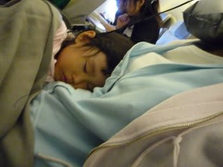
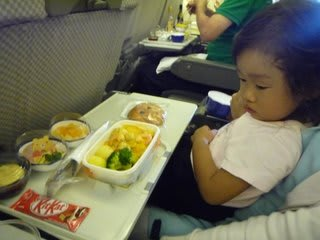
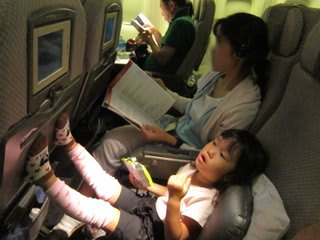
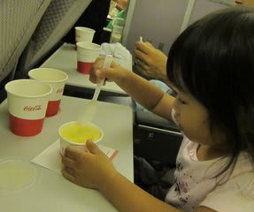
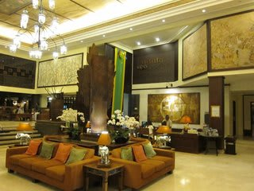
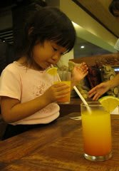

# コドモとコモド！子連れダイブクルーズ2　バリに到着

📅 投稿日時: 2011-07-05 00:41:54

んで．

成田を離陸した直後．

初めて，自分一人の席に座って大喜びの娘．

「よかったね～」

と思ったものも，わずか20分ほど後．

「だっこ～」

…娘よ．

お前は飛行機でいつもだっこしてると，

「一人で座る～」

と暴れるくせに，

一人で座ると，20分で飽きるのか！！

でも，どうやら眠たくてだっこして欲しかったらしく，

だっこしたら即座に落ちてました．

娘が寝てる間に機内食が配られたので，機内食はゆったりと食べられたので

いいタイミング．

…でも，JLの機内食，なんか，かなりコストダウンされてる気が…

で．両親が機内食を食べ終わったころ，丁度目を覚ました娘．

タイミングいいね～．

娘のために，チャイルドミールをもってきてもらいます．

…なんか，チャイルドミールもかなりコストダウン努力が

見られますね…

娘はチョコを喜んで食べてましたが，食事はほとんど食べませんでした…

まぁ，量が少なめのコストダウン機内食のせいで

ちょっと不足気味の父親のおなかを満たす役に立ったので

よしとしましょう．

さて．

食事が終わって．

残りフライトはまだ5時間．

娘が残り5時間，じっと座っていられるわけが無いよなぁ，

でも，寝てくれそうにないなぁ．

暴れたりしないかなぁ，と心配でしたが．

エンターテイメントシステムの子供番組をおとなしく見て．

（おとなしく，というより偉そうにふんぞり返って見てますが）

通路をしばらくだっこしてお散歩して．

その後，エンターテイメントシステムで今度はゲームを

しばらくやって．

着陸前に配られたアイスを食べて．

…と．

なんか，5時間近く飛行機で起きていたのに，

ぐずることも無く大声で騒ぐことも無く，

ほとんどじっと座席に座ってすごせたという．

予想以上にあっさりと，第一の関門を乗り切りました．

さすが，3歳を待たずして飛行機搭乗回数すでに

15回を数えるわが娘．

父親と同じく，飛行機が大好きなだけあって，

飛行機に乗っているのが楽しいようです．

で，バリはデンパサール空港に到着したのは夜10時ごろ．

空港では，ビザを一人当たり＄35で購入します．

…に，2歳児も大人と同じ価格ですか～！！！

係員に，思わず，

「Baby用の値引きってないの？」

って聞いちゃいましたが，冷酷な否定の回答．

ちょいとショック．

空港から出ると，ツアー会社のピックアップの車に乗って

ホテルへ向かいます．

ホテルは，空港から車で10分ほど．サザンスター御用達のRISATAです．

かなり高級感があるホテルで，結構気に入ってます．

ホテルでウエルカムドリンクを飲みつつ，

ツアー会社の方から，今後の予定の説明を聞いて，部屋に入ります．

部屋に入るとすでに12時近く．

シャワーを浴びると速攻で撃沈でした…

明日は一日バリ観光です．

おやすみなさい…
