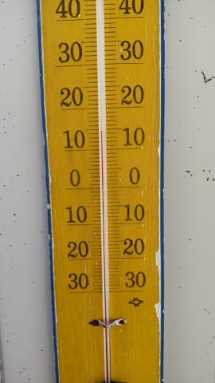
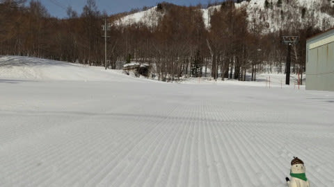
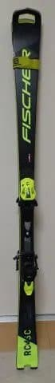
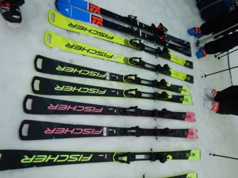

# FISCHERのRC4シリーズ，2022モデルと来シーズンモデルは一見同じだけど，来シーズンモデルが圧倒的に良い

📅 投稿日時: 2022-04-12 01:34:25

えー．

本日の志賀高原の状況が，いつものおこみん

特派員から送られてきましたが…

なんということか．

今日は奥志賀山頂，朝ですでに+14℃！！！

…なんということだ…（涙）

4月の朝でこんな気温って…

これはもう，異常気象レベルですね（泣）

こんな暑いくらいの気温だったので，

ゲレンデも朝イチは一見シマシマながら，

朝から雪は緩かったようです…

で．

こんな高温が，残念ながらまだしばらく続いて．

12日，13日も激烈高温な晴れ~うす曇り．

14日，15日は高温＆パラパラ雨，

16日，17日は平年並みの気温に戻って曇り．時折雨か雪．

という感じで．

15日まで高温が続く感じです…（涙）

16，17日の雨がひどい雨にならなければ

いいんだけど…

そして，気温があと10℃冷えてパウダーに

なればもっといいんですが…

さらに，そのパウダーが1mほど

積もってくれると文句ないんですが…

そのうえ…（以降，注文の多い料理店が続くので以下略）

ってなことで，本題へ．

昨日，日曜の志賀高原の状況を速報レポート

したので，今日は詳細レポートを書こうかな…

と，思ったけど．

…昨日のレポートを見返すと．

必要な情報はちゃんと書いてあって．

別にこれ以上詳しく書く必要ないじゃん

と思ってしまったので．

今日はちょっと違うネタを…

[ちょっと前の記事](ebce4e14d34daa93a774dfa2949907ce6.md)で，来シーズンモデルの

FISCHER RC4シリーズの板に試乗したことを

書きましたが．

私が個人的に所有している，2021シーズンモデルの

FISCHER RC4 Worldcup SC Pro．

この2021シーズンモデルと，今シーズンの

2022年モデルは全く変更がなく，

当然のごとく，乗り味は私が持っている

2021シーズンモデルと完全に同じだった

わけですね．

（2022シーズンモデルたち）

で．

来シーズンモデルも基本的な仕様は同じで，

構造やプレート，サイドカーブは変わって

いないとFISCHERは言っているので．

見た目の形状は，私が持っている

2021シーズンモデルと全く同じわけですが．

こいつを履いて滑ってみると．

…違う．

違うよ！

見た目は2021＆2022シーズンモデルと

同じで，サイドカーブもプレートも同じ．

テールの柄がわずかに違うとか，柄の

間違い探しレベルの違いしかないんだけど…

履いた感じが結構違う！！

実はFISCHERのRC4シリーズ．

2021シーズン以降のモデルより，

2020シーズンまでのモデルの方が，

板に粘りとばね感の強い返りがあり，

もしかすると，2020シーズンまでの方が

名機だったのかもしれない…と，

[RC4 RCの乗り比べでそれを
感じていた](ee1df2e54dbcf9baee3331c57466d4b56.md)のですが．

今回，2023シーズンモデルのRC4 worldcup SC Proを

履いてみると．

「え？これ，2020シーズンまでの感じに戻った？？」

という，

板の粘りとばね感の強い返り

を感じる板になってました…

端的に言うと．

2021＆2022シーズンモデルと

2023シーズンモデルの

RC4 worldcup SC Pro．

全く別物です

2021＆2022シーズンモデルは，板の

コアの強さで張りを出している感じで，

どちらかというとドライな乗り心地．

2023シーズンモデルは，踏み込むと

メタルのばね感を感じつつしっとりと

たわんでいき，切り替えの際に

ものすごく気持ちよくたわみが解放される，

粘りとウェットさを感じる乗り心地．

たわみのコントロールがしやすく，

気持ちよさは2023シーズンモデルが上．

…いや．

基本的なサイドカーブや構造のスペックは

変わってないんです．

…基本的な性格もそれほど大きく違うわけ

ではないんですが…

しっとり感というか，上品さというか．

その完成度が，2023モデルの方が高いです．

…いろいろ聞いた話によると．

2020シーズンモデルまでは，RC4シリーズは

オーストリア工場製で．

2021シーズンモデルからは，ウクライナ

工場製になったらしいのですが…

[こちらの記事](http://club-alpine.blog.jp/archives/1990023.html)にあるように，

フィッシャーのウクライナ工場，

2020年末に火災になり．

そのせいで，2023シーズンモデルからは

オーストリア工場製に戻ったようです…

それで，2023シーズンモデルの乗り味は，

2020シーズンモデルまでの乗り味に近く

なったのでは…

という話でした．

うーん．

現状としては，ウクライナ工場とかあれば

応援したくなる状況ですが．

火災で燃えちゃったのか…

とりあえず，そういう背景もあり．

2021，2022シーズンモデルと2023シーズンモデル．

見た目は同じでも，乗った感じはちょっと

異なります．

「2023シーズンモデルが試乗で気に入ったけど，

　中身同じだから2022シーズンの型落ちを

　買おうかな…」

と思う方は，買った後に，

「あれ？ちょっと試乗した印象と違うな…」

と思うかもしれませんので

ご注意ください．

とりあえず，2020シーズンモデルまでの

FISCHER RC4が好きだった人は，

2023シーズンモデルのFISCHERを試乗して

みることをお勧めします…！

## 💬 コメント一覧

### 💬 コメント by (Northfox)
**タイトル**: 自分も失敗しました。
**投稿日**: 2022-04-12 10:19:08

”中身同じだから型落ちを買おうかな” は要注意ですね。

自分も試乗会で凄く気に入った板に出会ったのですが、その型落ちを購入。しかしフィーリングの差がどうしても気になり、結局試乗した年式の板を買い直すというしょーも無いことをやってしまいました。😱

買い物上手のつもりが大散財。物欲のダークサイドに落ちてしまいました。👻

### 💬 コメント by (ikkun)
**タイトル**: Unknown
**投稿日**: 2022-04-12 10:53:58

野沢温泉でも履きたかったですが横から取られました(笑)乗れば良かったですが(笑)

### 💬 コメント by (レインボー74)
**タイトル**: Unknown
**投稿日**: 2022-04-12 13:36:19

火曜日の志賀高原情報

朝の上林+11℃　蓮池+10℃。朝から緩そうだ。午前勝負。

オリンピックとGSが快適。乗り物も含めた移動距離は一周4.3キロ。ゴンドラ標高差は450m。

暇だったので、どんなペースでできるのかなと、毎日志賀で最速の人と滑ってみました。

基本的にターンをして直かりは少しだけにしたら、8時30分~10時25分までで9周/115分(標高差450m×9=4050m　移動距離4.3km

×9=38.7km)。

6時30分FTから15時45分までの555分をそのペースで頑張れたら、標高差19546m　移動距離187km。

FT無しの435分では、標高差15320m、移動距離147kmになります。

今日はゴンドラがいつも私らを待ってくれていたという好条件もあったけど、午後は雪が緩むしでこぼこになるし、標高差20000m

には受難の時代ですよね。

11時の高天は+16℃　蓮池+18℃　上林+21℃でした。おそろしやー！

### 💬 コメント by (レインボー74)
**タイトル**: Unknown
**投稿日**: 2022-04-12 19:13:48

アイスバーンで混んでなければ、朝のFTからやれば、そして、常にちょっかれば、標高差20000mができるかも？

まあ来年かなあ、でも、一人やりそうな人が。

### 💬 コメント by (Skier_S)
**タイトル**: 4月に台風が来る…
**投稿日**: 2022-04-13 01:55:42

＞Northfoxさま

そうなんですよ…意外と表面のコスメチェンジだけかと思ったら，

細かいところが違うモデルってありますよね…

今回，ATOMICの板も，今シーズンと来シーズンモデルで

見た目は大きく変わらないけど，サイドカーブとかも見直されているようです…

＞ikkunさま

この板はぜひ一度履いてみることをおススメです！

＞レインボー74さま

早朝＋通常営業の1ゴンで20000m達成者もいますが，

最近，平日はゴンドラ遅くて．

日曜はさすがにトップシーズンより少なく見えても，

そこそこ待ち時間が発生するので．

やっぱり厳しいかな~…

