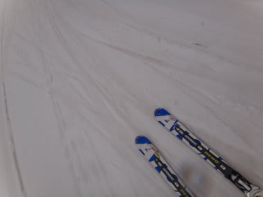
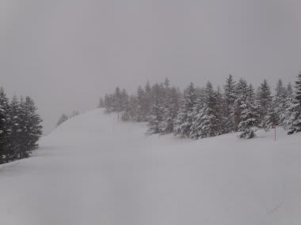

# 4月14日の志賀高原焼額山は…終日雪でした

📅 投稿日時: 2012-04-14 21:30:48

えー．

天気予報，はずしましたね．

朝のうちみぞれが混じるかもしれないけど，終日雨！

と予測したんですが．

今日は終日雪でした…

まぁ，雪といっても蓮池近辺までは雨．

一の瀬近辺でぎりぎり雪，という感じのびしょびしょ雪で．

かなり惜しい感じですが．

で．

おそらく昨日の夜からは雨だったんでしょうね．

朝イチは，水を吸った透明な雪の上に，新雪が数cm

積もった状態．

その上に，終日それほど強くない雪が降り続け…

4月中旬としては，まぁいいコンディションだったかも．

ただ，一の瀬メインバーン上部は，かなり重い湿った

新雪がところどころに溜まって，かなり

滑りにくい状況でしたが…

焼額ゴンドラも，ちょっと新雪が溜まって荒れ気味だったものの．

強烈なストップスノーでもなく．

溶けまくって板が潜ってしまう雪でもなく．

そこそこ楽しめました．

まぁ，終日湿った雪が降り続け，ウエアやゴーグルが

びしょぬれになって大変でしたが…

今日は雪を避けられる，ゴンドラのありがたさが身にしみました．

あ，ゴンドラやリフトはもうがらがらです．

さすがに，天気がこんなだったからガラガラです…

でも，今日一日で15cmくらい積もったんじゃないでしょうか？？

夕方にはこんな感じでした．

今日の夕方もちょっと積もったので．

明日の早朝は比較的良いコンディションで滑れるかな？？？
