# 上信越道から見える，あの妙義山へ登ってみた，その3

📅 投稿日時: 2020-10-06 01:09:14

🏷️ カテゴリ: [登山・旅行](c1d637a11a25b457ac978d197adbdafc5.md)

ということで．

[前回の記事に書いたように](e21484593e8cb0866ad5f3e9ec68ec50c.md)，

タルワキ沢を，矢印で示したてっぺん

（タルワキのコル）まで登ってきたので．

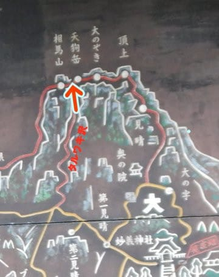

ここから左に行けば相馬山，

右に行けば天狗岳．

今回は，まずは相馬岳を往復し，

その後，天狗岳→大のぞき→頂上→見晴…

と抜けるルート．

タルワキのコルから相馬岳山頂へは，

急登のタルワキの登りに比べると，

なんて事の無い普通の緩い道．

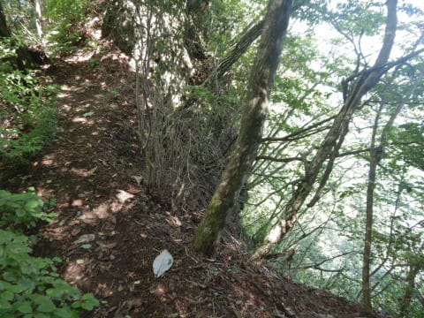

こんな道を10分行くか行かないかで，

やってきたのは相馬岳山頂！

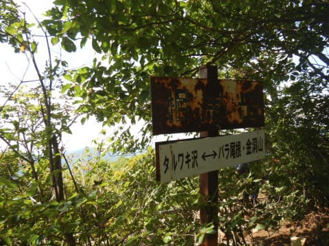

標高1104mの山頂ですが…

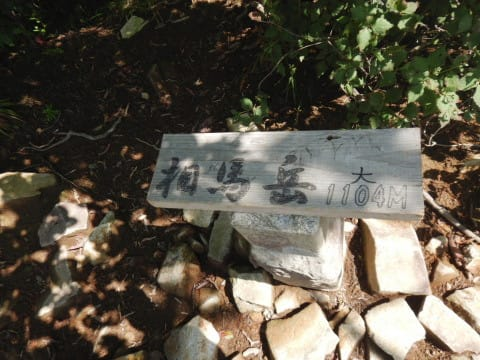

…山頂自体は，見晴らしのいいパノラマ！！

って場所ではないです…

これが山頂か…

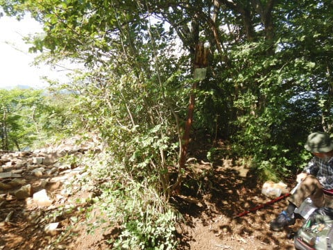

ただ，木々の切れ間からは，妙義山系が

見渡せて．

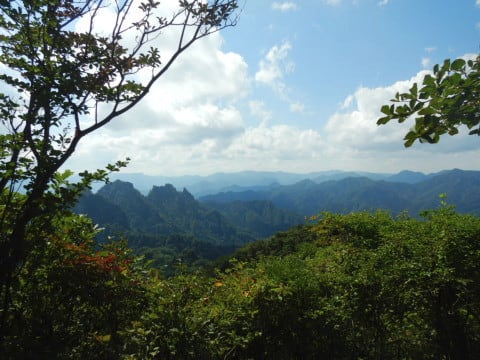

こっちは裏妙義方面ですかね．

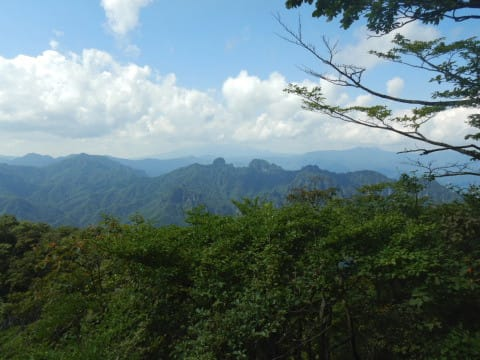

こちらはおもて妙義のお隣，

金洞山方面かな．

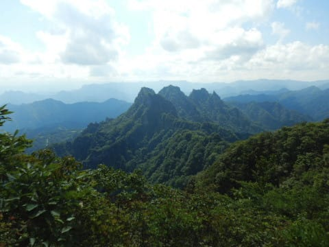

…どっちにしろ，周りの山もみんな，

妙にとんがってる山ばっかりですね(笑)．

ってなことで．

山頂では写真をとっただけで，引き返すこと

10分．タルワキのコルへ戻ってきて…

次は，この写真の崖のてっぺんに当たる，

天狗岳山頂へ！

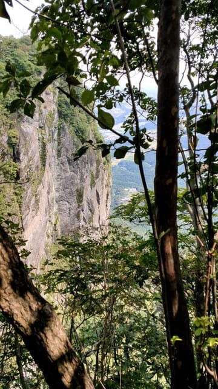

…タルワキのコルから，天狗岳山頂へは

意外と急登もなく，こんな感じの普通の

山道を30分ほど歩くと…

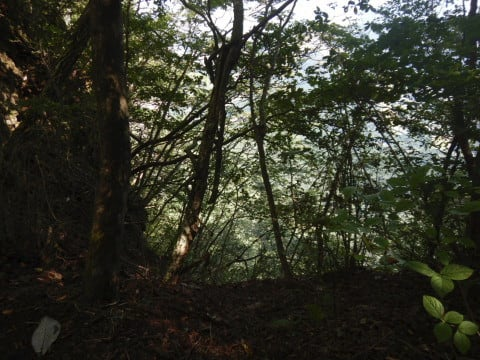

いきなり視界が開けて，天狗岳山頂

(天狗岩)へやってきました！

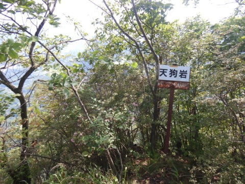

…ここも，絶壁感が半端ないんですが…

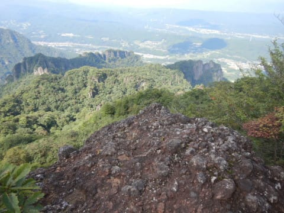

でも，相馬岳よりずっと見晴らしは

いいです！

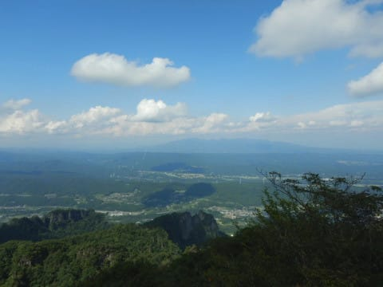

裏妙義も見えますね…

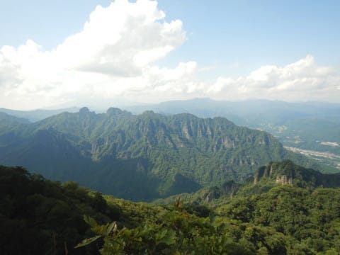

そして．

…これから先は…

この写真の右側の尾根沿いがルートの

ようなんですが．

…ホントにここから先に行けるのか？？

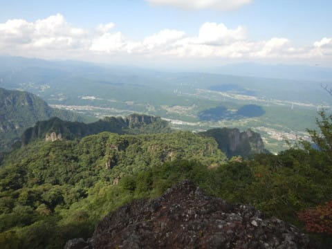

…と，心配になりながら，天狗岩を出発．

次の目的地は，大のぞき．

また，こんな道をしばらく歩いていき…

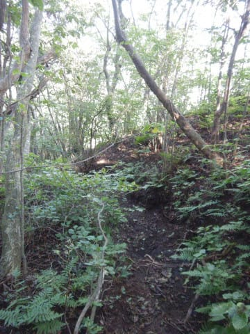

天狗岩から15分ほど歩いたあたりで．

ちょっと見晴らしがきくところに

出たのですが…

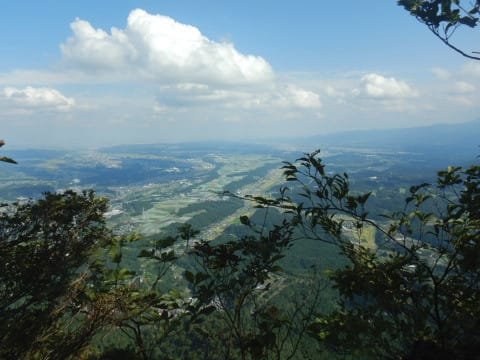

なんだか，目の前に

超絶に尖がってる岩

が見えてます．

いやーー．

尖がってるし，急だし．

すごいね～…

…と，思っていたところ．

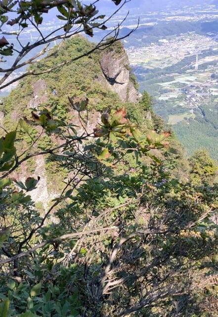

何か，その超絶に尖っている，

目の前の岩から人の声がするんですが…

…

…よく見ると，この矢印の部分．

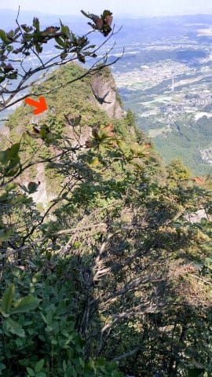

拡大すると…

え！？？

こんなところに人がっ！！

信じられん！！

スゲー…！！

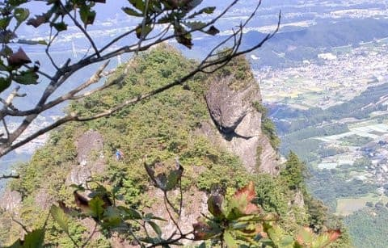

あんな怖いところ，自分は行けるわけがない．

あそこにいる人はザイルをもってるし．

普通のコースから外れたところで

トレーニングしてるんだよね…

…まさか，

これからあそこに行かなきゃならない

訳じゃないよね…？？？

…と．

思っていたら．

どうやら，この岩の．

赤い線で引いたところが鎖場になっていて．

赤い矢印のてっぺんが大のぞきらしく．

あの矢印のところを超えて行かないと，

次に進めないようです…

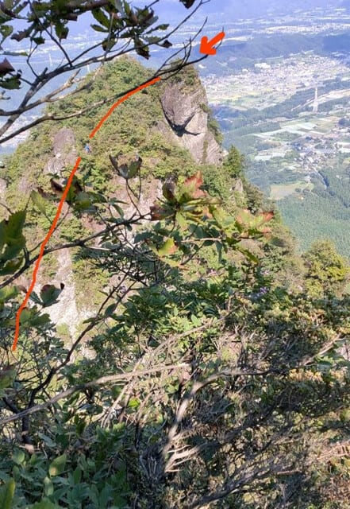

…

…

…

あそこ，ホントに自分も行くのっ！？？

（[続く](eb2304bc4ba43a76460e0ec2fc061e96d.md)）
