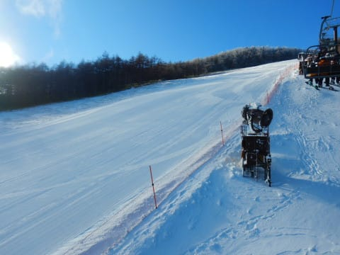
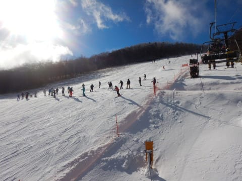

# 2021/11/28(日)，今シーズンオープン翌日のアサマ2000で滑ってきたよ！…速報レポート

📅 投稿日時: 2021-11-29 01:11:45

ってなことで．

やはり，27日はかなり雪が降りましたね～！

この積雪のおかげで，

八方と白馬47，五竜が27日にオープンしたのに続いて，

鹿沢が28日の日曜にオープンして…

([鹿沢スノーエリアホームページ](http://www.kazawa.com/snow/)より)

さらに，全く予告が無かったのに．

いきなり高天ヶ原が28日の12時に

オープンしたようです…

一の瀬ファミリーより先に高天ヶ原が

オープンするとは！

あ，ちなみに．

一の瀬ファミリーオープン日はまだ未定です…

([志賀高原リゾート開発Facebook](https://www.facebook.com/ShigaKogen.Ski/)より)

そして，かぐらが29日に，

なんとみつまたエリアまで一気にオープン！

([かぐらスキー場ホームページ](https://www.princehotels.co.jp/file.jsp?id=362948)より)

さらに，

野沢，丸沼も11月30日にオープンが決定

するなど．

続々オープン情報が出てきてます！

([野沢温泉スキー場Facebook](https://ja-jp.facebook.com/nozawaonsen.snowresort/)より）

([丸沼高原スキー場ホームページ](https://www.marunuma.jp/winter/1989/)より)

あとは30日の高温さえ乗り切れば，

これから1週間は人工降雪が打ち続け

られる気温が続くし．

12月4日はまたそこそこ積もりそうな

天気だし．

次の週末も，スキー場が次々オープン

していってくれるかな…

ってなことで．

土曜にオープンしたアサマに滑りに行って

来たわけですが．

今日は比較的早めの10時前に帰宅していたのに．

なぜか帰宅後に仕事をすることになり．

またこんな時間になってしまったので(涙），

今日も帰宅日恒例の速報モードにて…

今日のアサマ2000は朝から晴天！

…そして，人工雪の上に天然雪が

うっすら被ったいい感じのコンディションで

スタート！

あさイチは，しっかり締まったシマシマ圧雪！！

うおおおお！

久しぶりの緩斜面以外のゲレンデ！

それもシマシマッ！！！

午前中は1-2分リフトを待ったものの．

なぜか午前10時半を過ぎると，リフト待ちが

ほとんどなくなってきて，2-3組

待てば乗れるガラガラ状態に！

土曜はもう少し混んでたってことなので．

晴天でガラガラなのはラッキー！

…でも．

この時期のアサマ2000の常．

滑れる幅は，コースの全幅の半分くらいで…

そこに全員が集中するので．

ゲレンデは大勢で磨かれていき…

そうです．

12時前には，アサマ2000特有の

ツルツルバーンがところどころ顔を

出してきて…

午後1時ごろには，ツルツルに磨かれた，

見事な小回りレーンが出現！

午後2時ごろには，アサマ2000らしい，

かなりの凸凹＆ツルツルのミックスという，

かなり手ごわいバーンになっていったの

でした…

…ってなことで．

しっかりエッジを研いだ板で行かないと

午後はかなり辛い感じだし．

まだコース幅も制限されているけど…

でも，緩斜面しか滑れないYetiに比べると，

「あぁ…やっと本物のゲレンデで滑れた」

という感じで．

久しぶりのYeti以外の感触に，人生のシアワセを

感じてこれたのでした…

また明日，速報レポートやります～！

## 💬 コメント一覧

### 💬 コメント by (レインボー74)
**タイトル**: Unknown
**投稿日**: 2021-11-29 18:09:16

月曜日の志賀高原情報

今日は休養のつもりで寝溜めをしてのーんびり朝食をしていたら、クロアチア人(ウエアが、です)から電話が。

「高天が原は雪が良くて二人しかいない」

何事にもお誘いには極めて弱い私はすぐにその気に。

確かに高天であんなにいい雪は経験がない。10時半からレインボーまで、夢中で無休。

こないだの八方とは大違い。老人にはありがたいお雪様でした。クロアチア万歳！

午後になると、上のNHkに圧雪車が入っていましたよ。期待を持たせてくれますね。

明日火曜日は野沢オープンか高天か、悩ましすぎます。この選択に悩む苦悩を、エス様にも経験させてあげたい。

### 💬 コメント by (かず)
**タイトル**: Unknown
**投稿日**: 2021-11-29 19:33:03

レインボーさん今年もよろしくお願いします  今年は野沢にも行きますので野沢レポートお願いしまーす

### 💬 コメント by (レインボー74)
**タイトル**: Unknown
**投稿日**: 2021-11-29 20:25:34

お借りします。

先日八方で、カズさんと同じウエアの人がいたので近づいていったら、似ても似つかない可愛い女性でした。(ごめんなさいね。正直で)

### 💬 コメント by (ikkun)
**タイトル**: Unknown
**投稿日**: 2021-11-29 21:04:58

新潟人ですが長野FMを聴いてます( *´艸｀)朝から野沢 志賀の話題でしたよ  しかし75センチって凄いなあ

### 💬 コメント by (かず)
**タイトル**: Unknown
**投稿日**: 2021-11-29 21:37:20

いいきっかけじゃないですか！？その女のコとはその後うまくいきましたか？笑

### 💬 コメント by (Skier_S)
**タイトル**: 明日は昼間はいいけど，夜は荒れる天気
**投稿日**: 2021-11-30 01:11:22

＞レインボー74さま

ぐはぁ！！

高天ヶ原，そんなに良かったんですね…

うらやましい…

しかし，トリプルの緩斜面だけでそんなに楽しめたとは．

また野沢か高天のレポート，お待ちしています~！

＞かずさま

私もレインボーさんの野沢レポートを期待してます…

今シーズンの初滑りはいつになりそうですか？

＞ikkunさま

新潟県愛が足りないですね(笑)．

75cmも積もったんですか…

### 💬 コメント by (ikkun)
**タイトル**: Unknown
**投稿日**: 2021-12-02 15:05:57

いやいや( *´艸｀)新潟と言っても斜めに長いので(笑)(^-^ゞ野沢の最深と?ラジオにて  はい長野だから間違いないかと(笑)

### 💬 コメント by (うえいと)
**タイトル**: Unknown
**投稿日**: 2021-12-05 23:30:30

クロアチア人万歳(^^♪

### 💬 コメント by (Skier_S)
**タイトル**: 今日も焼額はよかった
**投稿日**: 2021-12-06 02:00:26

>ikkunさま

野沢75cmですか！

でも，これからしばらく積もらなさそう…(泣）

＞うえいとさま

クロアチア人ご本人からコメントですね(笑)．

今シーズンもよろしくお願いします～！！

