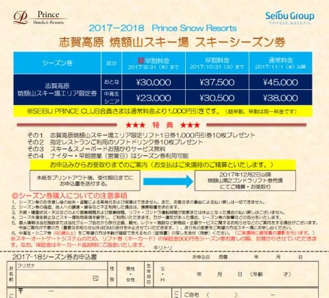
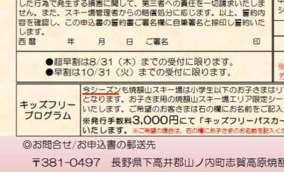
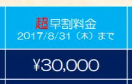
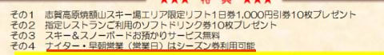

# 早くも2018シーズンの焼額シーズン券の情報が出たけど…なんだか昨シーズンより攻めてるよ！！

📅 投稿日時: 2017-06-06 01:06:34

🏷️ カテゴリ: [日記](cc4b5682fb7b8b144980957a978653fb0.md)

えー．

まだ2017シーズンが終わっていないというのに．

…

…ええ．

そうです．

まだ終わっていませんよ．

みなさんご存知のように，

まだまだ私にとっての2017シーズンは続いている

のですが．

[このBlog](http://blog.goo.ne.jp/olaf2125/e/30df36d2b8ee2463ea66d3b67dcf729a)を見て気づいたのですが．

どうやら，異常に気が早いらしい焼額山．

なんと．

早くも来シーズンの情報が出てきたようです…！！

焼額山公式ホームページの[ここ](http://www.princehotels.co.jp/ski/shiga/files/2017-18_season_ticket.pdf)にある案内のように．

どうやら来シーズンも，焼額限定シーズン券が発売されるようです！

…ふーむ．

なるほど…

じっくり見てみると．

今シーズンと来シーズンでは，結構変わってますねぇ…

ってか．

まず．

私にとっての来シーズンが「今シーズン」と書かれている

ことに違和感ありまくりですが…（笑）

とりあえず．

今シーズンと来シーズン，何が違うかというと．

超早割

というアグレッシブな価格が出てきました！

今シーズンは，[割引料金は早割35000円のみだった](ea19e7b651bc411ffabdc23c42fae0d50.md)のですが．

来シーズンは，8月末までに申し込めば

シーズン券が3万円だと…っ！？？？

…これは．

これは，攻めてる…

かなり攻めた価格だ．

そして．

これだけじゃない．

驚くことに…

は，はぅあっ！

なんとっ！

シーズン券が，

早朝・ナイターでも使えるだと！？？？

…3月中旬までのファーストトラックは使えないけど．

それ以降の早朝営業では使えるということか…

そして，ナイターも使えるとなると．

早朝とナイターだけでも，元が取れちゃうのでは？？

これは．

まさか，特定個人を狙い撃ちしていないか？？

焼額山は，

ナイターと早朝にかなりの高頻度でやってくる，

誰かの顔を思い浮かべながら，

このチケット作ってないだろうか？？？

…とか．

一瞬思ったけど．

でも．

GWまで営業してくれるなら，ナイター＆早朝だけでも

完全に元が取れそうなこのチケット．

来シーズンも，4月第1週で営業終わっちゃうんだろうなぁ…

だとすると．

早朝営業するのもわずか3週間だし…

だったら．

全山共通シーズン券を買う私が，

追加で焼額山限定シーズン券を買う

ことは無いなぁ…

…うーむ．惜しい．

GWまでの営業が確定なら，このシーズン券の売り上げが

かなり増えそうなのに…

惜しいっ！！

## 💬 コメント一覧

### 💬 コメント by (はなげ親分)
**タイトル**: 悩みどころ
**投稿日**: 2017-06-06 13:09:16

ほんと、気合入ってますね！

シニア券\23,000ですとナイター＆早朝で、そこそこクリアできそうな気がするんですけど・・・

カミさんの足の具合次第になりそうですけど、

どうしようかな～

### 💬 コメント by (olaf2125)
**タイトル**: よく見ると…
**投稿日**: 2017-06-06 18:29:11

ナイターと早朝も含まれて、よく見ると他の特典も結構な大盤振る舞いですね。ちょっと惹かれるなぁ…

来シーズンはどれくらい通えるかなぁ〜

（リンクありがとうございます！）

### 💬 コメント by (Skier_S)
**タイトル**: 焼額，GWまでやってくれないかな…
**投稿日**: 2017-06-07 01:35:12

＞はなげ親分さま

シニア券2万3000円だと，ヤケビ利用券

1000円券ｘ10枚もらえることを考えれば

実質1万3000円！！

これは…

ナイター＆早朝は，シニア割引が無かったので．

シニア券なら，シーズン券のモトがナイター＆早朝だけで，

余裕で取れそうですね…

＞olaf2125さま

あ，今度はこちらの名前でいらっしゃいましたか(笑)．

情報ありがとうございました～！

おかげさまで，焼額の情報が更新されていることに気づきました…

でも，来シーズンのシーズン券，確かに特典が

かなりついてるんですよね…

結構魅力的なお値段ですよね～．

ただ，焼額以外に行けないのはつらいです…

来シーズンは14日と言わず，もっといっぱい

志賀高原で滑りましょう～！！

### 💬 コメント by (Goku)
**タイトル**: Unknown
**投稿日**: 2017-06-07 18:50:49

う～ん、悩ましい価格設定ですね。

でも、この営業姿勢をＧＷまで営業するって事に変えてくれないだろうか。

と、思っているのは私だけではないはず。

### 💬 コメント by (しんちゃん)
**タイトル**: ＧＷまで・・・
**投稿日**: 2017-06-07 22:01:56

ホント超特価・大盤振る舞いですね。

ヤケビ、ＧＷまで営業してほしいですね。

あるいは、ゴンドラスピードを上げたり、搬器数を増やして、日帰りゲレンデスキーヤーでも日中に20000m目指せるようにして欲しいです(^^ゞ

### 💬 コメント by (Skier_S)
**タイトル**: ホントにGWまでやってほしい…（涙）
**投稿日**: 2017-06-08 02:20:24

＞Gokuさま

いやーー．

ナイター早朝込みと考えると，

かなりアグレッシブな価格設定ですよね…

GWまでやってくれれば，早朝営業に

15日ほど行っちゃうと思うので，

それだけで元を取っておつりが来ちゃいます…

でも．

GWまで営業することにした場合は，

シーズン券の値段がもっと上がるのかもしれませんが（笑）

＞しんちゃんさま

いやーー．

GWまで営業してほしい．ホントに．

でも確かに，ゴンドラのフルスピード運転も

お願いしたいところですね…

一の瀬から焼額ゴンドラの速度をチェックしていて，

フルスピードになったのを確認してからヤケビにくる

某20000mな方がいるし．

「減速運転だ」

となったら，20000mの大御所の方々は，

即，他のスキー場へ移動しちゃうので．

フルスピード運転すると，お客さんが多少は増えそうな

気がするのですが…

### 💬 コメント by (ゴン太(gonta))
**タイトル**: 信濃毎日新聞
**投稿日**: 2017-06-09 23:46:57

ゲレンデではご挨拶させていただいてましたが、初めてのコメントです。

今朝の信濃毎日新聞朝刊経済面でも記事になっていたようです。地元でもかなりのインパクトなんでしょうね。

索道協会も何らかの対抗プランを出してくれると有難いなと、本音では思いますが、無理し過ぎてリフトの削減やコースの改悪に繋がっては本末転倒なので悩ましいところです。

### 💬 コメント by (Skier_S)
**タイトル**: ゴン太さま
**投稿日**: 2017-06-10 03:04:01

をを！

初コメ，ありがとうございます…！

いつも焼額ではお世話になってます．

しかし，信濃毎日新聞に載るくらいの

ニュースだったんですね…

このヤケビのシーズン券．

志賀高原は広いスキー場をいろいろ

滑れるのが魅力なので，あまり各スキー場が

囲い込みをやるのはどうかなぁ…

って気がしているので，あまり過激な

競争にならないことを祈ってます．

志賀高原内で戦わず，

志賀高原以外のスキー場と比べて

魅力的に感じるような，そういう施策を

してほしいなぁ…

と，切に願うSkier_Sでした．

