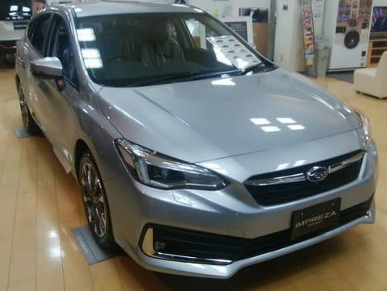
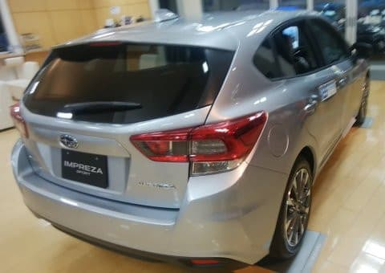
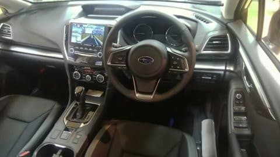

# SUBARU D型インプレッサスポーツに乗ってみた

📅 投稿日時: 2020-07-12 03:07:22

🏷️ カテゴリ: [車試乗](c07dec5709d34bd74e1f6cb9c8291061b.md)

えー．

昨年秋にD型にモデルチェンジした

インプレッサ．

C型⇒D型になるにあたって，

外観，内装，足回りなどにかなり手が入り，

見た目も大きく変わったわけで．

年次更改のない他社モデルでは

「マイナーチェンジ」と呼ばれる

変更がなされたわけですが…

今から振り返ること，数か月前に

このD型を試乗したので，

今さらながら，GTインプレッサスポーツD型の

試乗レポートをば…

乗ったグレードは，2.0i-S.

2Lの最高級グレード．

このグレード，4WDだと270万円近く

するんですね…

私が前に乗っていたBR レガシィ君より

高いじゃないですか…っ！！

外観は…

フロントは，C型までと比べ，バンパーまわりが

かなり変わりましたね．

リアは…

違いがよく分からん…

内装は，マルチインフォメーションディスプレイの

フードが丸っこい形になったくらいで，

後は違いがよく分からん…

ってなことで．

運転席に座り，走り出してみますが…

うむ！！？？

…これは，よくできてる…

ってか，スバル乗りでこの乗り味に

慣れているからか．

私がふだん乗ってる，LEVORG 2.0 GT-S E型から

のりかえても，全く違和感ない感じ．

というより…インプレッサよりクラスが上の

はずの，LEVORG2.0 GT-Sとほとんど変わらん

レベルの足回り＆ステアリングの完成度

じゃないかっ！？？

…というよりも．

この新型インプレッサの方が，

VMG LEVORGよりも，いい足してるんじゃないか？？

これ？？？

エンジンも，2.0L NAだけど．

ブーストが効いてなければ，LEVORG 2.0も

同じ2Lなので．

アクセルを踏みだした一瞬のトルク感は，

LEVORG2.0とそんなに変わらん…

さすがに動き出したあとのブーストの

盛り上がりは無いけど．

でも，ブーストを上げないで走る

緩やかな街中程度では，

トルクの不足感は無いな…

前回，A型に乗った時は，アクセルを踏むと

リニアトロニックがすっとローギヤードに

変速してエンジン音が高まるので，

ちょっとトルクの不足感を感じたけど．

D型から，街乗り程度のアクセル開度が

低い領域での制御を変えたのかな？

リニアトロニックのギア比を高いままにして，

回転数を上げずに，TBWでちょいと

オーバーシュートぎみにスロットルを

開けてトルクを出していく感じ…

登り坂でも，アクセルを踏めば十分な

トルクが出て，思った以上に軽快に坂を

登っていきます．

ありゃ？？

インプレッサ2.0ってこんなに軽快だったっけ？？

全体的に，アクセル開度がそれほど大きくない

領域ではあまり回転数を上げず，

アクセル開度が大きくなったら初めて

リニアトロニックをローギヤードに変化せていく…

という，スロットル＆リニアトロニックの

制御になったように感じます．

ブレーキタッチも妙にサーボが効いた

スポンジ―な感じじゃなくて，

踏み応えがあって踏んだだけ効く感じで

良いタッチだし．

電動パワステの制御も…

これ，LEVORGよりいいよ？？？

足回りも，かなりしなやかに動く感じ．

フリクションが少なく，ブッシュがゆるゆる

動く感じは無く，

タイヤサイズが18インチの45扁平ってのも

あるけど，かなりかっちりとした足回り．

とはいえ妙な硬さは無く，E型LEVORGと

比べても負けてない…

というか．

もしかすると，そこそこのハイスピードで

郊外を気持ちよく飛ばす程度なら，

新しいインプレッサの方が快感度で

上回っているかも…！？

そこそこの横Gをかけてみたけど．

トレッド剛性も高そうだし．

横Gでのロール増に伴うラインの変化もなく，

ステア量変化なしに狙ったラインをスッと

トレースできます…

以前乗っていたBRレガシィはロールが大きく

ゆっくり出たので，ロールの変化に伴う

フロント対地キャンバ変化でステア量の

修正が必要になったのですが…

このインプレッサはそんなこともなく，

VMGレヴォーグと同じ感じで，

かなり気持ちよく左右にうねった道を

走り抜けていけます．

かといって，足が硬いわけではないんです．

ダイレクト感はあるけど，足がちゃんと

動いている感じ．

とりあえず．

普通に街乗りから，緩やかな郊外道路程度を

良いペースで飛ばす程度の，普通の使い方に

おいては．

ブラインドでテストされて，足の動き，

ステアリングフィール，ブレーキ感，

インプとLEVORG，どっちがいい？

と聞かれたら．

うーーーん…

もしかしたらインプかな？？

と悩むほどのレベルでした…

これで，ちゃんとアイサイトツーリングアシストも

ついてるし．

LEVORGよりちょっと狭めのトランクの広さ

が許せるなら，インプレッサでいいかも…

でも．

2Lの4WD，

2.0i-Lで250万円越え，

2.0i-Sで270万円するのか…

BRレガシィは，安かったんだなぁ…

## 💬 コメント一覧

### 💬 コメント by (しんちゃん)
**タイトル**: SUBARUらしさ
**投稿日**: 2020-07-12 12:06:16

マイナーチェンジでSUBARUらしさが熟成されているんだなと感じました。

インプレッサって、コンパクトカーの中ではトランクにゴルフバッグが横に入れられる数少ない車なんですよね。（ゴルフ仲間がインプレッサに乗り換えた時の理由がこれでした）

安全装置の付加で、車の価格は50～100万円ちかく以前より値上がりしてますよね。

SUBARUはTOYOTAグループ傘下に入り数年たっていますが、TOYOTAらしくなってしまった点は何かありましたでしょうか？

### 💬 コメント by (U1)
**タイトル**: Unknown
**投稿日**: 2020-07-12 15:41:56

スバルグローバルプラットホームの採用第1段でボディ剛性向上が今回の好評価だったと思われます。

まだこれも序章で、その後のXVやフォレスター、アウトバックで更にボディ剛性上がってます。

次期レヴォーグが期待されますね。

### 💬 コメント by (Skier_S)
**タイトル**: コメント回答遅れました！
**投稿日**: 2020-07-14 01:22:38

＞しんちゃんさま

インプレッサ，マイナーチェンジで良くなりましたよ…

スバルはTOYOTA傘下に入りましたが，技術提携している

マツダの方が，ハイブリッドシステムをTOYOTAから供給してもらうなど，

技術的結びつきが強いかも…？

＞U1さま

インプレッサは，開発時にLEVORGを超えてもよい，

むしろ超えろと言われてたみたいですから…

下剋上ですよね(笑)．

時期LEVORGに期待です…

### 💬 コメント by (Noname)
**タイトル**: Unknown
**投稿日**: 2020-07-14 17:34:41

現行LEVORGを買おうかと思ったけど、これ読むと迷うなぁ

### 💬 コメント by (Skier_S)
**タイトル**: ＞Nonameさま
**投稿日**: 2020-07-14 23:09:11

現行LEVORGもわるくないのですが…

圧倒的なエンジンパワーが欲しいなら，次期型は1.8Lしかなくなるので，

今のうちLEVORG2.0を買っておくのがいいかと思います．

そうじゃなくて，現行のLEVORG1.6とインプ2LのD型だと…

私はインプレッサにしてしまうかも？？

好き好きだと思います．

どっちを買ってもいい車です．

### 💬 コメント by (Noname)
**タイトル**: Unknown
**投稿日**: 2020-07-18 15:58:25

2.0GT V-SPORTの見積もりをもらってきた

なんだかんだでオプション60万にもなってしまい結構な金額に

モデル末期でも思ったほどの値引きじゃなかった

どうしようかな？？

### 💬 コメント by (Skier_S)
**タイトル**: ＞Nonameさま
**投稿日**: 2020-07-19 02:46:48

私はバイザーとカーペットしかオプションを付けなかった人なので…

カーナビも通販で格安品買って自分で着けますし(笑)．

そして，わずか30分の交渉で激烈値引きを出してくれました…

https://blog.goo.ne.jp/tsakamot2001/e/ea6f4f8d1271dcfab296314604e46dab

カーナビの付け方も詳しく書いてありますので，

こちらを参考にしてみてください

https://blog.goo.ne.jp/tsakamot2001/e/dd57949b5ae86a0a208960256cb06e91

### 💬 コメント by (Noname)
**タイトル**: Unknown
**投稿日**: 2020-07-20 13:49:59

以前はナビとか自分で取付けしてたんですけど、最近は面倒くさくて…w

結局オプション代くらい引いてもらい、購入決定！

納車はお盆休み明けになるらしいです

楽しみ♡

### 💬 コメント by (Skier_S)
**タイトル**: ＞Nonameさま
**投稿日**: 2020-07-21 00:33:30

をを！！！ご契約おめでとうございます！！

納車が待ち遠しいですね…

昔はナビ自前取り付けされてたんですか．

確かに，かなりめんどくさいですよね…

でも，半分楽しみな感じでやってます(笑)．

では，良きLEVORG2.0ライフを！！

### 💬 コメント by (Noname)
**タイトル**: 納車
**投稿日**: 2020-08-29 23:55:33

契約から１ヶ月以上、本日やっと納車されました

もう少し早いかと思ったけど、結構時間がかかりました。

早速200km程ドライヴ。

ちょっと踏むとやたらと速くて馴れるまで気をつけないと。

踏まなきゃ14km/Lくらいは楽勝ですが18km/Lは自分には無理そうです…

### 💬 コメント by (Skier_S)
**タイトル**: ＞Nonameさま
**投稿日**: 2020-08-30 23:41:41

納車おめでとうございます！

2.0V-SPORT，コストパフォーマンス高い車だと思います．

こんなに要らないというほどのパワーがある車ですから，

楽しんでください…

高速道路でリッター18km走るには，アクセルを踏みたい欲求と

戦うかなりの精神的修行が必要です（笑）．

