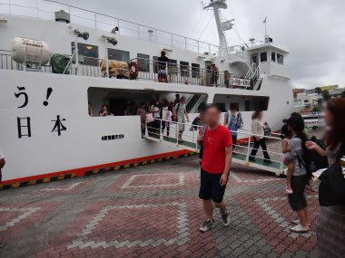

# 2012年7月　子連れ座間味ダイビング旅行記14　そして悲しき那覇移動

📅 投稿日時: 2012-08-14 02:22:15

🏷️ カテゴリ: [ダイビング日記](ce3a7a8d424d112fce83ee85c81a0e344.md)

というわけで．

本日午前の1本を潜ったら，

台風を避けるために急いで那覇に移動しなくてはならんわけですね．

ダイビングボートが港に到着したら，全速力でシャワーを浴びて，

びしょぬれのダイビング器材をそのまま大急ぎでキャスターバッグに詰め込み…

そしてフェリー乗り場へダッシュ！

な，何とか12時半の出港には間に合った…

しかし．

今回のペンション星砂のおばさんの対応には感謝．

港へフェリー待ちの様子を見に行ってくれたり，両親が必死に

荷造りをしている間，だれにもかまってもらえない娘のために，

揚げたてサーターアンダーギー(沖縄の揚げドーナッツ)を作ってくれたり．

予想外の台風で，一泊キャンセルになっちゃったけど．

ホットな対応は感謝感激．

さらに．ペンションのおばさん．

出港するフェリーを見送ってくれました．

ありがとう～！

そして，さようなら～！

座間味．

またやってくるからね～．

…ホントは明日までいるはずだったんだけど（ぼそ）

でも．なんだか台風が接近していると思えない海況．

海がベタなぎなのが，悔しさを3割増にしてくれます．

とりあえず．

フェリーに乗っている時間に，今晩那覇市内で泊まるところを探さないと…

と，ネット時代のありがたみを最大限に享受しつつ，

宿を探すと．

なんと．

市内のリゾートホテルが，平日当日割引で超激安で出ているのを発見．

…リゾートホテルですよ．リゾートホテル．これ，ビジネスホテルと変わんない値段だよ…

ということで．

ネットで激安ホテルを予約している間に那覇に到着．

ホテルに向かい，ダイビング器材を部屋の中に広げまくって

乾燥させて…

…そのあとは．

せっかくのリゾートホテルだし．

プールに行きましょうか．

…ホントは今頃，まだ慶良間の海に潜っているはずだったのに…（涙)

外はまだ，台風の気配もない穏やかな天気です（涙)．

ということで．

プールにやってきましたが．

まぁ，娘は海でもプールでもいいみたいですね．

プールでも大喜び．

うれしそうに泳いでます．

まぁ，親は多少悔しかったけど．

娘はプールでも楽しめたみたいだし．

結果オーライとしておこう…

と，自分を慰めてみる（涙)

## 💬 コメント一覧

### 💬 コメント by (KENKEN)
**タイトル**: 台風残念でしたね
**投稿日**: 2012-08-14 23:22:07

これ(台風)ばかりはどうしようもないですが、残念でしたね。

自分は当日西表島に居ましたが、離れていたため殆ど台風の影響はありませんでした。

娘さん4歳にしてシュノーケルデビュー凄いですね。

うちの娘はまだ顔を水に付けるのが怖いらしく、シュノーケルとまでは行きませんでしたが、今回浮き輪があればどこでも行けるようになりました。

（水深10mでも平気でこっちがびっくりです）

しかし、うちの娘もそうですが、海水浴は殆ど沖縄（しかも離島ばかり）となんと贅沢なことか・・・・

自分なんか初沖縄（西表)は大学生だったのに。

（しかも那覇⇔石垣の往復は今は無きフェリー）

今更ではありますが、座間味⇔那覇間でヘリコプターのチャーター便があるそうですよ。（座間味村のHPの記載があります。）

しかも台風で船が欠航したり遅れる場合は半額だそうです。（それでも船よりは高いですが・・・）

翌17日の昼頃は自分も那覇空港に居ました。

ひょっとしたらどこかですれ違っていたかもしれませんね。

夏(ダイビング)モードは訪問者が減るとのことですが、子連れの様子が分かるこちらの方自分を楽しみにしていますよ。

ところでザマミセーリングさんではご夫婦で交互に潜られていたようですが、去年のおねーさんはいなかったのでしょうか？

ザマミに続き次の旅行記も楽しみにしてます。

### 💬 コメント by (Skier_S)
**タイトル**: KENKENさま
**投稿日**: 2012-08-15 01:28:36

これまで沖縄で台風には数え切れないほど遭遇しているんですが．

もう，飛行機が飛ばなかったの，滞在を途中で切り上げただの…

いつもは「自然の脅威だから仕方ないな」という

あきらめの心境でいるんですが．

今回は，飛行機のダイヤもほとんど乱れず，

ほとんど台風の影響がなかったにもかかわらず．

慶良間の船だけ狙ったように欠航になりちょいと

悔しい感じが…

しかし，同じ時期に西表ですか！

いいなぁ～

サンゴは元気でしたか？？

娘さん，深い海でも大丈夫になりましたか．

将来に期待がもてますね（笑）．

座間味のヘリコプター，ペンションに案内ポスター

ありましたが，とても利用しようという値段では

なかったです…（汗）．

そうそう，ザマミセーリングのお姉さん，今回は

残念ながら乗船してなかったんですよ…

おそらく夫婦そろって潜りに行っても，船長が船の上で

面倒みていてくれると思うんですが．

我が家は，ダイビング中に娘を船の上で待たせるのもかわいそうで，

その間も泳がせて上げたかったので，交互に

潜ることにしました．

PS.このブログ，夏の間の読者は冬の半分以下です…（タイトルが悪いか？？）

### 💬 コメント by (KENKEN)
**タイトル**: 西表の珊瑚は・・・
**投稿日**: 2012-08-15 23:27:43

元気でしたよ。

これでもかって位お腹一杯になりました。

ショップの話では西表はオニヒトデの被害もなく、珊瑚の状態は良好だそうです。

(逆に石垣は昨年Skier_Sさんが訪れた通り今年も芳しくないそうです）

娘は最初足が付かないところは怖がってましたが、だんだんと慣れていき最後は水深関係なくなってました。

海慣れしているショップ(ダイブワンロードさん）のお子さん達が一緒だったのも影響したかと思います。

座間味の高速船やフェリーは直ぐ欠航するので困ったもんですね。

自分も那覇で足止めされたり、ダイビングを諦めて帰ったことがあります。（ところが翌日は凪）

安全を考えると仕方ないかもしれませんが、安全代を取りすぎではと思うことがあります。

### 💬 コメント by (Skier_S)
**タイトル**: 西表は大丈夫ですか…
**投稿日**: 2012-08-16 01:44:02

西表のサンゴが元気と聞いて一安心です…

私も西表が大好きなので，今度は西表に行きたいんですが．

石垣までの飛行機代が高いんですよね…

大人はかなり割引がありますが．

子供の割引があんまりなくて．

ダイブショップのお子さんが一緒に遊んでくれたんですか．

いいですね～．

ザマミセーリングさんも，子連れのお客さんが

多いらしく，子供同士で刺激しあうと上達が

すごい早いと言ってました．

幼稚園児で，素潜りする子もいるとか…

ザマミセーリングは，おねーさんがいなくても，

親のダイビング中は船の上で子供の面倒を見てくれるので，子連れぜんぜんOKです．

…おねーさんがいれば，親のダイビング中も

海で遊ばせてくれたんですけど．

で．

次の旅行は，9月の予定なので，それまでは

また過去の旅行記を掲載します．

お楽しみに！

