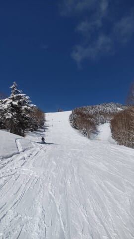
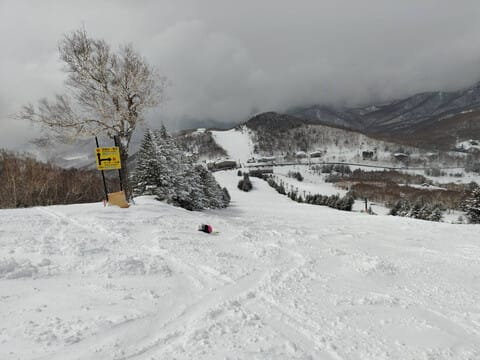

# 3月23，24日の週末の志賀高原スキー場の天気は…土曜は液体が降るかも(涙)，日曜も高温の曇り空．そして3月20日の志賀高原は，昼までは晴れ間もある冷え冷えコンディションだったみたい

📅 投稿日時: 2024-03-21 01:58:57

🏷️ カテゴリ: [スキー天気予想](c6554f5c3c106093b511a8daae23757e8.md)

ということで．

本日は祭日で仕事が休みだったけど，

午後から天気が大荒れになりそう

という予想だったこともあり．

家でやっつけたい仕事もあり，

睡眠不足も解消したかったと

いうこともあり．

家でゆっくりするという

判断をしたわけですが…

特派員からの写真を見ると．

あさイチは確かに雪降りで．

20cm以上の積雪があったよう

ですが．

気温も-6℃とそこそこ低め

だったものの…

ゴンドラが動き出すころから雪も

止んで，風も全然強くなく．

あさイチは圧雪の上に冷え冷え雪

10cmという，楽しそうなコンディション

だったみたいです…

それどころか．

午前中は晴れ間ものぞくくらいで．

冷え冷え雪で日が射すという

かなり楽しめる状況だった

みたいです…！！

いや，これ，ちょっと日が射すレベル

じゃなくて，完全に晴れてますやん！！

…昨日の予想で，

明日の午前中は冷え冷え最高の雪質で，

そこまで雪や風もひどくなく，

朝は結構いい感じだろうし．

と書いていたけど．

ここまで日が射す，いい天気になるとは…！！

くそーーーー．

志賀高原に行けばよかった…

でも．

やっぱり昼頃からは完全に曇り空で，

雪も蹴散らされて荒れてボコボコに

なっていったようですが…

さらに午後2時前ぐらいから，予想通り

天気は急変して悪化！

激烈な雪降り，そして3時ごろから

風も強まったらしく…

焼額は午後3時半に，全リフト・ゴンドラが

強風で営業終了になったようです．

そして，帰りの下り坂はすごい吹雪に

なったようで．

うーん．

これなら行かなくてよかったかな…

とも思いつつ．

午前中のいいコンディションだけでも

楽しみたかった…

数年前の仕事がご無体じゃない頃なら，

100%日帰りで行っていただろうなぁ…

で．

夕方から激しく雪が降り始めた志賀高原．

今もすごい勢いで降ってるみたいです！！

午後6時ごろのライブカメラでも，

かなりの勢いの雪が降っているのが

写ってますが…

（[焼額山スキー場ライブカメラページ](https://www.princehotels.co.jp/ski/shiga/livecamera/)より，以下同じ）

深夜1時半ごろでもまだ降り続けていて…

6時間で30㎝以上積もってますね…！！

ってなことで．

ダメダメな2月と違って，冷えて

ドサドサ雪が降る3月になってきている

わけですが．

このいい雪が，今週末までもつのか？

天気図から予想してみましょう…

まず，21日木曜の850hPa図ですが．

をを！！水色の-9℃線が志賀にかかって

いるので…真冬レベルの冷え込みです！

地上天気図も，日本海側にかなり多めの

降水量が集中した予想になっていて．

…明日まで，雪はまだまだ積もり

続けます…！！

続く22日の金曜ですが．

この日の850hPa気温図も，朝のうちは

まだ水色の-9℃線が志賀にかかっていて…

朝のうちは結構冷え冷え！

この日の地上天気図は，高気圧に覆われて

ますので．

朝のうちは雪が残るけど，午後は晴れて

行くかな…

そして肝心な週末の23日の土曜の

850hPa図を見ると…

うがーーー！！ちょうど週末になったら，

赤い0℃線が志賀ぎりぎりくらいまで

上がってきちゃいましたよ…！？？

そして，地上天気図は…

うぎゃー！

こっちもちょうど日本海に低気圧が

発生して…

なんだか降りそう．

この気温で降ったら，朝のうちは雪だけど，

昼間は液体になりかねないんですが…！？？

ヤバい…土曜はちょっとヤバい．

で．24日の日曜の850hPa図を見ると．

ううううーーん．

赤い0℃線ははるか北海道まで北上…（泣）

そして，志賀高原には+6℃線がかかり．

5月並みの気温に…

これは，降れば絶対液体の気温（涙）

そして，地上天気図も．

この日はぎりぎり志賀高原にかかって

いるので．

ヘタすると日曜も液体が空から落ちてくる

可能性が…

ってなことで．

まとめると．

21日(木)：午前中まで強い雪．

　朝一の気温は-12℃くらい．

　朝までの積雪は50～60㎝くらい積もる．

　圧雪バーンも圧雪の上に10～15㎝の積雪．

　非圧雪の深いところは膝から太ももパフ！

　午前中はパウダーが供給され続ける．

　午後は雪が弱まるが，終日冷え冷え

　吹雪の根性なしスキーヤーふるい落とし

　の一日．

22日(金)：朝のうちは雪が残る．

　あさイチの気温は-10℃以下の

　冷え冷え！

　朝までに10cm弱積もってるか？

　昼頃から雪がやみ，午後は曇り，

　時折青空も！

　冷え冷えのいい雪が楽しめる

　ラストデー

23日(土)：あさイチの気温は-3℃くらい

　朝からパラパラと雪が降る．

　あさイチのバーンは柔らかめの

　トップシーズン雪の圧雪に，

　うっすら雪が乗ったいい感じ！

　ただ，昼に向かって気温がぐんぐん

　上がり，山頂でも+3℃くらいまで

　ヘタすると，昼頃にはパラパラ降るものが

　雪から液体に変わる．

　液体になったら，雪はちょっと重めの

　微妙な雪になるかも…

　運が悪ければ午後一瞬強く液体が降る．

　運が良ければ，弱い降りの雪が午後も

　パラパラ降る感じ．

24日(日)：この日の天気はまだ予想

　ばらつきが大きく，精度が低いけど…

　天気は曇り．

　朝から気温はプラス．

　あさイチのバーンは表面が硬めの

　圧雪．

　前日に雨がそんなに降らなければ

　いい感じに締まったシマシマ，

　雨が降ればコロコロが出る雪．

　でも，気温が高くコロコロはすぐ

　つぶれる．

　気温が上がるので，雪はしっとり

　するけど，しっかりした滑りやすい

　バーン状況だと思う．

ってな感じでしょうか…

で．

来週の26日あたり．

なんだかかなりの液体が降る

可能性が…(泣)

せっかく積もった雪が融けていく…(涙)

その後はまたちょっとだけ雪が降って

くれそうなので，ひどいバーン状況は

続かないかもしれないけど．

うーん．

22日までの低温と，23日からの

高温の切り替わりが激しすぎる…

天気が極端なんだよ…

もう少し平均的に冷えてほしい…

とりあえず．

トップシーズンの冷え冷え雪で滑れる

のは，土曜の午前中がラストの可能性が

高いので．

今日は滑りに行かなかったけど．

今週末は絶対滑りに行かねば！！

## 💬 コメント一覧

### 💬 コメント by (地元民)
**タイトル**: Unknown
**投稿日**: 2024-03-21 06:41:03

郷も、夕方の降り方はすごかったっす。

30m先が霞むくらい

### 💬 コメント by (Unknown)
**タイトル**: Unknown
**投稿日**: 2024-03-21 22:24:12

土曜日の午前中は風が強くてリフトが動かないのでは？

### 💬 コメント by (Skier_S)
**タイトル**: 今週末も冷えてほしい…
**投稿日**: 2024-03-22 01:22:29

＞地元民さま

やっぱり麓でもかなり降ったんですね…！

せっかく積もったのに，今週末から高温でぐんぐん解けていきそうなのが怖い…

＞Unknownさま

うーん．

今のところ，土曜のどこかで前線が通過しそうですが，リフトが止まるまでの

強風にはならないと踏んでます．

一部ゴンドラが減速するかもしれませんが…

今のところ私が天気図で見たところでは，そこまで強風になるとは読み込めてないです…

