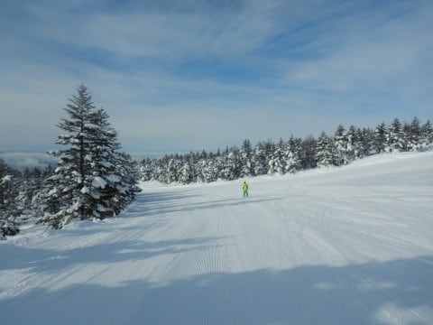
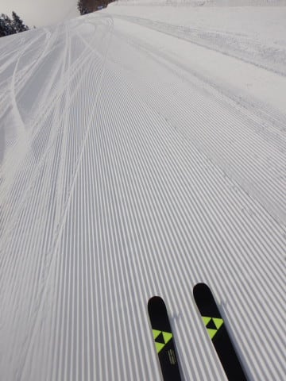
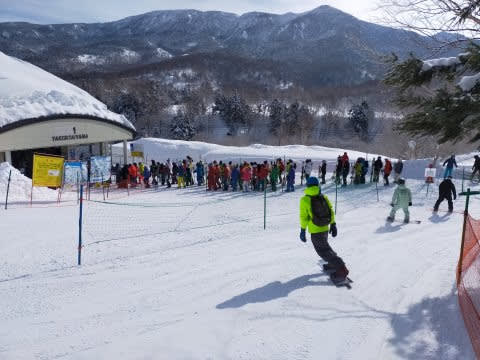
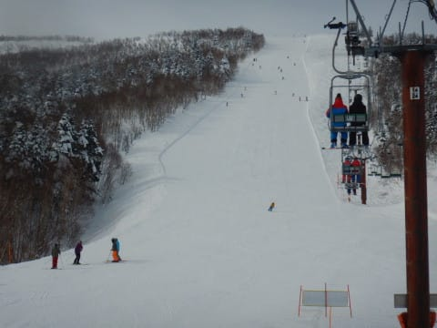
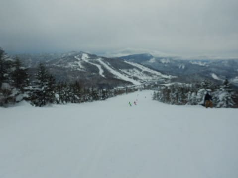
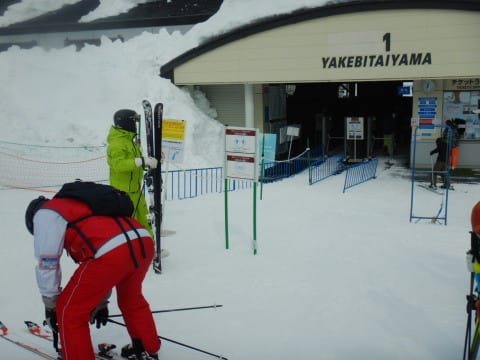
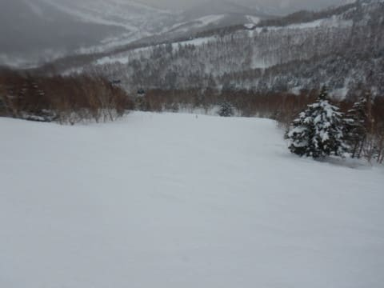
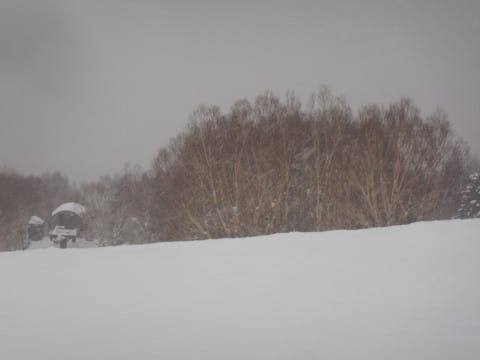
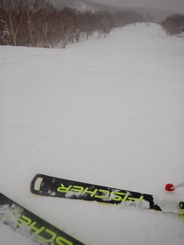

# 2022/2/13(日)の志賀高原スキー場速報レポート！…晴れのち曇りのち雪，午前は混んだけど昼からガラガラだったよ

📅 投稿日時: 2022-02-14 01:43:10

えー．

これからしばらくの天気図を見ると．

明日月曜の志賀高原は，意外にも晴れそう！

そして，15日からまた雪が降り始め…

16日から17日にかけて，かなり積もるかも？

17日，18日とパウダーねらい目かな？

…そのあとは，なぜか20日の日曜に，

かなり気温が上がりそうな感じ…(ちょい涙)

うーん．

今のところ雨になることはなさそう…

うん．雨にならないはず！！(強い祈り)

…ってなことで．

今日も志賀高原から帰宅したのは日付が

変わるころ…（涙）

だもんで，本日の志賀高原レポート，

いつもの速報モードにて！！

まず．

今朝はちょっと雲が多めだったものの，

晴れでスタート！

あさイチは，いい感じに冷えて締まった，

トップシーズンシマシマバーン！！

うほほほ！いいよ！

いい感じの快楽まっ平らバーン！！

…だったんだけど．

さすが3連休，営業開始30分も経つと

焼額第1ゴンドラ待ちは10分を越えて，

さらに列が伸びていきました…(涙）

最高20分待ちくらいまで行ったようです．

…焼額第1ゴンドラの待ち時間が

10分を超えると，焼額の呪いが解ける

設定の私．←どんな設定だ

迷わず奥志賀へ脱出！

奥志賀，ゴンドラはそこそこ混んだけど，

リフトは待ちなし！

ただ，11時ごろになると，焼額ゴンドラに

待ちが無くなったらしく．

そうなると，焼額の呪いが復活する

設定なので，焼額へ戻ります…！←だから，どんな設定だ

昼からはゴンドラ待ちはかなり短く

なっていて，午後のゴンドラ待ちは

ゲートの中に収まるレベル．

そして，ゲレンデも一気にガラガラに！！

…ただ，昼ごろになると，

　昼に向かって雲が増え，曇り空に．

　午後は曇り，夕方くらいに雪が

　ぱらつきだす．

という水曜の予想通り，完璧な曇り空に

なってきました…(涙)

「これ，予想通りなら，午後遅くに雪に

なるんだけど…

予想が外れて，降らないでいてほしい…」

という強い願いはかなわず．

午後3時ごろには，予想通りの雪降りに

なってしまったのでした…

うむ．当たらなくていい予想も見事に

当てちゃうって，すごいね…（喜ぶべきか悲しむべきか）

ってなことで．

今日も予言レベルで天気予想を

当てたわけですが．

午後になると曇り~雪降りになったとはいえ，

午後はガラガラで，焼額は終日快適フラット

バーンをキープしてくれて．

今日も最後まで大回り板でかっ飛ばせる，

いい感じの一日でした～！！

ってなことで．

また明日，詳細レポートやります～！

## 💬 コメント一覧

### 💬 コメント by (地元民)
**タイトル**: Unknown
**投稿日**: 2022-02-15 01:13:21

以前からの素朴な疑問なのですが、土日と滑るときは、志賀高原のホテルに宿泊してるんですよね?

まさか日帰り２連続?

言及されたことがないので、ず〜と気になっていました。

### 💬 コメント by (レインボー74)
**タイトル**: Unknown
**投稿日**: 2022-02-15 15:18:29

火曜日の志賀高原情報

朝の上林-4ど　蓮池-4℃。強風で奥ゴン休止。中央エリアは非圧雪。

ニゴン休止なのでイチゴンスタート。オリンピックは横風が凄い。一通り滑ったあと、バス時間に合わせて漕いで奥志賀へ。

ダウンヒルが勘違いバーンで、この日のベスト。

バスでエキスパートへ。エキスパは斜面が見にくく、とどまっている人が多いので気持ちよく滑れない。

三高はいつもながら感動もの。

再び漕いで白樺からニ高の獅子で昼食。

風も強いので終了です。

老人のエブリデイスキーヤーにはこんなペースがいいのかも？

### 💬 コメント by (Skier_S)
**タイトル**: 明日16日は意外と積もらなさそう
**投稿日**: 2022-02-16 01:43:42

＞地元民さま

土日では志賀高原の宿，または湯田中あたりに泊ってます～！

さすが日帰り2連発は死にます…

＞レインボー74さま

ダウンヒルはゴンドラが動いてなかった分良かったでしょうね…

3高沿いのイーストも，リフト動いてないのにSGSを滑る人のために

ちゃんと圧雪してあるところが焼額クオリティーですね！！

