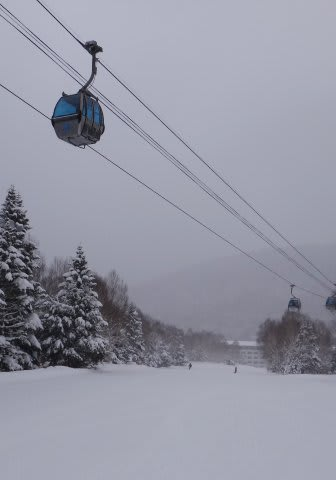
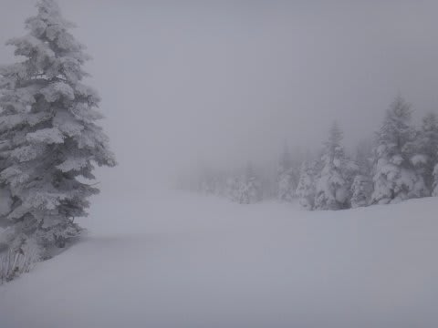
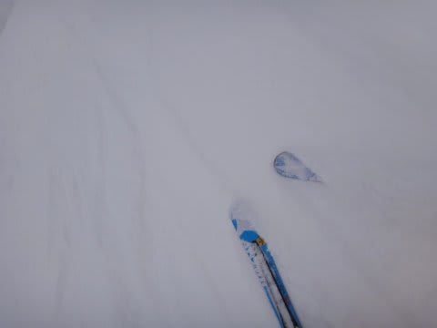
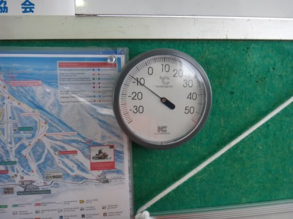
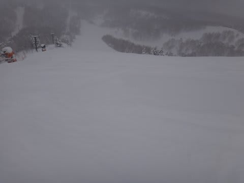
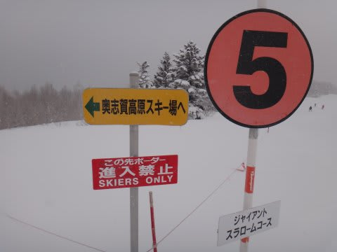
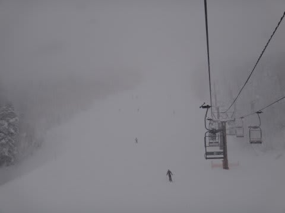
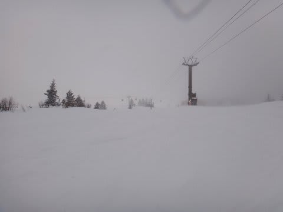
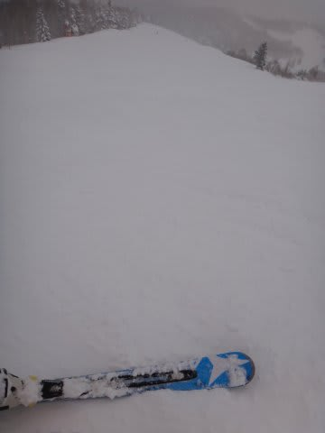

# 1月20日の志賀高原，焼額は…朝から雪

📅 投稿日時: 2013-01-21 00:36:42

えー．

今日，日曜日．

朝イチに，いつもどおり焼額の第1ゴンドラの駐車場に向かったわけですが…

駐車場の入り口に．のゎんと．

「第1ゴンドラ運休」

の看板がっ！！

私「あのー．運休って…今日，一日動かないんですか…？」

係員「…故障で状況見てるんですが，いつ直るかわからないです…」

…がががががーーん．

なにも，日曜に壊れなくても…

ってことで．

本日は，第2ゴンドラでのスタートでした．

んで．

今日の天気は…

朝から雪．

でも，昨晩からの積雪はこんな感じで10cmほどかな．

積雪がそれほどでもないので，ぱふぱふパウダーを

楽しめるほどではないですね～．

でも，気温は寒く，

朝イチは，かなりやわらかいふわふわ雪が圧雪された，

柔らかバーン．

いやーーー．

トップシーズンの志賀らしい！！

第1ゴンドラが止まってるので，みんな第2ゴンドラ側のコースを滑ってますが…

第3高速→第2ゴンドラとまわせば第1ゴンドラ側コースを滑れるので．

誰も人がいない，第1ゴンドラ側のコースを滑ります…

いやー．

貸切バーンだっ！

快適…

と，思っていたら．

当然，第2ゴンドラ一本に人が集中するので．

第2ゴンドラ，朝9時半には10分近く待ちになっちゃうわけですね…（涙）．

おそらく．10時には30分待ちくらいになっちゃいそう…

ちと，耐えられないなぁ…

ってことで，奥志賀へ移動！

うーむ．

奥志賀．わがホームゲレンデ焼額のすぐ隣にあるというのに．

今シーズンは初めてだなぁ…

＃昨シーズンも一回しか行ってない気がする

奥志賀は．リフト・ゴンドラともに，待ちはまったくなしで，がらがらです．

…んでも，コースは視界が悪く，あんまり面白くない…

そうこうしているうちに，

11時ごろに，第1ゴンドラが動き出したらしいので．

昼食後，ヤケビへ復活．

いつも，日曜の午後は人が減るんですが…

今日は視界も悪く，朝から降り積もり続けた雪のため，

雪がちょっともさもさになってきたからか，

いつもよりも，さらにゲレンデはガラガラ．まさに，無人状態．

あのー．

人がいないんですけど．まったく．

って感じで，がらがらのゲレンデ．今日も，リフトストップまで満喫したのでした…

＃でこぼこが見にくくて，滑りにくかったけど

でも，

先週からの大雪で．

ゲレンデのアイスバーンは完全に隠れましたね～．

トップシーズンのゲレンデコンディションに，完全に復活しましたよっ！！

## 💬 コメント一覧

### 💬 コメント by (ひろりん)
**タイトル**: Unknown
**投稿日**: 2013-01-21 21:35:18

奥志賀・・・ゴハンが高級という記憶しかないくらい長いこと行ってません（汗）

というか、第1からあの距離、こげない（笑）

オガサカオモタイシ・・・

明日、2013’X-KART164が到着します。

疲れた時用と言いながら・・・初日から履くかも（爆）

オガサカオモタイシ・・・（汗）

### 💬 コメント by (いか)
**タイトル**: Unknown
**投稿日**: 2013-01-21 21:45:25

すごいガラガラですね…。

そんなにガラガラなら行きたい！と思うのですが、志賀高原に日帰りバスツアーって横手山方面しかないんですよね^^;

去年一度だけ志賀に行ったときのオリンピックコースぐるぐるが忘れられません…(笑)

### 💬 コメント by (Skier_S)
**タイトル**: ひろりんさま
**投稿日**: 2013-01-22 00:44:45

あー．

ご飯は高級ですね…確かに（笑）．

奥志賀，おととしまでは焼額第3ロマンス乗り場と

奥志賀第6ペアの間で，楽に行き来できたんですが…

いまでも，奥志賀方面にはジャイアントスラローム

コースの途中から滑っていけますが，

帰りは山頂を歩かないとだめなんですよね…

X-Kert到着ですか．

どんなだったか，レポートしてください…

### 💬 コメント by (Skier_S)
**タイトル**: いか様
**投稿日**: 2013-01-22 00:46:53

いやー．

「日曜の午後は」がらがらなんですよねー．

日帰りバスツアーって，関東からですか？

横手山方面行きバスでも，蓮池で降りて

シャトルバスかリフト乗り継いで焼額

いけませんかね？？

オリンピックコースぐるぐる，楽しいですよ～っ！！

