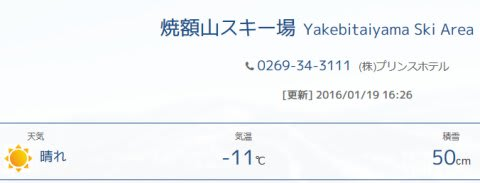

# 今週末，スキー場に雪は積もるのか？…1月23日の週末までの志賀高原の積雪を予想してみた

📅 投稿日時: 2016-01-20 03:45:12

いつもならば，水曜夜にお送りしている

スキー天気予想ですが．

…スキーヤーの皆さんは，

今週末は，超絶雪不足が解消するのか？？

…ってことが気になって，

夜も寝られない日々を過ごしているのではないかと思います．←いや，そんな人いないから…

なので．

天気予想恒例の水曜にはなっていませんが．

今週末までの志賀高原の積雪がどうなるか，

ちょいと予想してみましょうか…

とりあえず．

18日は結構積もって．

志賀高原では，30cm程度の積雪があったようですが．

…なんだか．

19日は意外と積もらなかったようで…

てか，19日の志賀高原．すっきり晴れだったようです（涙）．

…まぁ，これは．

[昨日の記事](e344cb2f9f31aae0e88b442edbd1bf221.md)の一番最後に

「19日は西風で，思ったほどの積雪にならないかもしれないけど」

…と予想していたように．

19日は素直な西高東低ではなく，

日本海側に小型低気圧がある，こんな奇妙な天気図だったので…

等圧線が水色線で示すような右下がりになってます．

この場合，赤矢印で書いたような西風になって．

雪雲が北アルプスに邪魔されて，志賀高原まで届かず，

志賀はすっきり晴れになるパターン（残念）．

というか，南西に近い風だったので．

日本海側も，新潟あたりは晴れちゃったんじゃないかな？

まぁ，しかし．

19日に積もらないのは織り込み済みなのだ．

ふふふふ．

20日は，ドサドサ降るのだ！

これが，20日の予想地上天気図．

見事．みーごとな，縦縞＆縞の間隔が狭い，

教科書に出てくるような冬の天気図です！

…んで，500hpa図を見ると…

をを！

そこそこの雪の目安，赤線で引いた-30℃線が日本の南まで下がっているどころか，

すごい大雪の目安，水色の-36℃エリアが志賀高原に！

…これは，降る．

降るはず．

この天気図で降らなかったら，今年の雪不足は．

自然の力を超越した何かが引き起こしている

としか考えられないレベル．

降る．

20日は，ぜーーーーったい，ドサドサ降るのだっ！

19日夜から20日の夜までの積雪は，おそらく

50cmクラスのはず！

そして．

次の日．

21日の木曜日は．

地上天気図を見ると…

うくっ！ざ，残念．

ちょっと冬型が弱まっている…

そして，500hpa図を見ても，-30度の線は

南東北くらいまで上がっちゃってます…

うーむ．

あんまり降らなさそう…

…でも．

普通の天気予報だと，

「この日の志賀高原は，曇り」

と予想するところ．

風向きその他を考えると．

20日ほどドサドサ降る感じではないですけど，

この日も一日，雪がシンシンと降り続けそうです．

で．

22日の金曜は…

地上天気図を見ると．

冬型は，崩れちゃってますね…（涙）．

だもんで，22日はそんなに降らなさそう（残念）．

この日，積雪はほとんどなさそうです．

そのあと，23日，24日の土日ですが．

うむ！？？

また，冬型が強まってきますよ～！

特に，24日はすごい冬型っ！

このままの天気図なら…

24日は，来る．

きますよ～！！

パウダーデーの予感！！

FZCX50で，この日のクラスタばらつきを見ると…

予想はそれほど大きくばらついておらず．

複数のクラスタの線は大体同じところに重なってます．

スプレッドも0.39と比較的小さめの値なので…

この日の天気図，現時点の予想から大きくずれることはなさそう．

うむ．

24日はドサドサパウダーデーの，

昼間もエンドレス新雪供給デーになりそう！

＃もしかしたら，吹雪になるかも…

＃ゴンドラ止まらないことを祈るばかり

そして，850hpaの気温傾向を見ても…

24日は平年より3℃から6度ほど低くなりそうで．

この日は激寒の一日になるなぁ…．

ということで．

ざっくりまとめると．

20日（水）：終日ドサドサ積もる．1日で50cmクラスの積雪．

　この日でゲレンデ状況は一気に改善するはず…

21日（木）：終日降る．あんまり積もるほどではないかも．

22日（金）：曇り～晴れ．ほとんど積もらず

23日（土）：まだ何とも言えないけど…午後は降るかな？

24日（日）：朝からパウダー！終日パウダー！積もる！

　…強風でゴンドラが止まらないといいんだけど…．

って感じかな～．

また，後日，週末詳細天気の予想をやります…

今週末こそ．

今週末こそ…

ブッシュの無い，冬らしいゲレンデで滑れるはずっ！！！！

## 💬 コメント一覧

### 💬 コメント by (Goku)
**タイトル**: 安心してください
**投稿日**: 2016-01-20 19:11:58

降ってますよ！

今日は長野市街地でも２５㎝の積雪、一日中止むことはありませんでした。

もうこれで雪の心配は無くなりましたね♪

今週末オリンピックコースも滑れるかな～？

### 💬 コメント by (べべ)
**タイトル**: Unknown
**投稿日**: 2016-01-20 21:01:31

がっつり降ってますねー！

今週は楽しめそうです！

土日の南岸低気圧がちょっと気になりますが...

### 💬 コメント by (Skier_S)
**タイトル**: 降ってますね！
**投稿日**: 2016-01-21 00:31:03

＞Gokuさま

降ってますか～！

良かったです～！

明日からオリンピックコースも白樺コースも

ミドルコースもオープンみたいですので，

今週末はイケますね～！

＞べべさま

ガッツリ降ってますよ～！

すごい積もったみたいで，今週末は安心…

土曜の南岸低気圧，今のところそんな

影響はなさそうに感じます．

むしろ，南岸低気圧が通過した後…

志賀高原でも，ガッツリ降ります！！

