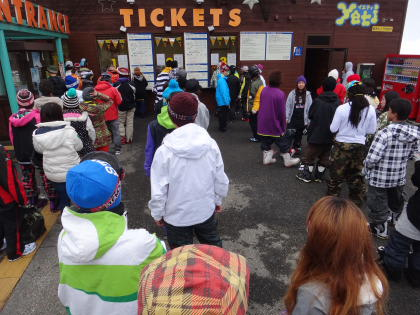
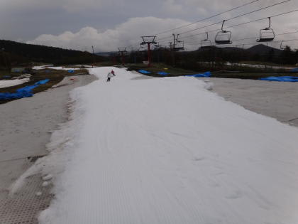
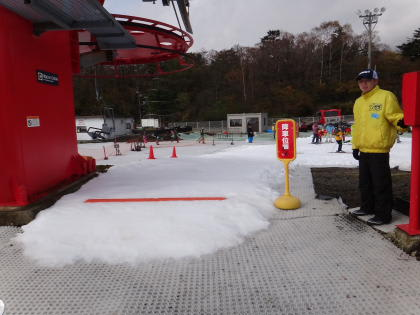

# 2011/2012シーズン初滑りのレポート…Yetiがオープン！

📅 投稿日時: 2011-10-24 00:18:26

という感じで．

昨日予告したとおり．

今日は今シーズンの先陣を切ってオープンしたイエティへ，

2011/2012シーズンの初すべりに行ってきました．

さ～て．

始まりましたよ～．

スキーシーズンがっっ！！！！

実に．

実に．

6月19日の月山以来の，約4ヶ月ぶりのスキーです．

こんなに長いことスキーを履いてないと，

「あれ？スキーってどっちが前だったっけ？」

って忘れそうなくらいのブランクです．

＃そんなこと忘れるヤツいないって

今日のYeti.10月21日にオープンして3日目．

天気は，曇ってましたが雨は降らず一日持ちました．

昨日の昼までは雨が残る天気予報でしたが…

ラッキー！

気温も結構高く．

私はミドルジャケットを着ていきましたが，

暑がりの人はトレーナーとかでもいける感じでしたね～．

とりあえず．

本日，日曜は．

昨日の雨のため，朝はコース整備が必要となり（かぶせてあったビニールシートを

外して，圧雪車で均し直す），営業開始は10時から．

9時半には，もう駐車場の車も予想以上に多く，リフト券売り場もそこそこの列

でしたね～．

でも，やっぱり朝方雨が降って天気が悪かったからか，激込みってほどの

人の入りではないですな．

で．

この時期．

土日リフト1日券が2800円と安く，さらにYetiのホームページから

メール会員になれば，さらに500円引き．

2300円で，朝から10時のナイターストップまで滑れるという…

なんてお得なんでしょう！

＃コース1本しかないこの時期，それだけ滑り続けたら飽きるって

朝10時…

ゲレンデオープンのときに待っていたのは40人～50人ほどでしょうかねぇ．

オープンと同時に，一気にゲレンデになだれ込みます．

コース幅は…

一部狭いです．

最も狭いと3mほどか？

広いところでも10m程度．

廊下です．

だけど．

狭かろうがなんだろうが．

この時期に，雪の上を滑れるってだけでシアワセ！

クワッドリフトは，板を履いて乗り降りできますが…

ボーダーが板を履くエリアは，コース幅が狭いこともあり，ちょいと

渋滞します．

朝のうちは比較的固めの雪だけど，しばらく経つと緩んできて…

11時過ぎには，数箇所雪が薄くなってくるところもありましたね～．

係の人が一生懸命雪入れしていたので，あまりひどい穴にはなりませんでしたけど．

リフト待ちは，最大5分程度ですか．

11時ごろ，クワッドが5分待ちを超えそうになったけど，並行してかかっている

ペアリフトが運行されて．

で，ペアリフトは乗り降りにちょっと歩くけど，リフト待ちほとんどゼロだったので，

丸沼や軽井沢のように

「リフト待ち20分，滑るの1-2分」ってことはなく．

この時期にしては，結構滑れます．

 スキー 

…まぁ．動画にあるように．人は多く，コースは狭いですが．

だけどこの時期，どうせポジション確認だとか，雪の感触を思い出すのに

ゆっくり滑るだけだし．

かなり満足度高いです

＃お前は雪があればどこでも満足だろう，という突込み禁止

昼を過ぎてくると，リフト前の急斜面なんか，一部でこぼこしている部分もありましたが．

基本的には，コブになるとかはなく．

コースも1km程度と長いので．

この時期としては，十分恵まれた状況ではないでしょうか．

という感じで．

コース幅は狭いけど．

天気も雨も降らず．時々日が射すぽかぽか陽気で．富士山も見えたし．

リフト待ちも最大5分程度，ペアリフトに乗ればほとんどゼロという，

恵まれた状態で．

無事，シーズンインできました．

## 💬 コメント一覧

### 💬 コメント by (森田勝里)
**タイトル**: Unknown
**投稿日**: 2011-10-24 20:36:49

天は私のような根性なしを見捨てて

意を決して行った人に味方しましたね！

今週末こそは、と思っています

この時期初めてなので着るものに悩みますが

レポート拝見するとTシャツにスキーウェアで

いけそうですね

### 💬 コメント by (Skier_S)
**タイトル**: 当日朝に天気予報を見れば…
**投稿日**: 2011-10-25 00:49:25

日曜は雨が降らないと確信して行けましたよ！

今週末の天気が良いといいんですけどね～．

今週末は，先日より冷える可能性が大です．でも，日が照ったらTシャツにスキーウェアで十分でしょうか．

曇ってたり風が強いと意外と寒くなるときがあるので，念のため何か長袖インナーをもっていくことをお勧めします．

初すべりの準備はもう完璧ですか？

