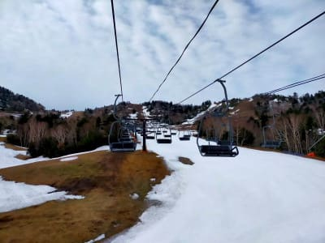
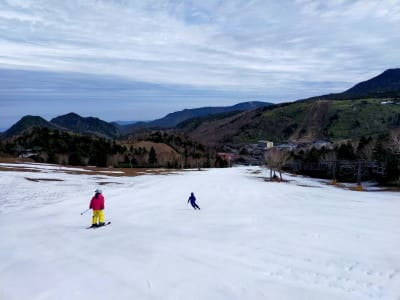
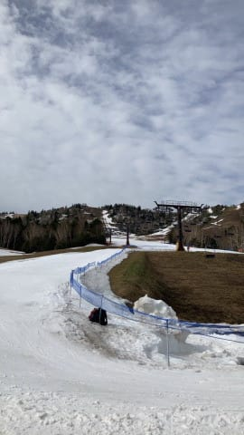
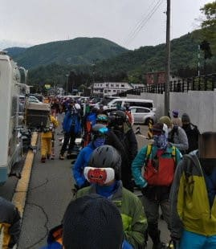
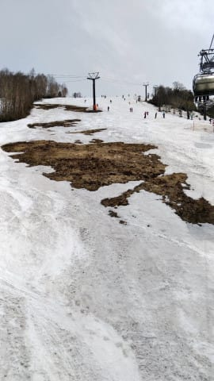
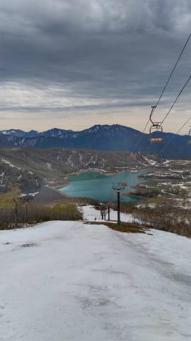
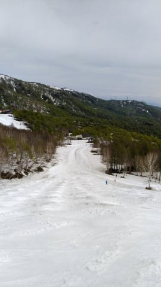
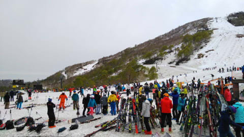
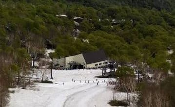

# 実に7か月ぶりにスキーに行かない週末！？…そして5月15日の熊の湯・かぐらスキー場の雪の状況の特派員写真

📅 投稿日時: 2022-05-16 00:27:01

🏷️ カテゴリ: [日記](cc4b5682fb7b8b144980957a978653fb0.md)

実に．

実に久しぶりに全くスキーにかない週末を

過ごしたわけですが…

そうですね．

以前にスキーに行かなかった週末を

振り返ると．

だいたい縄文時代くらいまで

さかのぼらないといけませんね(噓)．

…いや．

でも，実際振り返って見ると…

昨年10月23日にYetiで初滑りしてから．

土日どっちか日帰りだけになった週も

あったけど．

初滑りから先週まで，毎週欠かすことなく

スキーに行ってるじゃないですか！！

いや…このくそ忙しい殺人スケジュールの中，

よく毎週滑りに行ったもんだ…

実に，10月16日の週以来，7か月ぶりに

スキーに行かない週末でした…！！！

ってなことで．

私がスキーに行ってない週末も，

本日の熊の湯とかぐらの状況が

特派員から送られて来ましたが．

熊の湯は，オガサカキャンプをやっていた

ものの，それ以外の一般客はかなり

少なかったようで…

ゲレンデはガラガラですね．

そして，人工雪を付けた第2緩斜面は，

まだ結構雪が残ってますね…！

これならまだ数日間営業できそう…

今日で営業終了ってのはもったいない！

で．

今度はかぐらですが．

こちらはむちゃくちゃ混んだようです…

あさイチのロープウェー．

これは，この列に並びたくない感じの

混雑です…行かなくて良かったのかも（ぼそ）

メインバーンはちょっと土が出て

きてるものの，来週営業終了と考えれば

まだ十分雪はあるのかな…

パノラマコースはオープンしてたけど，

途中で切れたようで．

明日以降はクローズですね（涙）

ただ，ジャイアントはまだ滑れるようで…

去年よりは雪が多いのかな．

とはいえ．

月山の大斜面も滑れず，奥只見も終わった

今シーズン．

かぐらに人が集中したのか，ゲレンデは

すごい混雑だったみたいで…

かぐらクワッドリフトがピーク13分待ち，

午後になっても10分待ちくらいあった

みたいで…

これは，1時間に4本くらいしか滑れませんね．

やっぱりいかなくてよかった…と自分に言い聞かせておこう

ってなことで．

アライスキー場も今日で終わったので，

残るスキー場は，

横手＆渋，

かぐら，

月山

となる来週以降ですが．

月山の大斜面がクローズの今シーズン．

来週のかぐらファイナルも，

混むんだろうなぁ

## 💬 コメント一覧

### 💬 コメント by (you160)
**タイトル**: Unknown
**投稿日**: 2022-05-16 22:13:25

Sさま

スキーをしない週末を過ごされた、、、ということで、ご存命？されていて何よりですw

こちらは、予定通り渋峠に行ってきましたので、またまだシーズンアウトしない皆様のご参考に。

5/14(土)

雨と霧。

前日からの雨でだいぶ雪解けが進んだようで、ゲレンデ上も所々土が出てました。

ただし、気温は高かったものの、滑走性は悪くなく、ご伝授頂いたカッパ導入で、空いていたゲレンデを堪能できました。

5/15(日)

6時時点、曇でマイナス1℃。

ただし、中間リフト降り場の雪出しのため、早朝営業のリフト開始が30分程度遅延し、さらに横手山の早朝営業断念（5/15で横手山は最終日になった）により、リフト開始時の待ち行列は、まっすぐ駐車場の裏手にある赤い雪上車？付近までの混みよう…

その後も早朝営業が終わった8：30頃に一瞬、リフト待ちが解消されましたが、滞在した午前中いっぱいは駐車場裏手まで行列が伸びた状態。

リフト待ちは終始10分程度で、かなり効率が悪い感じでした。

一方で、気温が低く、早朝営業終了時までガチガチバーン、その後、薄陽が射したことで良い感じに緩み、10時頃までは快楽バーンを堪能。その後、撤収した12時頃でもそれほど荒れず、5月としては良い感じでした。

いよいよ、かぐら、渋峠、月山だけとなり、来週も混雑が予想されるので、来週も渋峠行くか、このままシーズン終了か迷い中といった感じです。

### 💬 コメント by (Skier_S)
**タイトル**: ＞you160さま
**投稿日**: 2022-05-17 05:12:46

土日2日とも滑ってらしたんですね…！

あの雨の日の土曜も…！！すごい…！！！

娘さんたちもあの雨の土曜日に滑ったのですね．

そして日曜はかなり混んだんですか…

渋峠のペアで10分待ちは辛い…

### 💬 コメント by (you160)
**タイトル**: Unknown
**投稿日**: 2022-05-17 21:54:10

Sさま

はい、家族全員で滑りましたw

朝方は結構降ってましたが、通常営業後は降ったりやんだりな感じだったので、カッパ効果と、リフト待ちなしで、それほどストレスなく滑れましたよ。

リフト待ちが辛い感じですが、今週末、渋峠で滑り納めの予定です。

Sさまが、今週末、ご無休じゃない状態で雪山に行けることをお祈り申し上げます。

### 💬 コメント by (ikkun)
**タイトル**: Unknown
**投稿日**: 2022-05-18 12:28:10

スキー馬鹿(失礼します(笑))の皆様のパワーは凄いなあと改めて想いながら 近いけど絶対行かない新井(笑) 皆様の22スキーが無事終わります様に願います

### 💬 コメント by (Skier_S)
**タイトル**: コメント回答遅れました
**投稿日**: 2022-05-19 02:57:57

＞you160さま

ええ？？

娘さんも雨の中滑ったんですか！！！

すごい…

今週末も渋峠に行かれるんですね．

私はたぶんかぐらに行くと思います…

残念ながら渋ではお会いできなさそうです．

また来シーズン，志賀高原でお会いしましょう…！

＞ikkunさま

アライ，春スキーやるにはいいスキー場ですよ！

行かないなんてもったいない…

