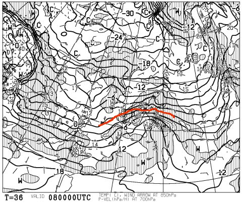
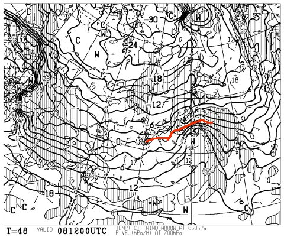

# 8日の低気圧はかなり南を通って…土日は雪です！

📅 投稿日時: 2014-02-07 04:08:08

ついさっき仕事から帰ってきて．

なんて時間にBlogを更新してんだ，って感じだけど．

でも．

土日の天気予報の精度が上がってきたので．

情報のアップデートを…

8日朝9時の850hpa気温はこんな感じになり．

8日夜9時ではこんな感じで．

危険な8日は，低気圧が結構南にずれてくれて，

昨日の予想よりもかなり南に0度線が下がってくれたので．

志賀高原で雨になることは絶対ありませんっ！

雪ですっ！

安心してくださいっ！

8日はドカ雪って予想もありますが…

…志賀ではそんなに積もらないんじゃないかな～．

太平洋側では雪になるけど，

志賀ではそんなに大雪にならない気がします．

むしろ．

8日夜から9日に朝にかけて，たっぷり積もります．

9日朝はパウダーだなっ！

で．9日は終日降り続けます．

エンドレスパウダー供給デーかも．

っつーより．

9日，吹雪きます．

ゴンドラ，動くかな～？

…昨日と大きく予想が変わりましたが．

南岸低気圧って，予想が難しいんですよね～

＃先週日曜の予想をはずしたのも，南岸低気圧パターン(涙)．
