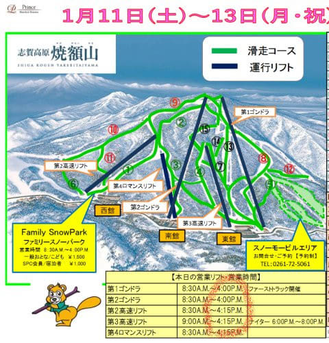
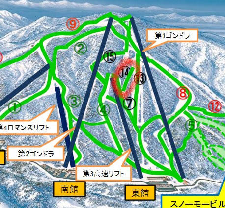
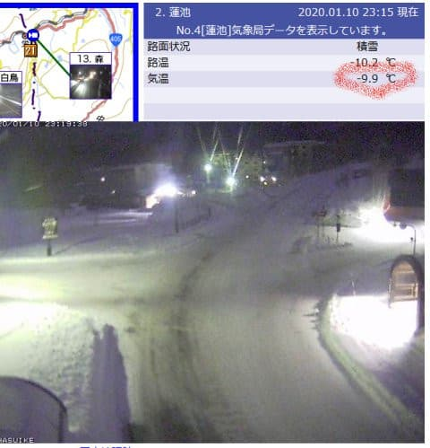

# この3連休も志賀高原で滑ってます～！

📅 投稿日時: 2020-01-11 00:36:27

🏷️ カテゴリ: [日記](cc4b5682fb7b8b144980957a978653fb0.md)

ということで．

今さら宣言するまでもない気がするのですが．

はい．今週末3連休も，志賀高原で滑ってます～！

で．

明日からの焼額スキー場ですが．

8日の雨にも負けず．

無事全コースがオープンのようですね…

（[焼額山Facebook](https://www.facebook.com/yakebitaiyama/?hc_ref=ARSiMpkDJPGTLyyqTipLoB8Izmr1tXVOBse5VM-AyoQ3PCDiXmOWDkEsDv5-YcOFCUQ&fref=nf&__xts__[0]=68.ARAjocGwy2NEMPxZotCxAYI40ciQTClIxVwuDdvqb6VoBSQD2d7jErAcW82_dyuj34jUfL_7nTkoETNYmfou6seEqlZdTOTMEYIJymw-g3kRlyGPcUSxaB-M9gVn29GyJTpMdArRDLYw0kwpTLYsQQYbOglyS2Z44ESvuF2sSR-GYV66oPr6hM67r1foE8iR7879y8ONfHznT0q8SCrR2G0n_yByfjF3UJzFWLpQuOhp37HzTLXInG-bLVQxR0mLvnbTH8-NrUNjzEBASBVHy2m5lYzIu6GY0MxwfR8cfCS5O6nnBZj4XWttbDne2rFbuXhEWzFtGwLP7EhPfjFTjw&__tn__=kC-R)より）

そして．

赤く囲ったリフト終了時間．

これまでは，ゴンドラが15:45，

リフトが16:00までだったのが，

それぞれ15分ずつ伸びて，

ゴンドラが16時，リフトが16:15に

なってます！

いくらなんでも，15:45終了はちょいと

早すぎた気がするので．

15分延びるのは嬉しい限り…！

しかし．

このコースマップですが．

2シーズン前にコースマップから消されて，

今は木が生えるままに放置されている，

この赤丸で記したコース．

そう，エキスパートコースがオープン

することになってますね…！

…たぶん間違いだと思うのですが．

まさかホントにエキスパートコース，

オープンしないよね…？？

ってなことで．

現在の志賀高原ですが．

路面には雪が積もってるものの…

今日の積雪はほとんど0ですね（涙）

そして，明日朝までには積雪は

全くありそうにありません（泣）

でも，気温は赤く囲ったように-10℃近くと

かなり冷え込んでいるので．

明日の朝イチは，いい感じの締まった

最高シマシマが楽しめるかな…

この3連休の天気は，

11日（土）：朝は-5～6℃程度とそこそこの冷え込み．

　あさイチは日が射しているかも．

　そして，冷えたいい感じの最高圧雪バーン！

　ただし，午後に向かって雲が増え，

　曇り空になっていく．

　昼間は0℃近くまで気温が上がりそう．

　午後は，急斜面ではゲレンデ表面の

　柔らかい雪がはがれていき，多少凸凹になり，

　雨で固まった硬い下地が出てきそう…

12日（日）：昨晩からの積雪はほぼ0．

　あったとしても1cm程度．

　この日も朝は-5～6℃程度の冷え込みで，

　あさイチのシマシマバーンは最高！

　でも，朝から曇り空．

　南岸低気圧の接近とともに気温が上がり，

　午後には0℃近くまで上がる．

　天気は終日曇り空．昼ごろに雪が

　降り始めるか．

　雪は時折強く降り，午後はゲレンデに

　雪がうっすら被るほど積もるかも．

　この日も午後のゲレンデは荒れていき，

　夕方になると急斜面では

　下地の硬い雪が出てくるか…

13日（月・祝）：朝は，運が良ければ10cm

　くらいつもってるかも？？

　この日の朝は-5℃程度で，

　朝の天気は曇り～雪降り．

　朝イチはやわらかシマシマ圧雪のいい感じ！

　午後には雪も止むが，午後に向かって

　だんだんゲレンデが荒れていく．

　この日も，朝までの積雪状況によっては

　昼ごろには下地の硬いのが出てくるかも…？

という感じでしょうか．

これから3時間後に出発です．

いつも通り，3時間程度しか寝れないのか…（涙）

では，今週末，志賀高原でお会いしましょう！

## 💬 コメント一覧

### 💬 コメント by (ゆーき)
**タイトル**: Unknown
**投稿日**: 2020-01-11 09:27:36

予測が外れてほしい、、、私は日曜に行きますが、奥志賀が8時スタートなんで、奥志賀からかなと。

浮気して、八方か野沢かもしれませんが、、、

### 💬 コメント by (Skier_S)
**タイトル**: ＞ゆーきさま
**投稿日**: 2020-01-11 23:37:12

残念ながら，予想の通り，全く雪は増えませんでしたが．

意外と志賀高原，コンディション良かったですよ！

奥志賀のゴンドラ側，ダウンヒルコースはあさイチは

コロコロたっぷりで良くなかったようですが，

コースを選べばいい感じの一日でした～！

日曜にいらっしゃるなら，ぜひ焼額に．

朝イチオリンピックコースはいいですよ．

GSコースは人工雪を打つので，日曜はコロコロが出るかも…

でも，パノラマ-サウスはいいかんじかな．

ちなみに本日，一の瀬と西館も良かったようです．

