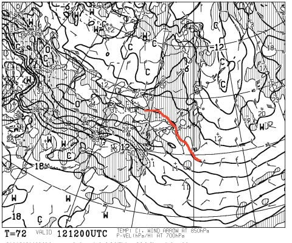

# 3月11，12日の週末の志賀高原の天気は…土曜は冷えて晴天，最高のコンディション！ちょっと気温が上がるけど，日曜もよさそう！

📅 投稿日時: 2017-03-10 05:44:35

えー．

昨日はBlogを更新できず．

「一体どうした？Skier_Sは死んだのか？」

…と，思った人は数多いと思うのですが←そんなこと思う人，いないから

はい．

死んでました．

そして．

今日もこんな時間に帰宅…（涙）．

いや，帰宅できただけ，昨日よりマシだったということに

しておこう…

だのに．

そんな状況なのに．

何がモチベーションで，こんな時間にBlogを更新しているんだろう…？

と，自分でも不思議になってきているSkier_Sです．

…しかし．

昨日できなかった天気予想．

待っている人も世の中に2億4000万人くらいいると思うので←だから，日本人口より多いって…

一日遅れですが，とりあえず週末の

予想をしてみるのだ…

まず，11日土曜の850hpa図．

ふむ．赤く印した0℃線はかなり南．

志賀高原には，水色の-9℃線が近いくらいなので…

この日も，朝は-10℃以下，

昼間も-5℃程度までしか上がらず，3月としては

冷え気味の一日になりそう！

で，地上天気図をみると．

基本的に高気圧に覆われてますね…

日本海側にわずかに水色の降水域が予想されてますので．

山の上は時々雲がかかるかもしれませんが…

基本的には晴れそう！

前日，金曜に降雪があるので．

いい雪，晴れ，冷え冷え…と三拍子そろった土曜に

なるんじゃないかな～

そして，12日の日曜．

850hpa気温は…

あぁ．

0℃線がかなり志賀に近づいてくるので．

土曜ほど冷えませんね…

昼間は0℃くらいまで気温が上がりそう．

地上天気図はこんな感じで，引き続き高気圧に

覆われるので．

…まぁ，日曜も晴れそうですね．

晴れて気温が上がるので，昼間，ちょいと雪は緩むかも…

ってことで．

まとめると．

11日土曜：朝は多少雲が残るかもしれないけど，基本的に晴れ！

　前日の冷え冷え積雪が圧雪された，柔らかめのピカピカ圧雪

　バーンでスタート！

　朝の気温は-10℃以下，昼間も-5℃程度までしか上がらず，

　雪質はいい状態を終日キープ．

　でも，晴れているので暖かく感じるかな．

　午後も時々雪雲が飛んでくるかもしれないけど…

　基本的に日が射す一日．

　午後は柔らかい雪が蹴散らされて，ちょっと荒れ気味の

　凸凹バーンになりそう．

12日日曜：朝からすっきり晴れ！

　朝は-5℃程度，晴天の中，Goodな感じで締まった

　圧雪バーンが楽しめそう．

　ただ，昼間は気温が0℃くらいまで上がるので，

　日差しが当たる南斜面は雪が緩みそう．

　この日は終日晴天．

　やはりこの日も午後は凸凹になっていくか…

　急斜面は，コブ溝に固い下地が出てくるかも．

…って感じでしょうか．

とりあえず．

この週末は．

最高の週末になりそうな予感！

特に土曜はトップシーズン並みの最高コンディションに

なりそう！

…なのに．

私は今週土曜，スキーに行くのは無理…（涙）．

なぜ，こんなシーズンそうそうなさそうなGood

コンディションな日に限って…（泣）．

あぁ．

もうダメ．

寝ます．

おやすみなさい～

…って．あと2時間しか寝れない…（涙）．

To月曜に滑る方へ

…月曜は，終日曇り，時折日も射す，って程度かな～．

日曜からの積雪の積み増しは無し．

気温は日曜と同じくらいの感じになりそうです

## 💬 コメント一覧

### 💬 コメント by (れお)
**タイトル**: お疲れ様です
**投稿日**: 2017-03-10 14:45:21

正直、倒れたかと思い心配しました...。

冬の間のＳさんは、絶対大丈夫なはず、と信じてますが。

決して無理はなさらずにです。

私は土曜日帰りなんで、日曜日楽しんできて下さい～。明日は太板も持っていきます。

### 💬 コメント by (michi)
**タイトル**: Unknown
**投稿日**: 2017-03-10 21:16:17

Sさま

昨日は更新が無かったのでどうしたかと思いました。そんなに寝なくて大丈夫ですか？自分なら倒れてますわ（笑）

今週も土曜日に行く予定なので会えなそうですね。

身体、無理しないように。

### 💬 コメント by (Skier_S)
**タイトル**: コメント回答遅れました
**投稿日**: 2017-03-11 10:35:03

＞れおさま

倒れるかと思いました．

とりあえず，月曜を乗り切れば…

次は木曜の山を乗り切って，

そしてその次の水曜と金曜の山場を迎え…

って，ずーっと山場です（涙）

＞michiさま

あら．土曜だけなんですね．残念．

またの機会にお会いしましょう～！

### 💬 コメント by (michi)
**タイトル**: Unknown
**投稿日**: 2017-03-11 19:48:55

Sさま

今日はとにかく寒くてほとんど１日雪降りでした。雪質は良かったです。

朝イチから2回連続でラブゴン（47、26）に乗るという奇跡に近い体験をしました（笑）

明日は今日より天気が良さそうですね。

かなり路面が凍結していて今朝は大きな事故も見たので気をつけて行って下さい。

### 💬 コメント by (Skier_S)
**タイトル**: michiさま
**投稿日**: 2017-03-11 20:30:43

今日はかなり冷えたのですね…

明日は今日より天気は良いものの，

気温が上がります．

おそらく明日も朝イチは最高かな～！

睡眠時間たりないのに，明日は早朝から参加予定です～

＃大丈夫か＞自分

