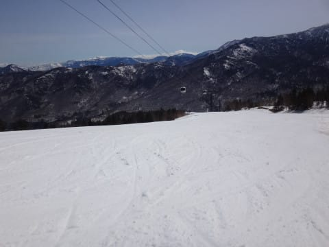
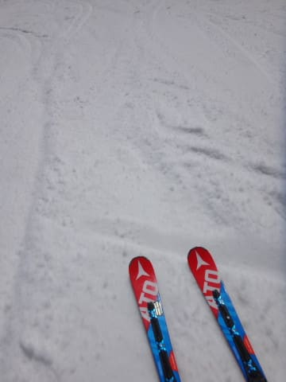
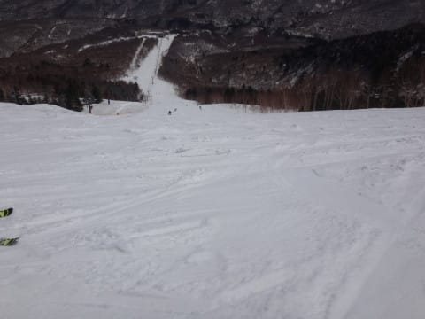
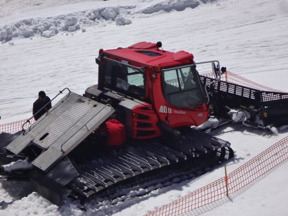

# 5月2日（火），GW谷間の奥志賀スキー場は…朝はスゲー硬かった！そのおかげで10時頃までざぶざぶにならず楽しかったよ！

📅 投稿日時: 2017-05-03 11:17:02

🏷️ カテゴリ: [2017スキー滑走日記](c7d777cecfc91bdf0fa464ad62c6d49ab.md)

えー．

昨晩の記事に書いたように．

昨日は朝5時起きで5時間滑り，

＃確か前の日は，Blog記事2本書いたので

＃就寝は夜11時を過ぎていた気がするが…

そこから5時間かけて帰宅，

さらに7時間運転し，現在関西某所に

滞在中のSkier_Sです．

…いや．

帰省のタイミングのどこまでぎりぎり

スキー場で滑ってられるのか？？？

という，極限をつきつめた結果なんですが…（笑）←バカだ…バカすぎる…

ということで．

ちょっと遅れましたが，5月2日の

スキー場レポートをば…

この日は，午前中しか滑れないので，

当然のごとく早朝から滑ろうと．

朝日が昇る前に宿を出て，奥志賀へ

向かいますが…

朝の気温は-4℃！

うーむ．

いい感じで冷え込んでますね…

道路はおおむねドライ路面ですが，奥志賀近辺では

一部凍結…

今朝は冷え込んでますよ～！！

ってなわけで．

早朝スキーへ出動！

GWの谷間の本日は，第2高速ペアのみの早朝

営業です．

で，天気は…

うははははは！

ピカピカ晴天っ！！！

そして，ゲレンデは…

うははははは！

シマシマだよっ！！！

で．

雪は…

…

…雪は…

…

…か，硬い．硬すぎる…（ちょい涙）

昨日の雨を吸った雪がガンガン冷やされて，

ガッチンガッチンに固まってます（涙）

そして，時々ピステンのキャタピラ跡が…（泣）

一見ぴかぴかで滑りやすそうですが…

朝イチは硬すぎて，かなりてこずるバーン

でした…（涙）

朝方がっつり冷え込んだので．

太陽が昇っても，1時間近くは結構硬めのバーン

をキープし．

朝7時を過ぎても，まだまだこんな感じで，

しっかりしたバーン！

…でも．

このころには，しっかりエッジが噛むようになって，

しっかり固いのに，がっつりエッジが食い込む

最高ハイスピード大回りバーン化してきましたよ～！

このまま，通常営業開始の8時になっても．

人が少なかったのもあり，超いい感じの

硬めバーンが継続！

こんな感じで，ガラガラで飛ばし放題だし．

いやーー．

いい！

今日の早朝は，最高にいいっ！！

そして，通常営業開始の8時には，

ゴンドラが動き始めるので，ゴンドラ側の

ダウンヒルコースへ！

…GWの谷間というのもあり，

誰も滑ってないし…

雪も，朝8時になっても緩んでなくて．

いや，最高！

今日の朝の奥志賀，最高に楽しいんですが！？？

朝8時半になっても，気温はまだ0℃程度と

低めだし…

ゲレンデはほぼ貸し切り状態で．

そして雪も締まっていて，飛ばしたい放題！

9時を過ぎても，まだまだ快適大回り可能！

いや，これ．

トップシーズン並みに楽しいかも…

…しかし．

さすがに10時ごろになってくると．

あぁ…

雪が緩んできちゃいましたね…（泣）

とはいえ．

GW谷間なので．

人は比較的少なく…

さらに柔らかい雪ながら，ひどくざぶざぶ

でもなかったので．

11時には，多少荒れ始めたものの．

最後まで大回りが楽しめた奥志賀高原でした…

…という感じで．

今日の午前中は最高でした～！！！

それも，昼前までがちょうど楽しかった感じ

だったので．

一番楽しかった時間帯を滑れた感じでしたね～．

ホントは昨日の夜に帰ろうかと思ったけど．

ふはははは．

無理をしてこの日の午前中まで滞在した

甲斐があったというもの！！

わがプランニングの素晴らしさが光ったな！←プランニングって…

ぎりぎり極限までスキー場に滞在するという，単なるご無体計画では？？

ということで．

次は5月5日に志賀高原に舞い戻ります～←また明日の夜～明後日の朝に，無謀な移動をするということか？

PS　本日，エキスパート下緩斜面にて…

　あり？

　なぜ，コース真ん中に圧雪車が？？？

　あぁ…壊れて修理してるのね…

　[昨シーズンのこれ](e05ffbce833f14ec3abc818796a49c706.md)といい．

　奥志賀の圧雪車，春によく壊れてるイメージが…

## 💬 コメント一覧

### 💬 コメント by (しんちゃん)
**タイトル**: 5/4はゆるゆるでした
**投稿日**: 2017-05-05 00:40:04

5/4は奥志賀・一ノ瀬両方ゆるゆる・こぶこぶでした。

本日で今シーズン終了にいたします。

月一程度でしたが、大変お世話になりました。

とっても楽しいシーズンを送れました!!

ありがとうございました。

### 💬 コメント by (Skier_S)
**タイトル**: しんちゃんさま
**投稿日**: 2017-05-05 01:45:23

あらら…

今シーズン終了ですか…！

私は明日から志賀高原戻りなのですが，

お会いできずに残念です．

今シーズンはお世話になりました．

また来シーズンお会いしましょう～！

