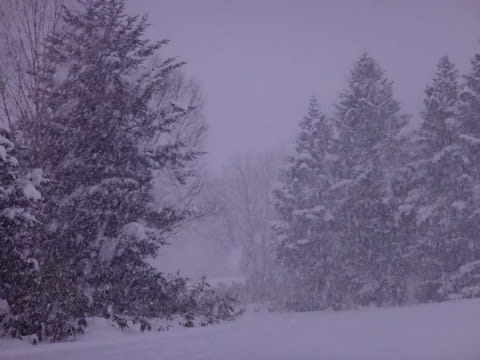
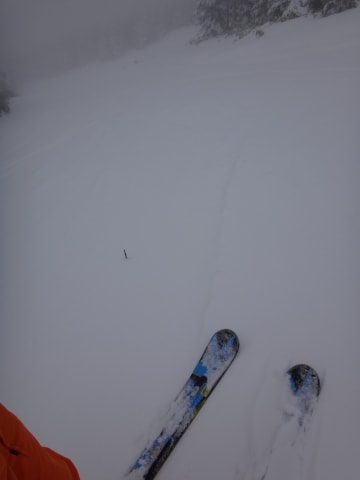
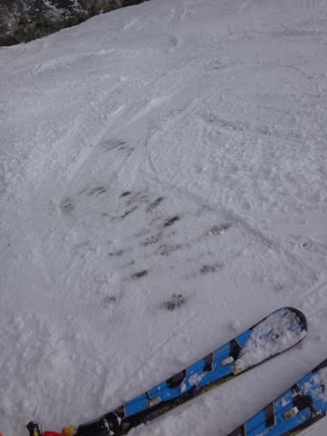
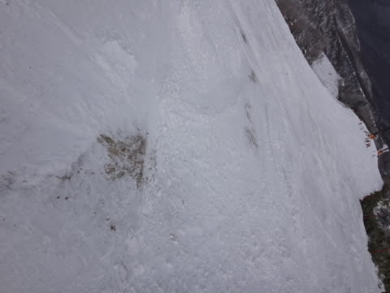
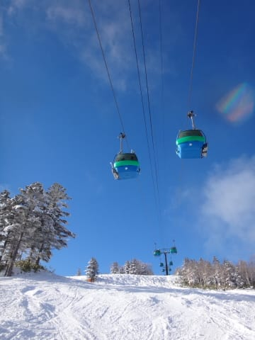
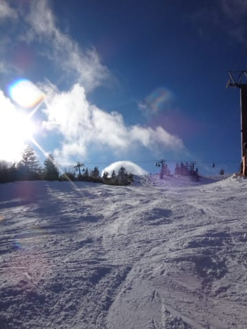
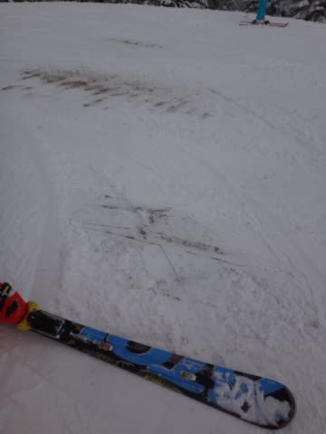
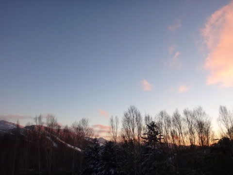
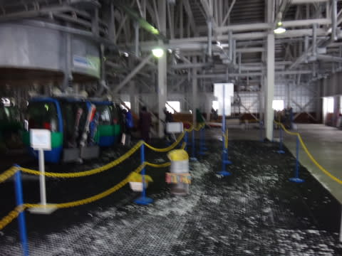

# 1月1日の志賀高原は…朝は雪が降ったけど，全然ゲレンデ状況改善せず（泣）

📅 投稿日時: 2016-01-02 03:13:54

ということで．

2016年も始まりましたが．

…私は相変わらず志賀高原で滑ってます．

いつもの日常とあまり変わらないので．

どうも，年が変わった感じがしないのですが…年が明けると，なんだかめでたいらしいので．

とりあえず，おめでとうございますと

挨拶しておくSkier_Sです．

…今年もよろしくお願いします．

ってことで．

本日の志賀高原レポートですが．

飲んだくれて夜遅くなってしまったので．

簡易バージョンで…

で．

本日．

元旦の朝は，期待の雪でスタート！

とはいえ．

積雪は，わずか10cm程度（涙）

でも．

待望の、

期待の、

待ちに待った積雪だっ！

これでゲレンデ状況も改善っ！！！！

…と，期待したところ．

…軽い雪なので，人が滑るとあっという間に蹴散らされ…

…ああ…

な、なんということだ…(T.T)

あっという間に，積もった雪がはがされて．

昨日と同じレベルに戻っちゃったよ…（激烈な涙）

そして．

昼には雪もやみ．

青空が広がる天気となり…

結局．

期待の雪だったものの，本日は全くゲレンデ状況は

改善せず．

…なんてこった（止まらない涙）

で．

午後にはゲレンデはぼこぼこになり．

人工雪がある焼額の第2ゴンドラ側も，

山頂はブッシュが広がり始めるという，

むしろ昨日よりゲレンデ状況が悪化するという

悲しい状況で．

うーーーーーーーーむ．

本日の積雪で，ゲレンデ状況はよくなったはず！

と，思った人は多いでしょうが…

残念ながら，全く全然ちっともこれっぽちも

改善しなかった，この元日だったのでした…

せめてもの救いは．

今日はリフトもゴンドラも，待ちがなく

済んだくらいかな～．

…で．

明日以降もしばらく積雪はなさそうなので．

まともに滑れるようになるのは，

一体いつのことやら…

今年の寒気，根性なさすぎ（泣）．

この根性のなさは．

[神田に行ったときのSkier_S](e676591ac0d87f01c70ad0ad2ceae84f6.md)レベルだよ…

## 💬 コメント一覧

### 💬 コメント by (komu)
**タイトル**: 今年もよろしくお願いしまする
**投稿日**: 2016-01-02 05:37:03

雪無いですね

焼額では第二と第一ゴンドラ滑りましたが、小石にビビりさっさと横手山に移動しました。

しかしこの雪の少なさは危険ですね。それを理由に物欲に負ける気が…

今日も横手山で滑って帰ります。

### 💬 コメント by (Skier_S)
**タイトル**: komuさま
**投稿日**: 2016-01-02 10:31:10

今日は横手があたりかもしれません

私はヤケビの呪いがかかっていて、

ヤケビから出られないので(笑)。

### 💬 コメント by (はなげ親分)
**タイトル**: 呪いですか…
**投稿日**: 2016-01-02 12:32:09

明けましておめでとうございます。

ヤケビの呪いを解くのには、やっぱり豚の生首なんぞが必要なんですか？

今日は、怖いもの見たさに焼額山に来ましたが、○○縮みあがる程でしたので午前中は第３高速でぐるぐるしてました。

明日はまた熊の湯になりそうです。

### 💬 コメント by (Skier_S)
**タイトル**: はなげ親分さま
**投稿日**: 2016-01-02 22:09:16

豚の生首は必要ありません．

面白いコースに，いい雪質で効率がいいゴンドラが

かかっているスキー場があれば，ヤケビの呪いは

すぐ解けます（笑）．

…でも，これから積雪がなければ焼額はやめたほうが

いいです．

一の瀬・奥志賀方面も似たようなものです．

…横手山が一番まともなような気がします．

### 💬 コメント by (KENKEN)
**タイトル**: あけましておめでとうございます
**投稿日**: 2016-01-03 21:49:23

昨年は大変お世話になりました。

今年も宜しくお願いします。

年末の北海道(札幌)は幸いにして雪はあった(直前に降った)のですが

パウダーとはいかない状況でした。

北海道も年々雪が重くなっている気がします。

ただ志賀高原の状況を見ると贅沢は言ってられませんが・・・・・

当方の初滑りは1月中旬の予定です。(西日本に雪があればですが）

それまでイメージトレーニングに励みます。

一刻も早くまとまった雪が降ることを祈念しております。

### 💬 コメント by (Skier_S)
**タイトル**: KENKENさま
**投稿日**: 2016-01-04 02:08:27

明けましておめでとうございます．

北海道は，雪があって良かったですね…

初滑りまでにはどっちゃり降ってほしい

ところです…

また一緒に滑りに行くときには，いつも通りの

志賀に戻っていることを祈るばかり…

また，今年もよろしくお願いします～．

