# 奥志賀は予定前倒しで本日5日で営業終了、熊の湯も7日で営業終了（泣）…5月4日、5連休2日目の志賀高原スキー場特派員情報

📅 投稿日時: 2023-05-05 10:03:31

🏷️ カテゴリ: [日記](cc4b5682fb7b8b144980957a978653fb0.md)

昨日は、なぜかBlogを書いている途中で

倒れたように寝てしまっていました…

どうやら、GW前の怒涛の7連勤（最後は

宿泊出張）で、出張から帰宅後5時間ほどで

志賀高原に出かけて2泊3日スキーというのが

効いたようで．

さらに昨日は一日、朝から車のタイヤ交換やら

下回りメンテという肉体労働をやっていたせいか、

夜はお風呂にも入らず寝落ちしてました…

で．

なんだか、5連休が始まってから暑い日が続いて

ますが…

そのせいで．

やはり，各スキー場の営業予定が軒並み前倒しに

なりました（泣）

奥志賀高原スキー場は，7日までの営業予定が

本日5日で終了（涙）

それも，本日は第3リフトが動かず第4のみ…

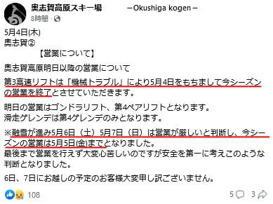

そして，熊の湯は14日まで営業する予定が，

7日にて営業終了です（泣）

でも，7日はすごい薄い雪で，かなり厳しい

ゲレンデコンディションじゃないかな…

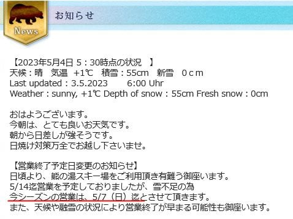

ってなことで．

昨日5/4(木)，5連休2日目の奥志賀高原の

写真が送られてきましたが…

昨日も朝から気温は+10℃（泣）

暑い一日だったようです…

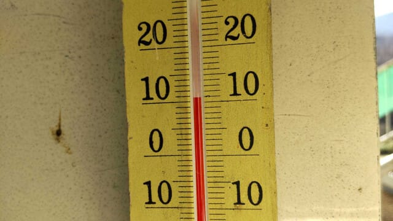

当然，麓には全く雪が無く…

今日も滑れる第3，第4ゲレンデまでは

ゴンドラで往復です！

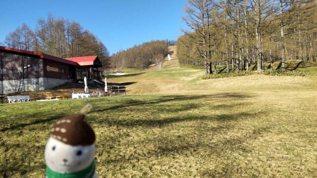

が…

朝，ゴンドラで登ると．

第3高速ペアが故障で営業開始が遅れ，

第4リフトのみで営業スタート．

あさイチの第4はよさげに見えますね…

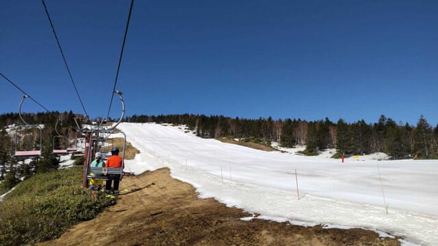

30分くらい遅れて，8:40ごろに第3ペアが

運転開始したようですが…

こちらも営業開始直後はかなりいい感じ！

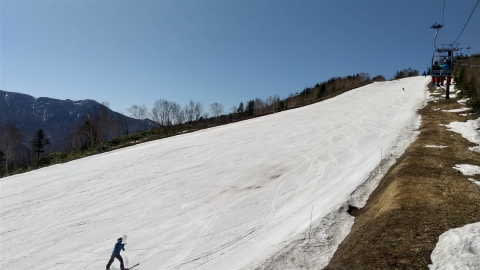

でも…

気温が高かったので，雪は緩みきっていて．

結構すぐに荒れ荒れバーンになっていった

みたいですね…

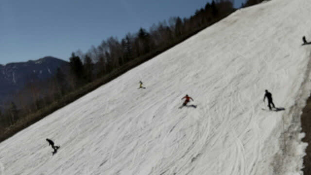

そして，ゲレンデの人も，前日の5連休初日

よりはこんでいて…

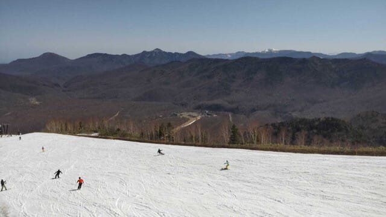

機器不具合で減速運転だったのもあったため，

第3リフトはかなり混んだみたいです…（泣）

いや…すごい列…

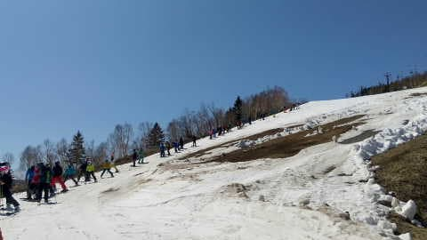

そのせいか，普段はそれほど混まない第4ゲレンデが

すごい人が多かったみたいで．

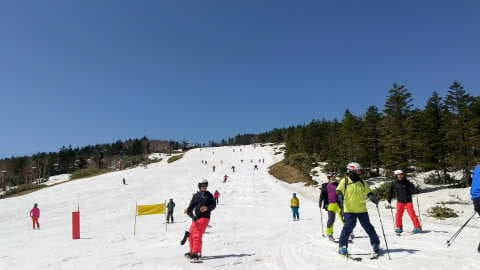

第4リフトも，シーズン一番混んでますね…

こんな混んでる第4リフト，見たことない…！

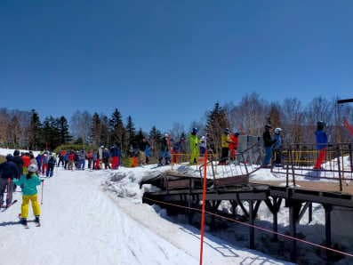

でも，雪が柔らかい春雪ってのもあり．

コブ道場がそこそこ楽しめたようです～！

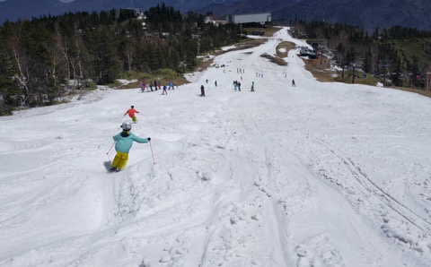

…ってなことで，雪出しすればまだ滑れそうな

奥志賀高原ですが．

第3リフト故障の影響もあり，第4リフト1本での

営業に限界を感じたのか，本日が営業ラスト…

これで，志賀高原で残るは熊の湯と横手・渋だけ

ですが．

横手はまだ第1リフトの一番下まで滑れるようです…！！

いや…横手山，すごい…

…天気は雨の降り始めが当初予想より遅くなり，

明日，土曜の夜までは雨が降らず持ちそうですが…

土曜の夜から7，8，9日の3日間，梅雨のように雨が

降り続けます（泣）

さて．

横手・渋がどこまでもつことか…
